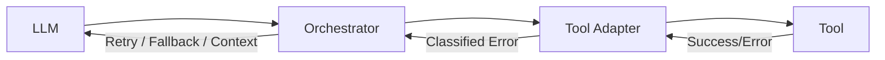

# Error handling

> **Learning Path:** Tool Calling & AI Interfaces
> **Section:** 10.1.9 — Learn

**Error handling in Tool Calling & AI Interfaces**

### 1. The problem

Tool calling adds a hard boundary between a non-deterministic reasoner and deterministic systems. The LLM proposes a call, the system executes it, and something can go wrong at every step.

The model can produce invalid arguments, wrong schema, or hallucinated parameters. The tool can be down, rate limited, slow, or return a business error. The network can drop. 

Without explicit handling, the system either crashes silently, returns a generic failure to the user, or feeds raw errors back to the model which then hallucinates a fix.

The constraint is: you need reliability and coherence despite partial failure, while preserving enough signal for the model to reason correctly.

### 2. Mental model

Think of errors as a control signal, not an exception to be swallowed.

Classify errors into three buckets:

* **Model errors** - bad output from LLM: schema violation, missing required param, type mismatch
* **Transient tool errors** - timeout, 5xx, rate limit, temporary unavailability
* **Permanent tool errors** - 4xx validation error, business rule violation, unauthorized

Only transient errors are worth retrying. Permanent errors must be surfaced as facts for the model to work around.

### 3. How it works

A robust tool calling layer sits between LLM and tools. It validates, executes, classifies, and translates errors.

Flow:
1. **Validate before call.** Schema check the LLM output. Fail fast with a structured correction prompt instead of calling a bad tool.
2. **Execute with policy.** Timeout, idempotency key, and retry with exponential backoff for transient errors only.
3. **Classify and translate.** Map tool errors to a small, stable taxonomy the model can reason about: `transient`, `invalid_input`, `not_found`, `permission_denied`, `business_rule`.
4. **Return error as context.** Give the model a concise, safe error summary plus the last successful state, not a stack trace. Let the model decide next action: retry, use alternative tool, ask user.

### 4. Architectural reasoning

Centralize handling in the orchestrator / adapter layer, not in individual tools or in prompts.

When it helps:
* Multi-step agents where one failure can derail the whole plan
* Tools with different SLAs, auth, and rate limits
* Need for observability and cost control on retries

Alternatives:
* Let the model retry by re-prompting on raw error. Cheaper to build, fails often because models repeat the same mistake.
* Handle everything inside the tool. Hides failure modes and couples LLM logic to tool implementation.

Decision: Use an adapter per tool family with a shared error policy. The orchestrator owns retry/fallback strategy and decides when to re-invoke the model with corrected context.

### 5. Trade-offs and failure modes

* **Latency vs reliability.** Retries improve success but increase tail latency and cost. Use circuit breakers and jitter to avoid retry storms.
* **Signal vs safety.** Raw errors give the model more info but risk leaking PII or confusing it. Sanitized errors are safer but can starve the model of needed detail.
* **Idempotency.** Without idempotency keys, retries can create duplicate orders, charges, messages. Design tools to be idempotent or make the adapter enforce exactly-once semantics.
* **Poison loops.** A permanent error fed back to the model without classification can cause infinite correction loops. Cap retries per step and escalate to human.

Common failure modes: unbounded retries amplifying outages, exposing internal error messages to users, and silent swallowing that makes the model hallucinate success.

### 6. Example

Customer support agent booking a refund. Tools: `get_ticket`, `verify_identity`, `create_refund`.

`create_refund` returns 429 rate limited. Adapter classifies as transient, retries once with backoff, succeeds.

Later `verify_identity` returns 400 `invalid_dob_format`. Adapter classifies as invalid_input, returns to orchestrator: `verify_identity failed: invalid_dob_format. Last known dob: 1990-13-01`. Orchestrator returns to LLM with the fact and asks for clarification. No retry.

If `create_refund` returned 402 `insufficient_funds`, adapter classifies as business_rule. Model is told the refund cannot be issued and is prompted to offer alternative compensation.

### 7. Reasoning challenge

Your agent tries to call `submit_payment` with amount $150. The tool returns 400 `amount_exceeds_limit`. The model retries three times with the same amount, getting the same error.

What do you change in the architecture, not the prompt, to break the loop?

### 8. Key takeaway

* Error handling in tool calling is about classification and translation, not just try/catch.
* Retry only transient errors with backoff, idempotency, and circuit breaking.
* Return permanent errors to the model as concise, safe facts so it can reason, not as raw exceptions.
* Centralize policy in adapters/orchestrator to keep tools clean and behavior consistent.

You should be able to reason: what error bucket is this, should I retry or re-plan, and what context does the model actually need to proceed correctly.
