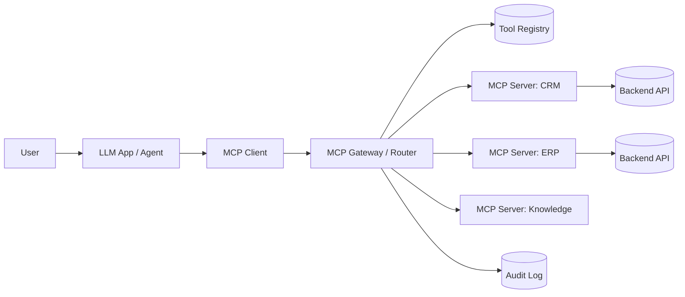

# Enterprise MCP architecture

> **Learning Path:** Tool Calling & AI Interfaces
> **Section:** 10.2.10 — MCP

**Enterprise MCP architecture**

### 1. The problem

AI apps need tools. Not just one tool, and not just one app.

An enterprise has CRM, ERP, ticketing, code repos, internal docs, billing, HR. An agent needs to read a ticket, check a customer in CRM, pull an invoice, and summarize. 

Without a standard, each LLM app builds its own integration per tool: custom SDK calls, bespoke auth, bespoke schemas, bespoke error handling. Every new model or agent re-implements the glue.

Constraints appear fast:
* **Fragmentation.** N apps x M tools = N*M adapters.
* **Governance.** Who can call what, with what data, audited how?
* **Lifecycle.** Tools change schemas, auth rotates, models change tool-calling style.
* **Operational visibility.** No single place to see tool usage, latency, failures, cost.

MCP was created to solve the integration problem. Enterprise MCP architecture solves the scaling problem.

### 2. Mental model

Think USB-C for AI.

MCP is a protocol for an AI host to discover and invoke capabilities exposed by a server. The server declares *tools, resources, prompts*. The host calls them via JSON-RPC over stdio or HTTP/SSE.

In enterprise, you don't want 200 servers wired directly into 20 apps. You want a controlled fabric.

### 3. How it works

Core pieces remain the same, architecture changes:

* **MCP Client** lives in the app. It speaks MCP, not REST.
* **MCP Gateway** is the enterprise control plane. It handles discovery, routing, authZ, rate limiting, observability, and protocol translation.
* **MCP Servers** are thin wrappers around existing systems. They expose a stable tool surface: `get_customer`, `create_invoice`, `search_docs`. They do not contain business logic.
* **Registry** holds server metadata, schemas, ownership, policies.

Request flow: App asks for tools → Gateway resolves which server, checks policy → forwards call → server calls backend → response back through gateway with audit.

### 4. Architectural reasoning

When it helps:
* Multiple AI apps need the same internal capabilities.
* You need centralized policy for data access in AI.
* You want tool reuse without coupling apps to backends.

Alternatives:
* Direct API integration per app. Cheaper initially, unmaintainable at scale.
* OpenAPI → tool wrapper per app. Standard schema but no unified runtime governance.
* LangChain/Agentic frameworks with custom adapters. Fast to prototype, hard to govern.

Choose enterprise MCP when tool count > ~10, multiple teams ship agents, and compliance/audit is non-negotiable.

### 5. Trade-offs and failure modes

* **Latency fan-out.** Agents call 3-5 tools per turn. Gateway adds hop. Mitigate with connection pooling, SSE streaming, and tool result caching.
* **Security surface.** Tool = code execution with data access. Prompt injection can turn a read tool into an exfiltration path. Enforce allow-lists, input validation, and per-tool least privilege at gateway.
* **Version drift.** Server changes tool signature, apps break. Treat tools like APIs: semantic versioning, schema registry, deprecation window.
* **Observability gap.** Tool calls are invisible to traditional API gateway metrics. You need MCP-specific telemetry: tool name, caller app, success/latency, token cost.
* **Centralization risk.** Gateway becomes a single point of failure and a bottleneck. Design for horizontal scale, regional routing, and graceful degradation to local servers.

### 6. Example

A bank wants agents for customer support.

Instead of each team building CRM connectors, they deploy:
* MCP Server: CRM read-only, with tool `get_customer_by_id`
* MCP Server: Ticketing read/write, tools `create_ticket`, `update_ticket`
* MCP Server: Knowledge base, resource `policy_docs`

Gateway enforces: Support Agent can read CRM but not write; can only call ticketing for customers in its region; all calls logged to SIEM.

New agent team adds a new LLM app in 1 day by connecting to gateway, not by writing 3 integrations.

### 7. Reasoning challenge

You have 200 internal microservices and 5 AI product teams. Do you build one monolithic MCP server exposing all tools, or 200 small servers behind a gateway with a registry?

What breaks first with each choice: latency, governance, deployment velocity, or blast radius?

### 8. Key takeaway

* MCP standardizes *how* an AI discovers and calls tools, not what tools exist.
* Enterprise value comes from the gateway/registry layer: authZ, routing, audit, lifecycle.
* Treat MCP servers as thin, stable adapters; keep business logic in backends.
* The hard problems are operational: policy enforcement, versioning, observability, and failure isolation — not the protocol itself.
