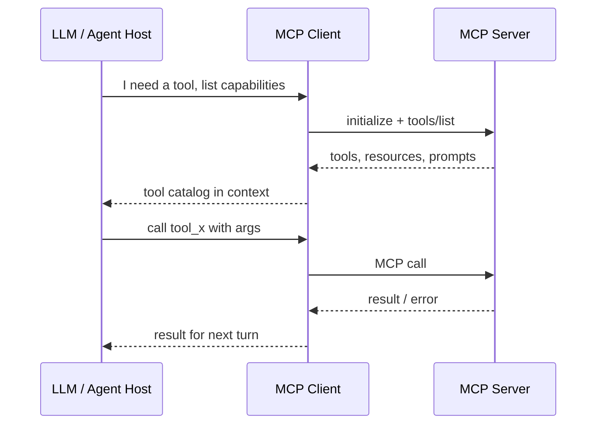

# MCP clients

> **Learning Path:** Tool Calling & AI Interfaces
> **Section:** 10.2.2 — MCP

### 1. The problem

LLM agents need to use tools: run a query, read a file, create a Jira ticket, call an internal API. 

Before a standard, each integration was bespoke. The host app had to know the auth scheme, transport, schema, and lifecycle for every tool. Add a new data source and you add custom glue code. Scale to 10 tools and you get 10 adapters, no discovery, no consistent security boundary, and tool schemas drift from the model context.

The constraint is not just calling an API. It's **dynamic discovery of capabilities + secure, managed execution + consistent presentation to the LLM**, without coupling the model runtime to every backend.

### 2. Mental model

An MCP Client is the host-side controller that sits between the LLM/agent runtime and one or more MCP Servers.

Think of it as a universal remote and power strip for AI tools. The client discovers what tools exist, keeps the connections alive, translates LLM tool calls into MCP requests, and returns results in a form the model understands. The LLM never talks directly to servers.

### 3. How it works

Essentially three responsibilities:

* **Session management.** Maintain transport connections to servers, typically stdio for local processes or SSE for remote. Handle reconnects, health checks, and capability negotiation.
* **Capability aggregation.** Pull tools/resources/prompts from all connected servers, de-duplicate, and expose a unified catalog to the LLM. Cache schemas so the model knows what arguments are valid.
* **Request routing and safety.** Translate a model tool call into an MCP request, enforce per-server auth and policy, stream results back, and surface structured errors.

The client does not implement tools. It orchestrates them.

### 4. Architectural reasoning

When it helps:
* You have multiple heterogeneous tools that should be composable by one agent.
* You want tooling to be pluggable without changing the LLM host.
* You need a consistent security boundary for tool execution.

Alternatives:
* Custom adapters per integration. Works for 1-2 tools, explodes in maintenance.
* Generic OpenAPI wrappers. Good for REST, poor for local resources, streaming, and stateful sessions.
* MCP. Standardizes discovery, transport, and authorization, and lets servers evolve independently.

Choose MCP when tool ecosystem growth is expected and you need isolation between the model runtime and sensitive backends.

### 5. Trade-offs and failure modes

* **Tool explosion.** A client that aggregates 50 servers presents hundreds of tools to the model. The model gets noisy and hallucinates parameters. You need filtering, namespacing, and per-task server selection.
* **Trust boundary.** The client runs with access to both the model and backend credentials. A compromised server can exfiltrate via tool results. Run servers in isolated processes/containers and scope tokens tightly.
* **Lifecycle coupling.** Servers crash, hang, or become slow. The client must timeout, retry, and surface partial failures without killing the conversation.
* **Version drift.** MCP is evolving. A client must negotiate protocol version and gracefully degrade when a server implements an older schema.

### 6. Example

Enterprise code assistant in VS Code.

The MCP Client lives in the extension host. On startup it spawns three local servers via stdio: Git, FileSystem, and an internal Jira MCP server that talks to your VPN-protected instance.

The client lists tools like `git_diff`, `read_file`, `jira_create_issue`. The LLM sees a single, consistent catalog. When the user asks "Open the PR that fixes login and file the follow-up ticket", the client routes `git_diff` to the Git server and `jira_create_issue` to the Jira server, enforces that Jira requires an enterprise token, and returns results for the model to reason over.

Adding a new data warehouse server requires zero changes to the LLM host; just connect a new MCP Server and the client exposes its tools.

### 7. Reasoning challenge

You are designing an AI agent for customer support that needs read-only access to Postgres and write access to Zendesk. The Postgres server must never be reachable from the public internet.

Do you run the MCP Client inside the agent service in the cloud, or run it locally on a bastion host and stream tool results back? What changes to auth, latency, and failure modes does each choice create?

### 8. Key takeaway

* MCP Clients exist to decouple the LLM runtime from tool implementations via a standard discovery and execution layer.
* The client’s job is session management, capability aggregation, and safe routing, not tool logic.
* Value comes from pluggability and isolation; cost comes from tool catalog complexity and new trust boundaries.
* Architect for filtering, timeouts, and per-server isolation from day one.
