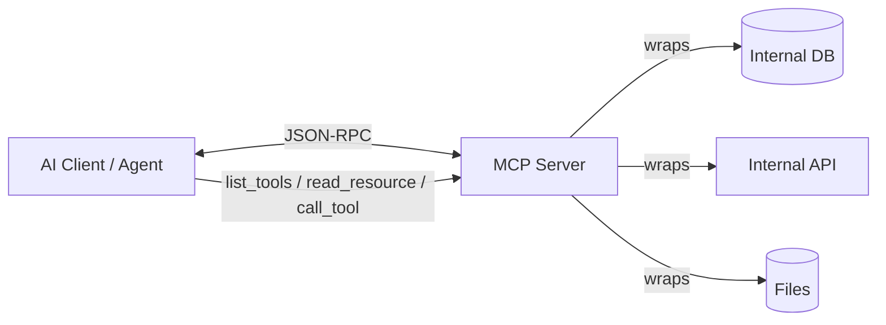

# MCP servers

> **Learning Path:** Tool Calling & AI Interfaces
> **Section:** 10.2.3 — MCP

**The problem**

An AI agent needs more than a prompt. It needs tools, data, and context: search a DB, read a file, call an internal API, get live pricing. 

Before a standard, every integration was bespoke. Anthropic tools, OpenAI functions, custom plugins, LangChain wrappers. The model side changes, the provider side changes, and you end up with N x M adapters. Worse, capabilities are hidden. The client has no discoverable way to ask "what can you do?" and the server has no standard way to expose it safely.

The constraints that create the need:
* The LLM is stateless and generic. Capability must live outside it.
* Integrations must be secure, scoped, and local-first for internal data.
* Teams want reusable providers, not one-off glue per assistant.

**Mental model**

Think of MCP as USB-C for AI capabilities.

An MCP server is a capability provider. It wraps an internal system — database, filesystem, ticketing, CRM — and exposes a small, typed interface: tools you can call, resources you can read, prompts you can reuse.

An MCP client is the AI assistant. It discovers what the server offers, then calls it via a standard protocol. The model never talks directly to Postgres; it talks to the server, which enforces policy.

**How it works**

MCP is JSON-RPC over a transport. Local: stdio. Remote: SSE/WebSocket.

The handshake is tiny:
1. `initialize` -> server advertises capabilities
2. `tools/list` -> client discovers available tools with schemas
3. `tools/call` -> client invokes with arguments, server returns structured output
4. `resources/list` and `resources/read` -> expose context like files or query results

The server owns execution, auth, and schema. The client owns orchestration and safety.

**Architectural reasoning**

When it helps:
* You have multiple internal systems you want agents to use without custom adapters per model.
* You want a marketplace of reusable providers. Build once, plug into Claude Desktop, VS Code, custom agent.
* You need a clear trust boundary. The server runs with privileged access; the client runs untrusted.

Alternatives:
* Direct API integration in the agent code. Works for one agent, does not compose.
* Custom plugin systems per vendor. Locks you in, high maintenance.
* LangChain-style tool wrappers. Powerful but not interoperable.

Choose MCP when standardization and composability outweigh the cost of running a server per capability. Do not choose it if you only need one ephemeral tool call and no reuse.

**Trade-offs and failure modes**

* **Security is the trust boundary.** A server can read any data and return it into the model's context. Tool output poisoning is real. Scope servers tightly, read-only where possible, and never expose raw credentials.
* **No built-in auth standard yet.** You rely on transport security and server-side policy. Remote servers add token management, rate limiting, and audit.
* **Latency and partial failure.** Tools are synchronous from the model's view. A slow DB query blocks reasoning. Design tools to be fast, idempotent, and fail cleanly.
* **Schema drift.** Tool input/output schemas evolve. Clients cache `tools/list`. Version servers and test breaking changes.
* **Enumeration explosion.** Exposing 200 tools creates choice overload and hallucinated calls. Curate.

**Example**

Enterprise support agent. 

An MCP server wraps Salesforce and internal knowledge base. It exposes:
* `resources` - read-only views of playbooks, runbooks
* `tools` - `salesforce.search_customer`, `salesforce.create_case`, `kb.search`

The agent discovers them at startup, asks the user, then calls `search_customer` and reads the relevant resource before drafting a reply. The model never gets direct DB access; the server enforces PII filtering and audit logging.

**Reasoning challenge**

You need agents to query an internal Postgres with sensitive HR data. Do you expose a generic SQL tool via MCP, or expose three specific tools: `list_employees_by_team`, `get_employee_profile`, `search_payroll_summary`?

What do you optimize for, and what fails first in each design?

**Key takeaway**

* MCP standardizes how AI clients discover and call external capabilities.
* Servers own data access and policy; clients own orchestration. The boundary matters.
* It solves integration fragmentation, not tool quality. Bad tools stay bad.
* Design for security, minimal surface area, and observable failures.
