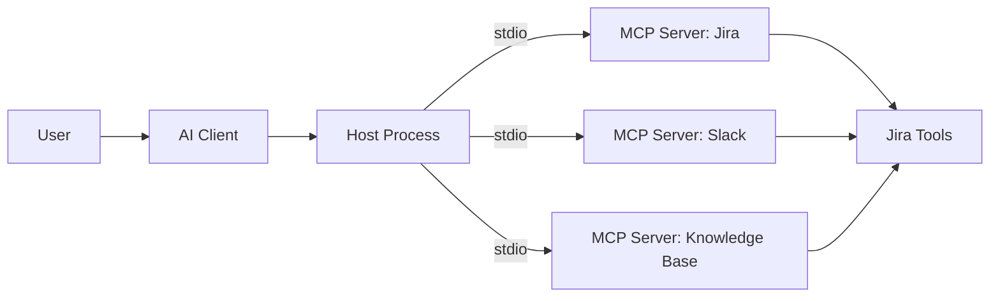

# Tools

> **Learning Path:** Tool Calling & AI Interfaces
> **Section:** 10.2.5 — MCP

### The problem

An AI client — Claude Desktop, Cursor, a custom agent — needs to do more than chat. It needs to read your local files, query Jira, run a terminal command, or pull live data from an internal API.

Before MCP, every integration was bespoke. The app vendor built a custom connector for each data source, and each data source implemented a custom client adapter. Result: N x M integrations, slow adoption, and agents that are effectively sandboxed from real work.

The constraint is not just access. It's **discovery, authorization, and a safe execution boundary**. You need a standard way for a client to ask "what tools can you provide?" and for a server to say "here are my tools, here's their schema, here's what they can do" — without the client knowing implementation details.

### Mental model

MCP is a protocol for exposing tools and context as a service to an AI client.

Think of it as a **remote procedure call layer for agents**, not for humans. The LLM client is the caller. An MCP Server is a capability provider. A Host is the process that manages the connection, e.g. the desktop app that launches servers.

```
Client <--JSON-RPC--> Server --> Local Resources
```

The server never talks to the model directly. It advertises capabilities via a machine-readable schema, and the client decides when and how to invoke them.

### How it works

The essential mechanism is small:

1. **Discovery.** On connect, the server sends its tools list with name, description, and JSON Schema for inputs/outputs. The client builds a tool-use prompt for the model.
2. **Call.** The model decides to call a tool. The client translates that into a JSON-RPC request to the server.
3. **Execution.** The server runs the tool locally and returns structured output. The client feeds the result back to the model as context for the next turn.

Transports are deliberately boring: stdio for local processes, SSE/HTTP for remote. The protocol is stateless and synchronous from the model's perspective.

The architectural insight: **separate tool definition from tool implementation**. The model only needs a schema, not code.

### Architectural reasoning

MCP helps when you want composable agent capabilities without coupling the agent to every backend.

When it helps:
* You need an agent to operate on local, private data the model cannot see directly — files, git repos, databases.
* You want a single client to plug into many internal systems without custom integrations per system.
* You want non-AI developers to publish tools once and have them usable by any MCP client.

Alternatives:
* Custom plugins / SDK integrations. Faster for one use case, explodes with N x M.
* Direct API calls from the agent via the model provider's tool-calling. Works for public APIs, fails for internal, sensitive, or local resources.
* RAG only. Gives read context, not write/execute capability.

Choose MCP when tool reuse and decentralization matter more than tight control.

### Trade-offs and failure modes

* **Trust boundary.** Servers run with the host's privileges. A malicious or buggy server can read files, execute commands, exfiltrate data. You are essentially letting a tool provider run code in your environment. Sandboxing and least-privilege are mandatory.
* **Schema quality is the product.** A vague description or loose schema leads to hallucinated arguments and failed calls. Tool authors must invest in good schemas and examples, like API design.
* **No built-in auth standard.** Transport security is up to the host/server. Remote servers need auth, auditing, and rate limiting — MCP does not solve this for you.
* **Local vs remote tension.** stdio is great for local trusted tools, SSE/HTTP for remote. Mixing them creates operational complexity around lifecycle, versioning, and observability.
* **Failure amplification.** A slow or erroring tool blocks the agent loop. You need timeouts, retries, and clear error surfaces, otherwise the model gets stuck in retry loops.

### Example

Enterprise support agent.

The agent runs in an internal MCP host. Three servers are registered:

* `jira-mcp-server` — tools: search_tickets, create_ticket, add_comment
* `slack-mcp-server` — tools: list_channels, post_message
* `knowledge-mcp-server` — tools: search_docs

User asks: "Find the last outage for payments and post a summary to #incidents."

The client discovers the tools, the model plans the calls, the host invokes the servers locally. No custom integration code in the agent. Adding a new data source means adding a new server, not changing the agent.



### Reasoning challenge

You are architecting an internal coding assistant. Should you expose a production PostgreSQL with a `query_db` tool via MCP directly to developers' laptops?

Consider data exfiltration, query safety, auditability, and blast radius. What would you change to make the decision viable?

### Key takeaway

* MCP solves the N x M integration problem for AI agents by standardizing tool discovery and invocation.
* It moves capability publishing to servers, keeping clients generic. The schema is the contract.
* Security and operational control live at the host/server boundary, not in the protocol.
* Prefer MCP when you need reusable, local, and private tooling for agents. Avoid it as a blanket remote API gateway without auth, sandboxing, and observability.
