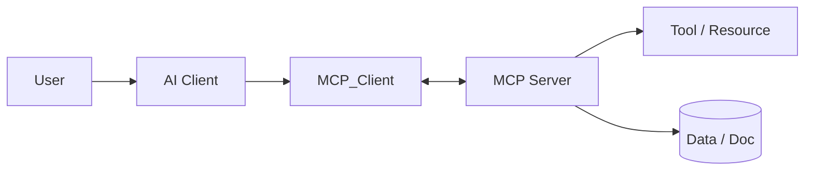

# Prompts

> **Learning Path:** Tool Calling & AI Interfaces
> **Section:** 10.2.6 — MCP

**The problem**

You build an AI agent that needs live context, not just a static prompt. It needs to read a ticket from Jira, query your warehouse, fetch a doc from Confluence, then call an internal pricing API.

Today each integration is bespoke. You write a custom adapter, hard-code auth, translate schemas, and poll for updates. Every new data source means new glue code in the agent. Prompt engineering becomes context injection hacks, and tool calling is inconsistent across clients.

The constraint is not intelligence, it's plumbing. Producers of data/tools and consumers of AI agents cannot agree on a contract, so you get N x M integrations, brittle auth, and no discoverability.

**Mental model**

MCP is a standard connector contract between an AI client and a context provider.

Think of it as USB-C for AI tools. The client speaks one protocol. The server advertises what it can do: tools to call, resources to read, and prompts to reuse. No custom SDK per data source.

**How it works**

An MCP server is a process that exposes capabilities via JSON-RPC. An MCP client, embedded in the AI app, discovers them.

The essential flow:

1. **Discovery**: client asks `tools/list`, `resources/list`. Server returns typed schemas.
2. **Invocation**: client calls `tools/call` with arguments validated against the schema.
3. **Context streaming**: server can push resources or notifications. Transport is stdio for local, SSE/HTTP for remote.

The server owns auth, rate limits, and data shaping. The client only needs the protocol, not the business logic.

**Architectural reasoning**

When it helps:
* Multi-tool agents in enterprise where tool set changes frequently
* Reuse of the same data source across multiple assistants
* Need for secure, auditable boundaries around sensitive tools

What it solves: eliminates per-agent adapter sprawl, makes tool capabilities discoverable, separates policy from model.

Alternatives:
* Direct API integration in the agent. Tighter, faster, but unmaintainable at scale.
* A central orchestration layer like LangChain adapters. Works but couples you to a framework.
* Prompt-based context injection. Cheap, fragile, no live validation.

Choose MCP when tooling is a product in itself and you want multiple AI clients to share it safely.

**Trade-offs and failure modes**

* **Security boundary**: The server is a privileged process. A bug in tool schema can expose data the model shouldn't see. You need per-tool authz, not just authn.
* **Server sprawl**: Each data source becomes a server. Operability becomes the problem. Versioning, monitoring, and lifecycle management matter.
* **Latency and reliability**: JSON-RPC over SSE adds hops. Tools that are slow or flaky degrade the whole agent. You need timeouts, retries, and fallback.
* **Standard vs reality**: MCP standardizes the shape, not the semantics. Two GitHub servers can expose different tools. Discovery helps but doesn't guarantee consistency.

Failure mode: treating MCP as magic plumbing. Without governance, you get 30 servers with overlapping capabilities, no tests, and no owner.

**Example**

Enterprise support copilot. Needs Jira for tickets, Confluence for runbooks, Postgres for customer 360, and an internal pricing API.

Instead of embedding four adapters in the copilot, you deploy four MCP servers behind your VPC. Each server handles its own OAuth, schema mapping, and PII redaction. The copilot discovers `jira.search_issues`, `confluence.get_page`, `db.query`, `pricing.get_quote` at startup.

When Confluence schema changes, you update one server, not every agent. Auditing is centralized at the server.

**Reasoning challenge**

You have an agent that must call both a public LLM tool marketplace and an internal HR database containing PII. Would you run both behind the same MCP host, or separate them? What controls would you put on the HR server to prevent prompt injection from causing data exfiltration?

**Key takeaway**

* MCP standardizes discovery and invocation of tools/resources for AI clients, reducing N x M integration cost.
* It moves tool policy, auth, and schema to the server side, keeping the agent thin and composable.
* Choose it for reusable, governed tooling across multiple agents; avoid it for a single, tightly coupled workflow.
* Operability, security per tool, and server sprawl are the real architectural risks.
