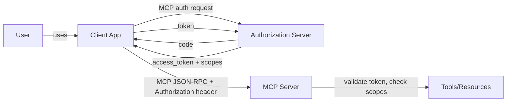

# Authorization

> **Learning Path:** Tool Calling & AI Interfaces
> **Section:** 10.2.8 — MCP

### The problem

An MCP client is an AI agent that can call tools on an MCP server. That server might be local, but in production it is remote and exposes real resources: a database, CRM, internal API, file system.

The agent is not the user. The user asked the agent a question, the agent decides to call a tool. Who is authorized to do that?

Without authorization you have two bad options:
* Trust the client completely → any compromised or malicious client can invoke any tool
* Trust the user completely → you lose auditability and cannot limit what each app can do

MCP moves the trust boundary from "inside the app" to "across the network". You need to prove *who* is calling, *on behalf of whom*, and *what* they may do.

### Mental model

Authorization in MCP is not about logging in. It is about **delegated capability**.

Think of an access badge system for a building with many rooms.
* The badge = OAuth access token
* The badge reader = MCP server validating token
* The room permissions = OAuth scopes mapped to MCP tools/resources

The badge is issued by a central authority, not by the room. The room only checks the badge and the list of rooms the badge opens. The agent is the person holding the badge, but the badge was issued for a specific user and app.

### How it works

For remote MCP servers, auth is OAuth 2.1. The flow is:

Essentially:
1. Client discovers server auth metadata via `/.well-known/oauth-protected-resource`
2. Client redirects user or uses client credentials to obtain a token
3. Client includes token in MCP requests, typically via `Authorization: Bearer`
4. Server validates token, extracts scopes/claims, and enforces them per tool call

MCP itself is scope-agnostic. The server maps OAuth scopes to tool permissions. e.g. `crm:read` allows `list_contacts`, `crm:write` allows `create_deal`.

Local servers can be unauthenticated, but any remote server should require it.

### Architectural reasoning

When does this help?
* Multi-tenant AI apps where each user has different data access
* Third-party MCP servers you do not control
* Audit and compliance requirements: you need to know *who* invoked *what*

Alternatives you might consider:
* API keys per client → no user delegation, hard to rotate, no scopes
* mTLS only → proves server identity, not user intent
* Custom token → works but breaks interoperability

Why OAuth? It is already the standard for delegated access, it separates identity from authorization, and it gives you revocation, refresh, and fine-grained scopes without building them.

Decision point: Do you need user-delegated access or service-to-service?
* User-delegated: Authorization Code + PKCE. Token represents user + app.
* Service: Client Credentials. Token represents app only.

### Trade-offs and failure modes

* **Scope granularity vs usability.** Too fine-grained scopes = complex mapping and token bloat. Too coarse = over-privilege. Most architects settle on resource + action scopes, e.g. `db:read`, `db:write`.
* **Token lifetime.** Short-lived tokens are safer but increase refresh churn for long-running agents. Use refresh tokens with rotation.
* **Confused deputy.** The agent can request actions the user never intended. Mitigate by requiring explicit user consent per sensitive scope and logging tool calls with user identity.
* **Token propagation.** In multi-hop MCP, server A calls server B. Do you forward the original user token or mint a new one? Forwarding preserves audit but leaks scopes. Minting reduces blast radius but adds complexity.
* **Discovery fragility.** Clients depend on well-known URLs. If metadata changes, clients break silently.

Failure mode to watch: a client caches a token and reuses it across users. This is identity bleed. Tokens must be bound to a specific user session.

### Example

Enterprise AI assistant with MCP servers for CRM and billing.

The assistant app is an OAuth client registered with the corporate IdP. User logs in, gets `crm:read crm:write billing:read` scopes.

When user asks "create a deal for Acme", the client obtains a token with those scopes, calls the CRM MCP server. Server validates token, checks scope includes `crm:write`, allows `create_deal`. The call is logged as `user_id=alice, app=assistant, tool=create_deal`.

If the same user asks for refund details, the billing server sees `billing:read` and allows it. A different user with only `crm:read` cannot create deals even though they use the same app.

### Reasoning challenge

You are designing an internal MCP gateway that aggregates 20 internal services. Each service wants its own OAuth scopes, but you want a single sign-on experience for agents.

Do you:
A) Issue one token with union of all scopes the user has across services
B) Issue a gateway token with minimal scopes and let the gateway mint per-service tokens
C) Skip OAuth and use mTLS between gateway and services

What breaks in each option and which trade-off matters most for auditability vs latency?

### Key takeaway

* Authorization in MCP is about delegated access across a trust boundary, not authentication of the model.
* Use OAuth 2.1 for remote servers: Authorization Code + PKCE for user-delegated, Client Credentials for service-to-service.
* Map OAuth scopes to MCP tools/resources, and enforce them at the server, not the client.
* Design for auditability first: every tool call must be attributable to a user and an app.
* Prefer minimal scopes and short-lived tokens; accept the complexity of refresh and token minting over over-privilege.
