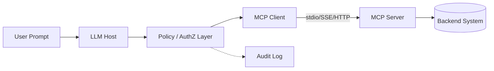

# Security

> **Learning Path:** Tool Calling & AI Interfaces
> **Section:** 10.2.9 — MCP

**10.2.9 — MCP Security**

### The problem

An AI agent needs tools. Database lookup, ticketing, CRM, code execution. Before MCP each integration was bespoke: custom adapters, custom auth, custom schemas.

MCP standardizes that: an LLM host talks to MCP servers over a common protocol. That solves integration sprawl, but it moves a security boundary from *human API calls* to *LLM-driven tool calls*.

An LLM is non-deterministic and attacker-influenceable. A tool has side effects. The problem is therefore: **how do you give a language model the ability to invoke real capabilities without giving it the ability to exfiltrate data, escalate privileges, or be weaponized by prompt injection?**

### Mental model

Think of MCP as a capability broker, not an API gateway.

`User -> LLM Host -> MCP Client -> MCP Server -> Backend System`

The LLM is the requester, the MCP Server is the capability provider. The security question is not just transport TLS, it is: *who is allowed to call what, with what data, under what context, and can we stop a compromised or malicious server from doing harm?*

### How it works, security-wise

MCP defines transport and tool schema, not trust. Typical transports are stdio for local, SSE for remote, HTTP for remote.

The essential security mechanisms you have to add yourself:

* **Identity and scope of the server.** Is the server local and trusted, or remote and untrusted? MCP has no built-in auth standard yet. You must gate connections with mTLS, OAuth2 client credentials, or capability tokens.
* **Tool allow-listing and least privilege.** The LLM can only call tools the client exposes. Architecturally you want a policy layer between the LLM host and the MCP server that filters tools by user, tenant, and session.
* **Input validation and output sanitization.** Tool arguments come from LLM output. Validate schemas strictly, reject unexpected types, and never pass raw LLM text into shell/command tools.
* **Execution sandboxing.** A code execution or file system MCP server must run in a sandbox with no network egress, limited resources, and audit logging.
* **Audit and observability.** Every tool call is a security event. Log who invoked, which tool, with what arguments, and the result. You need it for forensics and for detecting prompt injection abuse.

### Architectural reasoning

When it helps: internal agents where you control both client and server, or where you need fast tool composition across teams.

Alternatives: direct API calls with a service mesh, or a tool registry with explicit human approval.

Choose MCP when the value is developer velocity and composability, and you can afford a strong isolation layer. Do not choose it when you need fine-grained, audited human-in-the-loop approval for every side-effecting action, or when you are exposing third-party servers to your LLM.

### Trade-offs and failure modes

* **Convenience vs blast radius.** MCP makes it trivial to add tools. That same triviality lets a compromised server enumerate and abuse all exposed tools.
* **Prompt injection -> tool misuse.** An attacker can craft user input that makes the LLM call `delete_ticket` or `send_email` with attacker-controlled arguments. Tool schemas without strict validation are a direct exfiltration path.
* **Server trust asymmetry.** A local stdio server inherits the host's privileges. A remote SSE server you pull in from the internet is effectively code execution by proxy. Most breaches will start with a malicious or poisoned MCP server.
* **No standard auth.** Today you are building your own trust model. That leads to inconsistent implementations and credential leakage.

### Example

Enterprise support agent with MCP servers for CRM, billing, and internal knowledge base.

Architecture decision: run all MCP servers inside the VPC, behind a policy proxy. The proxy maps the logged-in user to a tool allow-list: customer support agents can read CRM and create tickets, but cannot call billing refunds. Tool arguments are validated against JSON Schema, and all tool calls are logged to SIEM. Third-party MCP servers are disallowed; if needed they are wrapped in a sandbox service with no direct backend access.

### Reasoning challenge

Your product team wants to let customers bring their own MCP servers for customization. Do you allow remote MCP server connections in production?

Consider: authentication, how you verify server integrity, how you prevent a customer server from exfiltrating data from other tools, and what happens when a customer's server is compromised. What minimal controls would make this defensible?

### Key takeaway

* MCP solves tool integration, it does not solve tool security. Security is a layer you must add.
* Treat every MCP server as an untrusted principal until proven otherwise. Apply least privilege, explicit allow-lists, and strong input validation.
* Prompt injection is a tool-call injection problem. Validate arguments and limit side effects.
* Log every tool invocation. You cannot secure what you cannot see.
