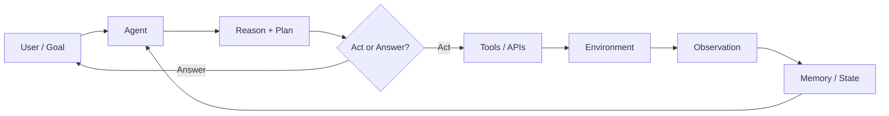

# Agent definition

> **Learning Path:** Agentic AI
> **Section:** 11.1.1 — Agent fundamentals

## The problem

A single-turn LLM is great at answering questions with its training data. It fails at real work.

Real work is multi-step, stateful, and involves the world: check a ticket, call a database, book a flight, retry on failure, remember what happened last time. A prompt → completion loop cannot do that reliably. It has no memory between turns, no way to act, and no mechanism to correct itself when the world disagrees with it.

Constraints emerge:
* **Non-determinism**: same prompt can give different plans.
* **World coupling**: the agent must read and write external systems.
* **Long horizons**: tasks require 5-50 steps, not 1.
* **Partial observability**: you must gather information before acting.

These constraints created the need for an agent: a system that persists a goal, reasons about it, and acts.

## Mental model

An agent is a goal-directed loop with memory, not a smarter chatbot.

Think: perceive → reason → act → observe → update.

The LLM is the reasoner inside the loop, not the whole system. The agent owns state, tools, and a policy for when to stop.

## How it works

Essential mechanism only:

* **Perception**: convert user intent + environment state into context the LLM can use. This is retrieval, summarization, and tool output normalization.
* **Reasoning / Planning**: LLM produces a plan or next step. Patterns like ReAct make this explicit: Thought → Action → Observation.
* **Action**: call a tool, write to DB, send message. Tools are deterministic boundaries around non-deterministic reasoning.
* **Memory**: short-term working memory for the current task, long-term memory for past tasks. Without it the agent repeats work and loses context.
* **Reflection / termination**: check if goal is met, if plan failed, and revise. This is the feedback that makes it more than a script.

Implementation is a loop, not a single call.

## Architectural reasoning

When does an agent help vs hurt?

Use an agent when:
* The task is open-ended and the steps are not known in advance.
* The cost of a wrong step is low and can be recovered by retry/observation.
* You need autonomy to handle variation across inputs.

Prefer a deterministic workflow when:
* Steps are fixed, e.g., KYC verification with a known checklist.
* Compliance requires auditable, pre-approved paths.
* Latency/cost budget is tight.

Alternatives:
* **Workflow / orchestration**: hard-coded DAG of tools. Predictable, cheap, brittle.
* **Human-in-the-loop**: agent proposes, human approves. Good for high-risk actions.
* **Retrieval-only assistant**: no actions needed.

Decision rule: choose agent for *exploration*, workflow for *exploitation*.

## Trade-offs and failure modes

* **Autonomy vs control.** More autonomy = more capability, less predictability. You need guardrails, tool allow-lists, and action validation.
* **Cost and latency.** Each step is an LLM call + tool call. Long tasks explode cost. Budget tokens, cache, and use smaller models for routing.
* **Drift and hallucination.** Plans can be plausible but wrong. You need observation grounding, tool output verification, and a max-step limit.
* **State management.** Memory is the hardest part. Bad summarization = lost context. Too much context = prompt bloat.
* **Operability.** Debugging a non-deterministic multi-step run is hard. You need full trace logs: prompt, tools, observations, decisions.

Common failure: building an agent for a task that could be a script. You get flaky behavior and higher cost for no gain.

## Example

Enterprise support triage agent.

Goal: resolve customer issues without human handoff.

System: Agent receives ticket + CRM data. Perceives via retriever for KB articles and customer history. Plans steps: check account status → query billing API → if overpaid, create refund draft → if technical, run diagnostics tool → summarize.

Tools are bounded: read-only CRM, read-only billing, write refund draft pending approval. Memory holds ticket state and previous observations. Reflection stops when resolution is confirmed or escalation criteria met.

This is agent work: path varies per ticket, needs memory, and actions in external systems. A fixed workflow would need dozens of branches.

## Reasoning challenge

You need to automate monthly payroll approvals for 200 employees. Approvals require checking timesheet, policy compliance, and manager sign-off. A mistake has financial and legal impact.

Do you build an autonomous agent, a deterministic workflow with human approval, or a retrieval assistant? What controls would you require?

## Key takeaway

* An agent is a persistent goal loop with perception, action, and memory; the LLM is the reasoner inside it.
* Build agents for open-ended, variable-step tasks where exploration beats a fixed script.
* Autonomy trades predictability for flexibility; contain it with bounded tools, memory hygiene, and observability.
* Always ask: can this be a workflow? If yes, prefer it.
