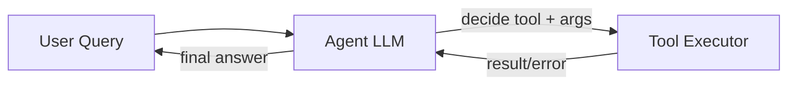

# Tools

> **Learning Path:** Agentic AI
> **Section:** 11.1.10 — Agent fundamentals

**Tools — 11.1.10 Agent fundamentals**

### The problem

A language model is a text predictor with no state, no execution, and no access to your world. It can summarize, reason about what it knows, and generate plausible text. It cannot check a live database, create a ticket, call a payment API, or read today's inventory.

When you need an agent to do something in the real world, you hit three constraints:
* **Grounding:** The answer must reflect current, private data, not training data.
* **Actionability:** The agent must produce side effects, not just text.
* **Composition:** One LLM step cannot do retrieval, calculation, and action reliably in one shot.

Tools are how you give an agent an interface to the world without retraining the model.

### Mental model

Think of tools as a limited API surface exposed to the LLM.

The agent reasons in natural language, then decides to call a function with typed arguments. The system executes the function, returns structured output, and the agent continues reasoning with the result.

Agent <-> Tool is not open-ended code execution. It is **deliberate, schema-bound function calling**.

### How it works

The essential loop is plan → call → observe → replan.

The LLM needs a description of each tool: name, purpose, parameters, types, and expected return shape. From that it emits a structured call, e.g. `create_ticket(customer_id, issue, priority)`.

The executor validates arguments, enforces auth and rate limits, runs the call, and returns a normalized observation. The agent then decides whether it has enough to answer or needs another tool.

Planning can be one-step or multi-step. The key is separation of concerns: the model plans, the system executes.

### Architectural reasoning

Tools solve the problem of extending reasoning with execution.

* **When it helps:** When you need real-time data, private data, or side effects. Search, CRM lookup, code execution, database queries, calendar writes, billing actions.
* **What it solves:** Grounding, actionability, and modularity. You can change a backend service without retraining the model, just updating the tool schema.
* **Alternatives:** 
  * RAG only retrieves, it does not act.
  * Prompting with instructions can't guarantee the model will use live data.
  * Fine-tuning for each action is brittle and expensive.

Choose tools when the task is a workflow of information gathering + decision + action, and the action space is enumerable and safe to expose.

### Trade-offs and failure modes

* **Latency and cost.** Each tool call adds a round trip and token usage. Deep tool chains amplify both. Design for minimal necessary calls.
* **Hallucination of tools/args.** The model may invent tool names or pass wrong types. You need strict schema validation and allowlists.
* **Error handling.** Tools fail, time out, or return ambiguous results. The agent must be able to interpret errors and retry or ask for clarification, not assume success.
* **Security and blast radius.** Exposing a tool is exposing capability. Validate inputs, enforce least privilege, audit calls, and never expose destructive tools without confirmation.
* **Observability.** Tool calls are the observable behavior of an agent. Log intent, arguments, result, and latency. Without it you cannot debug why the agent produced a bad answer.

Failure mode to watch: tool loops. The agent keeps calling the same tool with slightly different arguments because the result never satisfies its internal goal. Mitigate with max steps, result caching, and explicit stop conditions.

### Example

Enterprise support agent.

Tools exposed:
* `search_kb(query)` → returns relevant articles
* `get_order_status(order_id)` → returns status and items
* `create_ticket(customer_id, summary, priority)` → returns ticket id

User: "My order 48291 hasn't arrived and I need it today."

Agent reasons: needs order status, then decide if ticket needed. Calls `get_order_status`, sees delayed. Calls `search_kb` for expedite policy. Synthesizes answer and offers to create ticket. The model never sees raw DB schema, only the curated tool interface.

### Reasoning challenge

You are building a financial assistant that can read portfolio data and place trades.

Should you expose a `place_trade(symbol, qty, side)` tool directly to the agent?

Consider safety, confirmation, and the difference between information and action. What would you change in the tool design?

### Key takeaway

* Tools convert an LLM from a text generator into an actor by giving it a safe, schema-bound API to the world.
* Design tools for intent, not implementation details. Small, composable, well-documented tools beat one mega-tool.
* Every tool adds latency, cost, and risk. Validate inputs, observe outputs, and enforce guardrails before exposing action.
* Architect the loop: planning, validation, execution, observation. The agent reasons, the system executes.
