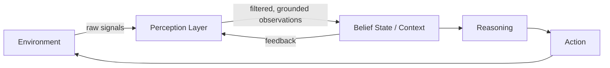

# Perception

> **Learning Path:** Agentic AI
> **Section:** 11.1.2 — Agent fundamentals

**Perception**

### 1. The problem

An agent can reason perfectly and it still fails if it doesn't know what's true right now. The world is not handed to it as a clean data structure. It arrives as raw, partial, noisy, multimodal signals: user chat, database rows, API responses, file contents, images, telemetry.

The problem is not input parsing. It's turning that messy stream into a coherent, actionable belief state the agent can reason over.

Without a deliberate perception layer, reasoning becomes hallucination on top of hallucination.

### 2. Mental model

Perception = Sensing + Filtering + Grounding.

* Sensing: collect observations from environment via tools, APIs, sensors, user input
* Filtering: select what matters, drop noise, de-duplicate, timestamp
* Grounding: map raw signals to symbols the agent understands: entities, relations, state changes

Think of it as the agent's sensory cortex. It does not decide, it prepares a consistent view of reality for the decision maker.

Perception is a loop, not a one-off parse.

### 3. How it works

In practice perception is a pipeline:

1. **Ingest**: pull via tools, webhooks, polling. Each source has its own schema, latency, and cost.
2. **Normalize**: canonicalize to a common representation. Timestamps, IDs, units. This is where you lose detail or pay for fidelity.
3. **Summarize / compress**: raw logs are too large for a context window. Perception extracts deltas, aggregates, and keeps history as episodic memory.
4. **Ground**: link observations to the agent's ontology. "Order 12345" -> an entity with status, owner, SLA. This is often LLM-assisted extraction/classification.

The key architectural choice is *where* this happens. In-agent with LLM calls, or in an external perception service that pre-processes and emits structured events.

### 4. Architectural reasoning

Perception helps when:

* The environment is partial and changes over time. The agent needs a current snapshot, not just the last user message.
* Observations are multimodal and high-volume. You cannot feed raw email + PDF + DB dump into reasoning every turn.
* Cost and latency matter. Filtering at perception avoids expensive reasoning on irrelevant data.

Alternatives:
* **Direct raw feed**: agent sees everything. Simple, but blows context, increases latency and cost, invites noise.
* **Fully pre-structured**: upstream systems emit perfect events. Ideal but rarely achievable; you lose flexibility.

You choose a perception layer when you need decoupling. Sensors change, reasoning model changes, but the belief state interface stays stable.

### 5. Trade-offs and failure modes

* **Fidelity vs cost**. More detail improves accuracy but increases token use and latency. Architects tune summarization granularity per use case.
* **Freshness vs stability**. Polling too often wastes cost; polling too slowly creates stale beliefs and unsafe actions.
* **Centralized vs distributed perception**. Centralized gives a single source of truth; distributed lets tools self-describe but risks inconsistency.

Failure modes to design for:
* **Missing context**: perception drops a signal the agent later needs. Mitigate with retention policies and delta logs.
* **Grounding errors**: LLM mis-extracts an entity. Errors propagate. Mitigate with schema validation and confidence scores.
* **Sensor bias**: one source dominates. Agent becomes blind to other modalities.

Perception quality caps agent performance. A perfect planner with bad perception will confidently do the wrong thing.

### 6. Example

Enterprise support agent handling tickets.

Raw world: Zendesk API, Slack messages, internal KB, customer profile DB.

Perception layer normalizes these into a single `CustomerContext`:
* Current open tickets with timestamps
* Recent Slack interactions summarized to intent
* Relevant KB articles pre-filtered by product and issue type

The agent reasons over `CustomerContext`, not raw API responses. When a ticket status changes, the perception service emits a grounded event, updates belief state, and triggers re-planning.

This decouples reasoning from the churn of three data sources.

### 7. Reasoning challenge

You are building a trading assistant agent. It needs real-time market data, portfolio positions, and risk limits.

Do you let the agent call market APIs directly each turn, or build a perception service that maintains a canonical `MarketSnapshot` with 1-second updates and emits only deltas?

What changes in your decision if the agent must explain *why* it traded based on exact tick data?

### 8. Key takeaway

* Perception is the interface between an agent and reality. It defines what the agent can know.
* Build an explicit perception layer to filter, normalize, and ground observations before reasoning.
* Optimize for freshness, fidelity, and cost trade-offs, not completeness.
* Perception errors are silent and compounding. Validate grounding and keep an audit trail of observations.
