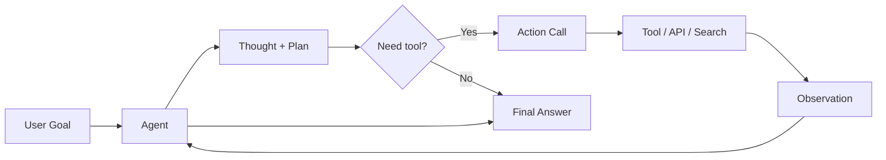

# Reasoning

> **Learning Path:** Agentic AI
> **Section:** 11.1.3 — Agent fundamentals

### 11.1.3 — Agent Fundamentals: Reasoning

**The problem**

A single LLM call is great at pattern matching. It is bad at reliable multi-step work.

When you ask for a task like "find the cheapest flight that allows a pet and book it if under $400", the model often hallucinates prices, forgets constraints, or picks a wrong tool. The problem is not knowledge, it's *execution*: planning, remembering intermediate results, using tools correctly, and correcting mistakes.

Constraints create the need:
* Tasks span multiple steps with dependencies
* The world state changes between steps
* You need verifiable actions, not just plausible text
* Cost and latency force you to do only necessary work

**Mental model**

Reasoning is iterative simulation with a scratchpad.

Instead of one-shot answer, the agent maintains an internal working memory and repeatedly:
1. Think about what it knows and what it lacks
2. Decide the next action to reduce uncertainty
3. Observe the result
4. Update its plan

Think of it as a human solving a problem on paper, not answering in one breath.

**How it works**

Reasoning is implemented as a loop, not a new model.

Two primitives make it work:
* **Chain-of-Thought:** The model is prompted to externalize intermediate steps. This improves planning but does not guarantee correctness.
* **ReAct loop:** Reason → Act → Observe. The model produces a thought, then a concrete tool call, then ingests the observation and continues. The loop provides grounding and the ability to self-correct.

The agent also needs a small persistent context: goal, history of actions/observations, and a set of tools with schemas. Without that, reasoning resets each turn.

**Architectural reasoning**

When to use reasoning agents vs a single LLM call:

Use reasoning when the task is *open-ended, multi-step, and tool-dependent*. Examples: research synthesis, ticket triage with system lookups, workflow automation.

Use a single call when the task is *closed, deterministic, and data-contained*: classification, summarization, simple extraction.

Alternatives:
* **Rules + LLM:** Hard-code the workflow, LLM only fills slots. Cheaper and deterministic, but brittle to new cases.
* **Retrieval-Augmented Generation only:** Good for grounding facts, bad for planning.
* **Reasoning agent:** More flexible, handles branching, but higher cost and variance.

You choose reasoning when the cost of a wrong answer exceeds the cost of extra tokens and latency.

**Trade-offs and failure modes**

* **Latency vs accuracy.** Each loop adds a round trip. 3-7 steps is typical. More steps = better plan, worse UX.
* **Cost.** Reasoning multiplies token usage 3-10x vs single call.
* **Non-determinism.** Same prompt can produce different plans. You need guardrails, not hope.
* **Reasoning loops and drift.** Agents can re-plan endlessly, repeat actions, or chase irrelevant paths. You need max steps, timeouts, and progress checks.
* **Tool misuse.** The model may call tools with wrong parameters or misinterpret results. Schema validation and output contracts are required.
* **Context blow up.** Long observation histories dilute the prompt. Summarization or sliding window is needed.

Failure modes to design for: hallucinated tool outputs, silent failure on tool errors, and overconfidence where the agent states a conclusion without evidence.

**Example**

Enterprise support agent for refunds.

User: "I was charged twice for order 48291 last week."

Agent reasoning:
1. Thought: Need to verify order exists, check payments, check refund policy.
2. Action: `get_order(48291)` → Observation: order exists, two charges $120.
3. Thought: Need payment timestamps to confirm duplication.
4. Action: `get_payments(48291)` → Observation: two charges same day, 2 minutes apart.
5. Thought: Policy allows refund within 30 days for duplicate charges.
6. Action: `create_refund(48291, $120)` → Observation: refund approved.
7. Final answer to user with refund ID.

A single LLM call would likely hallucinate order details. The loop grounds each step and produces an auditable trail.

**Reasoning challenge**

You are designing an agent to onboard new vendors. Steps required: validate tax ID via external API, check sanctions list, create vendor record, send welcome email. The sanctions API is flaky with 2s latency and 5% error rate.

Do you let the agent retry automatically, fail fast, or defer? What architectural guardrail do you add to prevent the agent from creating a vendor record before sanctions check completes?

**Key takeaway**

* Reasoning exists to make LLMs reliable executors, not just text generators.
* The core mechanism is an iterative Reason → Act → Observe loop with persistent context.
* Choose reasoning when tasks are multi-step, tool-dependent, and correctness matters more than cost/latency.
* Control it with max steps, tool contracts, validation, and observability; otherwise it will loop, hallucinate, and drift.
