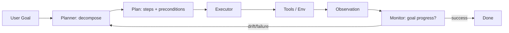

# Planning

> **Learning Path:** Agentic AI
> **Section:** 11.1.4 — Agent fundamentals

**Planning**

### The problem

An LLM is a next-token predictor. It has no memory of intent, no model of the world, and no ability to guarantee a sequence of actions will achieve a goal.

The problem appears when a user asks for something that requires multiple, ordered, contingent steps: *“Find the Q3 churn customers, check if they opened our win-back email, and draft a personalized offer if they didn’t.”*

A single completion will hallucinate steps, skip dependencies, or stop early. Without an explicit plan, the agent is reactive: it sees the current prompt and outputs the next step, with no guarantee of progress toward the original goal.

Constraints that force planning:
* Goals are abstract, multi-step, and may span tools
* Environment is non-deterministic: tools fail, return partial data, or change state
* Token and cost budgets make blind retries expensive
* The agent must be auditable and recoverable

### Mental model

Planning is building a partial, executable to-do list from a vague goal, then tracking execution and repairing it.

Think of it as: **Goal → Decomposition → Ordered Actions with Preconditions → Execution → Observation → Replan.**

Not a perfect plan up front. A living plan that is validated at each step.

### How it works

Essential mechanism is a planner-executor-monitor loop, not a single prompt.

1. **Decompose.** Planner turns the goal into sub-tasks with dependencies. This is often Chain-of-Thought or a separate planning model.
2. **Ground.** Each step is expressed as an action the agent can take: `call_tool(name, args)`, with preconditions that must be true.
3. **Execute.** Executor runs the next feasible step, captures output.
4. **Monitor & Replan.** Compare observation to expected outcome. If mismatch, failure, or new information arrives, trigger replanning instead of continuing blindly.

Planning can be flat ReAct style `thought → action → observation` per step, or hierarchical: a high-level planner sets milestones, a low-level planner fills them in.

### Architectural reasoning

Use planning when:
* Tasks are >1 step, have dependencies, or require tool orchestration
* Correctness and auditability matter more than raw latency
* Failure is expensive and needs a recovery path

Do not use heavy planning when:
* The task is single-turn and deterministic
* Latency budget is tight and errors are cheap
* A simple reactive policy already covers 95% of cases

Alternatives:
* **Pure reactive / ReAct.** Fast, cheap, works for simple tool use. Degrades on long horizons.
* **Planner-Executor.** Separates planning from execution, easier to test and cache plans.
* **Hierarchical planning.** Top-level strategic plan, bottom-level tactical execution. Good for complex domains.

Choice is driven by horizon length, error cost, and observability needs, not by “more planning is better”.

### Trade-offs and failure modes

* **Plan hallucination.** The planner invents tools or data that don’t exist. Mitigate by grounding plans against a tool schema and validating preconditions before execution.
* **Cost and latency.** Planning adds LLM calls and context. Each replan costs tokens. Budget planning depth vs. execution speed.
* **Brittleness.** A plan built on assumptions breaks when the world changes. You need monitoring and lightweight replanning, not full regeneration.
* **Over-planning.** Agents spend tokens planning details that could be discovered by executing. Good planners are *just-in-time* and *partial*.
* **State drift.** No single source of truth for plan state. Keep a durable plan artifact and execution trace for replay and audit.

### Example

Enterprise data reconciliation agent.

Goal: *“Reconcile the sales forecast vs actuals for EMEA, explain variances >10%, and notify account owners.”*

Planner produces:
1. Fetch forecast table for EMEA Q3
2. Fetch actuals table for EMEA Q3
3. Join on account_id, compute variance
4. Filter variance >10%
5. For each, fetch owner from CRM
6. Draft notification

Monitor checks after step 3: actuals table is missing two accounts. Replan step 2 to pull from backup source. Plan is persisted, execution resumes, and final trace is logged for audit.

No single prompt could reliably do this while handling missing data.

### Reasoning challenge

You are building a customer support agent that must resolve billing disputes. 80% of cases are simple: look up invoice, confirm payment, close ticket. 20% require escalation, manual review, and multi-day follow-up.

Do you use a single reactive loop, a static plan template, or a dynamic planner with replanning? What signals would you monitor to decide when to replan, and what would you log to make the system operable?

### Key takeaway

* Planning exists to bridge the gap between a vague goal and reliable multi-step execution in a non-deterministic world.
* A good agent plan is partial, grounded in available tools, and continuously validated, not perfect up front.
* Choose planning depth based on horizon, error cost, and observability, not novelty.
* The critical operational concerns are plan hallucination, replanning cost, and state observability.
