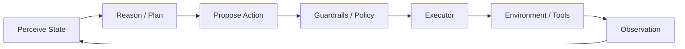

# Action

> **Learning Path:** Agentic AI
> **Section:** 11.1.5 — Agent fundamentals

**The problem**

An LLM can reason about the world, but it cannot change it. It has no write path.

You can ask it to plan a 5-step customer refund, generate the SQL, the email, and the Slack message. It will produce plausible text. It will not execute any of them, and it has no way to know if step 3 failed.

The problem that creates the need for Action is closing the perception-reasoning loop. Without a controlled way to produce side effects, an agent is a chatbot with memory. With action, it becomes a system that can operate.

Constraints that shape the design:
* **Safety:** Actions are irreversible and have business cost. Write once, regret forever.
* **Partial observability:** The agent never sees the full state, only what tools return.
* **Latency and cost:** Each action is a network hop, a human approval, or a billing event.
* **Composition:** Real tasks need sequences of heterogeneous actions: query DB, call API, write file, ask human.

**Mental model**

Agent = Perceive → Reason → Act → Observe

Action is the contract between the reasoning core and the world. It is not the LLM output. It is a validated, typed invocation of an external capability with an observable result that feeds back into the next reasoning cycle.

Think of it as an API boundary. The agent proposes an action; the execution layer decides if it is allowed, runs it, and returns a structured observation.

**How it works**

Essentially: tool schema → planning → execution → observation.

1. **Tool surface.** Each actionable capability is exposed as a tool with a strict schema: name, parameters with types, description, and a safety classification. This is the interface the model can reason over.
2. **Planning.** The agent selects a tool and binds arguments. Good agents don't generate raw JSON and hope. They generate against the schema.
3. **Guardrails.** Before execution: validation, policy check, idempotency key, rate limits, and for high-risk actions, human-in-the-loop approval.
4. **Execution.** A dedicated executor runs the tool, handles retries, timeouts, and maps results to a normalized observation.
5. **Feedback.** The observation is appended to context so the next reasoning step is grounded in real results, not assumptions.

**Architectural reasoning**

When it helps: tasks that require state change, multi-step workflows, and integration with existing systems. Ticketing, ETL, customer ops, code generation + test run, data retrieval + synthesis.

What it solves: decoupling reasoning from effect. The model can stay stateless and fast while the execution layer provides reliability, auditability, and safety.

Alternatives:
* **Direct function calling** baked into the model provider. Simple, low latency, but opaque and hard to audit.
* **Agent with code execution.** Powerful, but huge blast radius. You are running arbitrary code.
* **Workflow engine only.** Deterministic, safe, but not adaptive to novel inputs.

Choose tool-based action when you need auditability, policy enforcement, and composability across services. Choose code execution only when you control the sandbox and the problem is truly open-ended.

**Trade-offs and failure modes**

* **Autonomy vs control.** More tools = more capability, but larger attack surface. Every tool is a permission.
* **Hallucinated actions.** Model invents tool names or parameters. Mitigate with strict schema validation and a whitelist.
* **Side effects and non-idempotency.** Duplicate charges, duplicate emails. Require idempotency keys and transactional semantics.
* **Error handling.** Agents often assume success. You need explicit failure observations and retry policies, not just "it didn't work".
* **Observability gap.** If you can't trace *why* an action was chosen, you can't debug. Log plan, tool choice, arguments, policy decision, result.

**Example**

Enterprise support agent for refund processing.

Tools: `get_ticket`, `check_fraud_score`, `create_refund`, `notify_customer`, `escalate_to_human`.

The agent perceives the ticket, reasons the policy, then proposes `check_fraud_score`. Guardrails allow it. Executor returns score 92. Reasoner decides `escalate_to_human` instead of `create_refund`. Observation from escalation is fed back. Full trace is stored for compliance.

Without action, you get a suggested email. With action, you get a completed, audited workflow.

**Reasoning challenge**

You are designing an internal agent that can update pricing in a catalog. Should you expose a single `update_price(product_id, new_price)` tool, or two tools `propose_price_change` and `approve_price_change`?

Think about who bears the risk, how you enforce separation of duties, and what happens if the model hallucinates a product_id.

**Key takeaway**

* Action is the write path. It turns reasoning into observable state change.
* Model the world as tools with strict schemas, not free text.
* Separate planning from execution and enforce policy at the boundary.
* Design for failure: invalid proposals, partial results, and non-idempotent effects are normal.
* Auditability is architectural: you must be able to reconstruct why an action was taken and what it returned.
