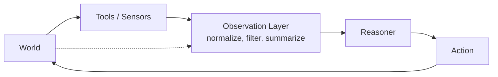

# Observation

> **Learning Path:** Agentic AI
> **Section:** 11.1.6 — Agent fundamentals

## The problem

An LLM agent has no senses and no memory of the world. It only sees what you give it in the prompt. If you ask it to book a flight, manage inventory, or triage support tickets, it needs a current, reliable picture of the world to reason about.

Without a deliberate observation layer, you get one of three failures:
* **Stale reasoning** - the agent acts on old data because the world changed after the last turn
* **Noise overload** - raw tool outputs flood the context, drowning signal in logs, JSON, and debug text
* **Blind spots** - critical state is never surfaced, so the agent hallucinates a plan

Observation is the bridge between an opaque, changing world and a stateless reasoner.

## Mental model

Think of observation as a curated sensor feed, not raw data dump.

World -> Sensors/Tools -> Observation Layer -> Agent

The observation layer is an API contract: it defines *what* the agent is allowed to perceive, *how* it is formatted, and *when* it is updated. It turns messy reality into a stable, actionable snapshot the model can reason over.

Partial observability is the default. The agent never sees everything, only what you choose to observe.



## How it works

The loop is Perceive -> Reason -> Act -> Perceive.

Observation is the Perceive step, and it has three jobs:

1. **Acquire** - call tools, poll state, ingest user input, read telemetry. This is where latency and cost are incurred.
2. **Normalize** - map heterogeneous sources to a common schema the agent understands. Tool A returns Postgres rows, Tool B returns an API JSON. Both become `inventory { sku, qty, location }`.
3. **Curate** - filter noise, summarize history, and enforce freshness. You decide what to keep in context now vs what to retrieve on demand.

Good observations are structured, timestamped, and bounded in size. Bad observations are raw dumps with no schema and no staleness signal.

## Architectural reasoning

When it helps: any autonomous loop where state matters and changes between turns.

You need explicit observation design when:
* Multiple tools produce overlapping signals
* The world changes faster than the agent's reasoning cadence
* Token budget is constrained, so you must choose what to surface

Alternatives:
* **Raw passthrough** - dump tool output directly into the prompt. Cheap to build, expensive to run, fragile.
* **Full state replay** - send entire history each turn. Complete but explodes context and cost.
* **Structured observation** - keep a canonical state representation, update incrementally, and only surface deltas.

Choose structured observation when reliability and cost matter more than initial build speed. Choose raw passthrough for prototypes only.

## Trade-offs and failure modes

* **Fidelity vs cost.** More detail improves reasoning but increases tokens and latency. Summarize aggressively for high-volume signals, keep raw for decision-critical signals.
* **Freshness vs overhead.** Polling guarantees recency but wastes calls. Event-driven updates are efficient but can miss silent failures. Add a staleness TTL and explicit refresh actions.
* **Completeness vs focus.** The agent cannot reason about what it cannot see, but it also cannot reason about too much. Observation design is selection, not collection.
* **Failure modes to expect:** Stale observation leading to repeated failed actions; observation drift where different tools disagree on truth; prompt injection via untrusted tool output; and context overflow from unbounded history.

If you do not version your observation schema, tool changes silently break agent reasoning.

## Example

Enterprise support triage agent.

Tools: Zendesk tickets, internal knowledge base search, user Slack message.

Observation layer builds a single snapshot per turn:
```
{
  "timestamp": "2026-01-10T12:04:00Z",
  "active_ticket": { "id": 8421, "priority": "high", "last_update": "..." },
  "relevant_kb": [ { "id": "KB-112", "score": 0.91 } ],
  "user_intent": "refund request"
}
```

The agent never sees raw Zendesk HTML or the full KB corpus. It sees a curated, timestamped view. When the ticket is updated by a human agent, an event pushes a new observation, invalidating the previous plan.

This makes reasoning deterministic and debuggable. You can replay exactly what the agent perceived.

## Reasoning challenge

Your agent manages inventory and places purchase orders. Inventory is updated by 3 warehouses via webhooks, but one warehouse is unreliable and sometimes sends duplicate events. Token budget is tight.

Do you:
A) Send the agent the last 50 raw webhook payloads each turn
B) Maintain a normalized `inventory_state` table and send only deltas since last observation with a last_updated timestamp
C) Poll each warehouse synchronously before every action

What breaks first with your choice, and what observation contract would you design?

## Key takeaway

* Observation is a design decision, not a data dump. It defines what the agent can know.
* Curate for fidelity, freshness, and token budget. Normalize across tools and timestamp everything.
* Partial observability is inevitable. Make the gaps explicit so the agent can request more info.
* Staleness and noise kill agentic reliability faster than model quality.
