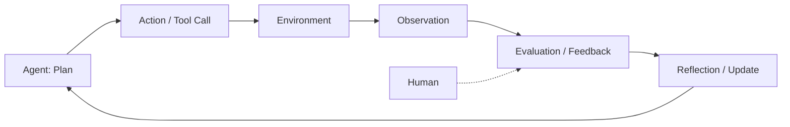

# Feedback

> **Learning Path:** Agentic AI
> **Section:** 11.1.7 — Agent fundamentals

**Feedback**

### 1. The problem

An LLM can generate a plan and call tools, but without a closed loop it is open-loop generation. The agent acts, the world changes, and the agent never reliably learns that it was wrong.

The problem appears when:
* Actions have consequences you cannot reason about statically - code compiles, API returns 500, user still confused
* The goal is long-horizon and partially observable - success is only visible after many steps
* The environment changes - data drifts, tools change, user intent is ambiguous

Without feedback the agent repeats mistakes, hallucinates success, and drifts. With only self-generated text as signal, you get confabulation instead of correction.

### 2. Mental model

Feedback is the error signal that closes the agent loop.

`Belief -> Plan -> Action -> Observation -> Feedback -> Update Belief`

The agent is not just a reasoner, it is a control system. Feedback tells it the gap between intended outcome and actual outcome, and provides the material for reflection and replanning.

Think of it as a thermostat: the setpoint is the goal, the action is heating/cooling, the sensor is the observation, and the feedback is the temperature delta that drives the next action.

### 3. How it works

The essential mechanism is: execute, observe, evaluate, adapt.

* **Execution feedback** - immediate, environment generated. Did the tool succeed? Did the SQL run? Did the test pass? This is cheap, objective, and fast.
* **Outcome feedback** - delayed, goal generated. Did the ticket get resolved? Did conversion increase? This is sparse and noisy but aligns with real value.
* **Human feedback** - explicit or implicit. Accept/reject, edit, rating, or even pause/correction mid-task. High signal, high cost.
* **Self feedback** - internal critique and consistency checks. The agent critiques its own output before acting. Cheap but prone to bias.

These signals feed reflection: summarise what happened, identify the failure mode, update the plan or the model.

### 4. Architectural reasoning

Feedback makes agentic systems viable. It solves the credit assignment problem across steps.

Choose feedback when:
* Action space is real and stateful. You need grounding, not just plausible text.
* Errors are costly. You want self-correction before human escalation.
* You can instrument the environment. Tools, tests, and business metrics can be observed.

Alternatives:
* **No feedback, pure prompting**: cheapest, works for one-shot generation. Fails on multi-step reliability.
* **Static validation only**: schema checks, guardrails. Catches format errors, not semantic errors.
* **Offline RL / fine-tuning on logs**: improves base model, slow to adapt to live changes.

Feedback enables online adaptation without full retraining. The architecture decision is where the loop runs and how often.

### 5. Trade-offs and failure modes

* **Latency vs signal quality.** Execution feedback is fast and cheap. Outcome feedback is slow and expensive. Too much waiting creates stale plans.
* **Reward hacking.** The agent optimizes for the measured signal, not the real goal. E.g., maximizing ticket closure rate by closing tickets without resolution.
* **Feedback starvation.** Sparse or noisy signals lead to oscillation or overconfidence. Self-critique without external grounding drifts.
* **Cost and operability.** Human-in-the-loop gives best signal but creates bottleneck. You must design sampling, escalation thresholds, and feedback storage.
* **Non-stationarity.** Feedback from yesterday may not hold today. You need decay, versioning, and a way to distinguish environment change from agent error.

### 6. Example

Enterprise support agent that triages tickets and runs remediation playbooks.

The agent drafts a fix, executes a runbook step via tool, and gets execution feedback: command succeeded, service health improved, or API returned error. If execution fails, reflection triggers replanning with a different tool.

If the ticket is marked resolved by the user, that outcome feedback is logged with the trace. Over time the agent learns which playbooks succeed for which symptoms, and self-critique is weighted higher for high-risk actions.

The loop is: generate plan -> execute -> observe tool result -> reflect -> replan if needed -> request human review only when confidence < threshold.

### 7. Reasoning challenge

You are designing an agent that generates SQL queries against a live warehouse and presents results to analysts.

You can get instant execution feedback from `EXPLAIN` and run results, and delayed outcome feedback from analyst edits and re-runs. You have a limited human review budget.

Where do you place feedback in the loop, and what do you automate vs escalate?

### 8. Key takeaway

* Feedback is what turns a generative model into a closed-loop agent.
* Execution feedback grounds the agent; outcome feedback aligns it; human feedback calibrates it.
* Design the loop before the prompt. Decide signal source, latency, and update mechanism.
* The biggest risks are reward hacking and feedback starvation, not lack of reasoning.
