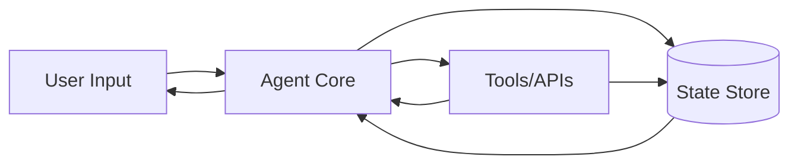

# State

> **Learning Path:** Agentic AI
> **Section:** 11.1.8 — Agent fundamentals

**State in Agentic AI**

### 1. The problem

An LLM is stateless. Each request is an isolated inference over a context window. An agent, however, must act over time: track what the user said 5 turns ago, remember which tool was called, know that the booking was created, and avoid repeating work.

Without state, you get:
* Amnesia between turns
* Re-derivation of facts the agent already knows
* Inability to recover from failures or continue a workflow
* Hallucinated continuity because the model tries to invent memory

The constraint is not the model, it is the system. You need continuity across stateless inferences, tool side effects, and a changing world.

### 2. Mental model

Think of state as the agent's working memory + the snapshot of the world it cares about.

* **Session state:** transient conversation progress, current intent, pending parameters
* **Persistent state:** user profile, preferences, entity records, long-term memory
* **World state:** external reality the agent must reflect: tickets, orders, inventory, calendar

The LLM is the reasoning engine. State is the substrate it reads and writes to stay coherent.

### 3. How it works

A typical agent loop:

On each turn:
1. Load relevant state + recent context
2. Reason over state + user input
3. Decide action: ask clarification, call tool, or produce output
4. Write back deltas to state: updated intent, tool results, world changes

State is explicit, not implicit in the prompt. The prompt contains a view of state, not the source of truth.

### 4. Architectural reasoning

State exists to decouple reasoning from memory.

**When it helps**
* Multi-turn tasks with dependencies
* Tool use with side effects that must not be repeated
* Personalization across sessions
* Recovery and replay after failure

**Alternatives and why they fail**
* Pure in-context memory: cheap but limited, expensive, leaks, not durable
* Relying only on vector memory: good for recall, bad for structured, updatable facts
* Storing everything in the LLM: no consistency, no auditability

Decision factors:
* **Scope:** session-only vs user-level vs organization-level
* **Structure:** typed schema for workflow state vs free-text memory
* **Consistency model:** strong consistency for transactional world state, eventual for preferences

### 5. Trade-offs and failure modes

* **Centralized vs distributed state.** A single store simplifies consistency but becomes a bottleneck and SPOF. Per-agent local state scales but requires reconciliation for multi-agent collaboration.
* **Durability vs latency.** Writing every micro-update to durable DB adds latency. Buffering improves speed but risks loss on crash.
* **Explicit vs implicit state.** Explicit schemas are auditable and testable. Implicit state in conversation history is flexible but drifts and is hard to migrate.
* **Freshness vs cost.** Polling world state is expensive. Event-driven updates are cheaper but increase complexity.

Common failures:
* **State drift:** model believes a booking exists, DB does not. Fix with read-after-write and source-of-truth enforcement.
* **Stale context:** agent acts on outdated user profile. Fix with TTLs and invalidation signals.
* **Context bloat:** loading entire history into the prompt. Fix with selective summarization and retrieval.

### 6. Example

Enterprise support agent with CRM.

Session state holds `current_intent=refund`, `missing_fields=[order_id]`.
Persistent state holds `user_id`, `plan`, `risk_score`.
World state is read from CRM: orders, tickets.

User: "I want a refund". Agent loads session state, sees missing order_id, asks for it. User provides it. Agent calls CRM tool, writes `order_id` to session state and updates `world_state.last_checked_order`. On next turn, state prevents re-asking and allows the agent to reason about eligibility without re-fetching the user profile.

If the process crashes after tool call but before write, replay uses idempotent tool calls keyed by state version.

### 7. Reasoning challenge

You have two agents collaborating: a Triage Agent and a Booking Agent. Both read/write a shared `booking_draft` state.

Triage collects preferences, Booking confirms availability and creates the reservation.

Should the draft live in one central store with strong consistency, or in each agent's local state with periodic sync? What breaks if the user edits preferences while Booking is finalizing?

### 8. Key takeaway

* State is the continuity mechanism that makes a stateless model act like an agent.
* Separate session, persistent, and world state. Know which source of truth owns each.
* Design writes first, reads second: make state updates explicit, versioned, and recoverable.
* Trade consistency, latency, and scope deliberately; state mistakes show up as drift, repetition, and hallucinations.
