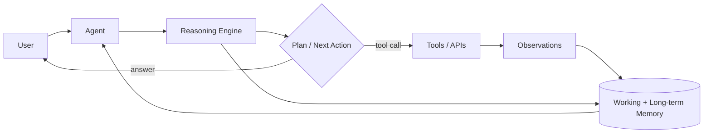

# Goals

> **Learning Path:** Agentic AI
> **Section:** 11.1.9 — Agent fundamentals

**11.1.9 — Agent fundamentals**

### The problem

A chat LLM is stateless, single-turn reasoning with a fixed context window. It can answer, summarize, and follow instructions well enough for one request.

It fails when the task requires:
* Persistent goal over multiple steps
* Access to external state and actions
* Correction of its own mistakes
* Use of tools with side effects

You get brittle prompts, prompt leakage, and a model that hallucinates when it cannot know. The problem is not comprehension, it's closed-loop autonomy.

### Mental model

An agent is a closed loop: **Perceive → Reason → Act → Remember → Repeat**.

The LLM is the reasoner, not the system. Tools are actuators. Memory is state. A controller decides when to think, when to act, and when to stop.

Think of it as a software robot with a very capable brain but no hands or long-term memory unless you give them to it.

### How it works

The essential mechanism is the agent loop:

1. **Perception.** Gather context from user input, memory, and tool outputs.
2. **Reasoning.** LLM generates a plan or next step. Often via ReAct-style thought: `Thought → Action → Observation`.
3. **Action.** Call a tool, query a database, send an email, browse. Tools return structured observations.
4. **Memory.** Update working memory for the current session and persist relevant facts to long-term memory for future sessions.

No magic. The model stays stateless; the loop provides state. Planning can be implicit in the prompt or explicit with a planner module. Tool use is constrained by schemas and validation.

### Architectural reasoning

When it helps:
* Multi-step workflows where the correct next step depends on previous results, e.g., triage → search → retrieve → summarize → act.
* Tasks requiring tool access the model cannot know, e.g., live pricing, internal ticketing, code execution.
* Goals that must persist across conversations.

Alternatives:
* **Simple chatbot / RAG.** One-shot answer with retrieval. Cheaper, faster, more predictable. Use when the task is bounded and read-only.
* **Hard-coded workflow.** Deterministic orchestration. Use when steps are fixed and low variance.

Choose an agent when you need autonomous decomposition and tool use, and you can tolerate non-determinism. Choose a workflow when the path is known and must be auditable.

### Trade-offs and failure modes

* **Autonomy vs control.** More freedom = better coverage, worse predictability. Agents drift, loop, or take wrong tools. Mitigate with guardrails, tool allowlists, max steps, and human-in-the-loop for high risk actions.
* **Hallucination propagation.** A bad tool observation or a hallucinated plan compounds. Validate tool outputs and require structured outputs.
* **Cost and latency.** Each loop is an LLM call + tool latency. A 5-step task can be 5x cost and seconds to minutes. Budget tokens and cache where possible.
* **Observability.** Traditional logs are insufficient. You need trace the plan, tool calls, observations, and memory writes per run to debug failures.
* **Memory correctness.** Long-term memory can become stale or poisoned. Need eviction policies, provenance, and confidence scoring.

Most production failures are not model quality, they are missing loop controls: no stop condition, no error handling on tool failure, no memory boundaries.

### Example

Enterprise support triage agent.

Problem: 10k tickets/day, need to classify, pull customer history, check KB, create Jira if needed.

Architecture:
* Perception: ticket text + customer ID
* Memory: vector store for past tickets, SQL for customer profile
* Tools: `search_kb`, `get_customer_history`, `create_jira`, `send_reply`
* Controller: ReAct loop with max 6 steps, tool schema validation, policy check before `create_jira`

Result: agent handles ~70% tickets end-to-end, escalates edge cases. Cost is controlled by caching KB results and short-circuiting on low confidence.

### Reasoning challenge

You need an agent to reconcile daily bank transactions against an internal ledger, flag mismatches, and create adjustment requests.

Would you give the agent write access to the ledger directly, or only to a staging table with human approval? What loop controls would you add to prevent infinite reconciliation loops?

### Key takeaway

* An agent is a loop of perception, reasoning, action, and memory, not a smarter LLM.
* The LLM provides flexible reasoning; tools, memory, and controls provide safety and state.
* Use agents for open-ended, multi-step, tool-requiring goals. Use RAG or workflows when the path is fixed.
* Architect for failure: limit steps, validate tools, trace decisions, and bound memory.
