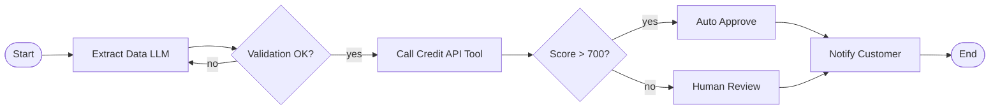

# Workflow agent

> **Learning Path:** Agentic AI
> **Section:** 11.2.10 — Agent patterns

**Workflow Agent**

### 1. The problem

An LLM can write a plan, call tools, and reason about the next step. That works for open-ended tasks like "research this topic".

It fails for business processes where *order matters, steps are mandatory, and you need proof it happened*. 

You need:
* Guaranteed sequence: extract data → validate → call credit API → route for approval → notify customer
* Deterministic error handling and retries per step
* Human-in-the-loop at specific checkpoints
* Audit trail for compliance

A free-form ReAct agent will skip steps, repeat steps, hallucinate outputs, and cannot be audited. You cannot ship that to finance or ops.

### 2. Mental model

Think assembly line, not a self-driving car.

A workflow agent is an orchestrator that executes a predefined graph of steps. The LLM is a worker inside each step, not the foreman.

The graph defines *what* happens and *when*. The LLM decides *how* to do its node.

### 3. How it works

A workflow is a state machine with nodes and edges.

Orchestrator responsibilities:
* Load current state, persist it
* Execute node with inputs + LLM/tool
* Check guard conditions and route
* Handle retries, timeouts, compensation
* Emit events for observability

The LLM is scoped to one node: "Given these fields, extract structured data". Not "do the whole loan".

### 4. Architectural reasoning

**When it helps**
* Regulated, auditable processes: loan approval, claims, KYC
* Multi-system coordination with strict ordering
* Need for human approval gates
* Predictable latency and cost per execution

**Alternatives**
* **ReAct / Autonomous agent:** Flexible, good for exploration. Bad for compliance and repeatability.
* **Planner agent:** Generates plan at runtime. Still non-deterministic.
* **Workflow agent:** Pre-defined control flow, LLM fills in content.

Choose workflow when correctness and auditability > flexibility. Choose autonomous when the task is ill-defined and you can tolerate variance.

### 5. Trade-offs and failure modes

* **Rigidity vs adaptability.** Changing the graph requires a deploy. If business rules change weekly, workflow becomes tech debt.
* **Error propagation.** A failure in node 3 leaves partial state. You need idempotent nodes and compensating actions.
* **State management.** Long-running workflows need durable execution. In-memory orchestration loses work on crash.
* **LLM brittleness inside nodes.** The graph doesn't fix bad outputs. You still need validation schemas, retries with different prompts, and tool output checks per node.
* **Over-engineering.** Not every task needs a workflow. Simple 2-step tool calls are cheaper as a single agent call.

### 6. Example

Enterprise loan pre-approval:

1. `ExtractApplication` LLM parses PDF application into JSON schema
2. `Validate` rule engine checks required fields, formats
3. `Enrich` tool calls credit bureau API
4. `RiskScore` LLM summarizes risk factors from notes + data
5. `DecisionGate` if score > 700 → auto approve, else → human review task
6. `Notify` sends templated email

Each step is logged with input/output/actor. Regulators can replay the exact path. Human reviewer sees only the relevant node context, not a free-form chat history.

### 7. Reasoning challenge

You are building a medical triage assistant. It must collect symptoms, check contraindications against a drug database, and if risk is high, escalate to a human doctor before suggesting treatment.

Do you use a workflow agent with a mandatory `Human Review` gate, or an autonomous agent that can decide when to escalate? What breaks if you choose wrong?

### 8. Key takeaway

* Workflow agents trade autonomy for determinism, auditability, and control.
* Use them for multi-step business processes with compliance, approvals, and retries.
* LLM stays inside nodes; orchestrator owns the graph and state.
* The main risks are rigidity, state durability, and validation of LLM outputs per step.
