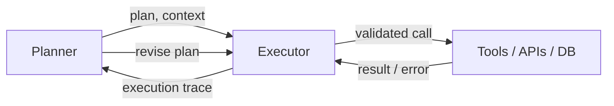

# Executor

> **Learning Path:** Agentic AI
> **Section:** 11.2.3 — Agent patterns

### The problem

An LLM is good at planning and bad at reliably doing. When a single agent both reasons *and* executes tool calls in one loop you get:

* Hallucinated parameters and tool names
* No retry, idempotency or backoff for flaky APIs
* Side effects committed while the model is still reasoning
* No separation of safety/policy from planning
* Hard to observe, test and rate-limit execution

The problem is not tool calling. The problem is mixing non-deterministic planning with deterministic, stateful, irreversible execution in the same component.

### Mental model

Planner is the architect. Executor is the foreman.

The architect produces a step-by-step plan. The foreman reads the plan, translates it to real work, enforces site rules, retries when a wall falls, and reports back what actually happened. The architect never touches power tools.

### How it works

A Planner produces an intent and a structured plan: steps, inputs, expected outputs, preconditions. The Executor receives that plan and owns execution.

Essential mechanism:
* **Validation & mapping:** Plan steps are mapped to concrete tool schemas. Missing params are resolved, not hallucinated.
* **Execution policy:** Retries with backoff, timeouts, idempotency keys, circuit breaking.
* **State tracking:** Tracks which steps succeeded, failed, or are in-flight. Maintains execution context separate from the model context window.
* **Safe feedback:** Returns structured results, not raw tool output, to the Planner for the next reasoning step.

The loop is Planner → Executor → feedback → revise, not a single ReAct step.

### Architectural reasoning

Use Executor when execution has real-world cost and constraints.

* It helps when tools have side effects, require auth/rate limits, or must be audited.
* It solves the coupling of reasoning quality to execution reliability. You can improve the Planner without changing tool safety logic, and vice versa.
* Alternatives: monolithic ReAct agent where LLM calls tools directly; or fully hard-coded workflows. Executor sits between: flexible planning with operational guardrails.

Choose it when you need separation of concerns for reliability, security, and observability more than you need minimal latency.

### Trade-offs and failure modes

* **Latency and complexity.** An extra hop and a contract between Planner and Executor adds latency and needs a clear plan schema.
* **Plan-execution mismatch.** The Planner can produce steps the Executor cannot perform. You need validation at hand-off and a way to request clarification.
* **State drift.** If the Executor mutates external state, the Planner's world model can become stale. Execution traces must be the source of truth.
* **Over-abstraction.** If every step is trivial and safe, the Executor adds no value. The pattern pays off with non-trivial, risky, or long-running actions.

Failure modes to design for: unrecoverable tool errors, partial failures in multi-step plans, permission escalation, and unbounded retries burning cost.

### Example

Enterprise customer onboarding.

Planner: "Onboard new enterprise customer X." Produces plan:
1. Create CRM account with email, tier
2. Provision sandbox in infra API
3. Create billing subscription
4. Send welcome email

Executor owns execution. It validates each step against schemas, generates idempotency keys, retries provision API with backoff, checks CRM response codes, logs each action for audit, and returns a structured trace:
`step 2 failed: quota exceeded`. Planner then revises to request quota increase or choose alternate region.

The LLM never sees raw infra errors. Ops can monitor Executor metrics without touching the model.

### Reasoning challenge

You are building an agent that can read a support ticket and refund a customer. The refund tool is irreversible, rate-limited, and requires manager approval over $500.

Do you let the Planner LLM call the refund tool directly with a guardrail prompt, or route all refund calls through an Executor service with policy checks, approval workflow, and idempotency? What breaks if the Planner changes its refund amount mid-execution?

### Key takeaway

* Executor exists to separate non-deterministic planning from deterministic, safe execution.
* It trades latency and schema complexity for reliability, observability, and policy enforcement.
* Use it when tool calls have side effects, cost, or safety requirements that an LLM should not own directly.
* The contract between Planner and Executor is the design surface: clear steps, validation, and execution traces.
