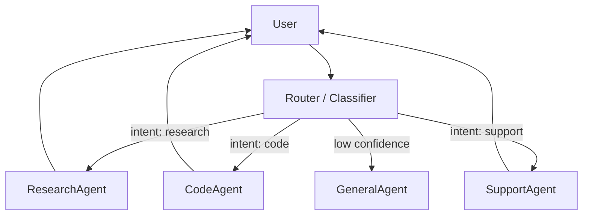

# Router

> **Learning Path:** Agentic AI
> **Section:** 11.2.4 — Agent patterns

**Router — Agent pattern**

### 1. The problem

A single agent trying to do everything gets bad at everything. As an agentic system grows you accumulate specialists: a research agent with web tools, a coding agent with a sandbox, a finance agent with internal APIs, a summarizer, a compliance checker. 

You also accumulate constraints: different models have different cost/latency, some tasks need tools, some need high accuracy, some need guardrails. Routing every request to the same agent means you pay for unnecessary tool calls, you violate latency SLOs, and you get hallucinations on domains the agent wasn't built for.

The problem is triage: *which capability should handle this request, right now?*

### 2. Mental model

A router is a triage nurse, not a worker. It doesn't solve the user's problem; it classifies the intent and hands it to the right specialist with the right context.

The mental model is **classify then delegate**. The router owns the decision boundary, the downstream agents own execution.

### 3. How it works

The router receives the user request and context, produces a routing decision, and forwards to one or more agents.

Mechanism is simple:
* **Classification**: rule-based keywords, embedding similarity to agent descriptions, or a small classifier LLM.
* **Decision**: pick agent, model, or tool set. Sometimes route to multiple agents in parallel then merge.
* **Context passing**: forward conversation history, constraints, and routing metadata.

The router can be static or learned. Early systems use a routing table; mature systems learn from success signals like completion rate and user satisfaction.

### 4. Architectural reasoning

When it helps:
* You have clear capability boundaries and distinct specialists.
* Cost/latency varies significantly across agents or models.
* You need to isolate failure domains and enforce policy per task type.

What it solves:
* Avoids over-provisioning a monolith.
* Enables model specialization: route simple queries to cheap model, complex reasoning to larger model.
* Makes the system evolvable: add a new agent without changing existing agents.

Alternatives:
* **Monolithic agent with all tools** — simpler, but tool selection becomes noisy and expensive.
* **Orchestrator / Supervisor** — actively coordinates multi-step workflows. Use router for first-hop dispatch, orchestrator for multi-agent planning.
* **Always-on ensemble** — run all agents and pick best answer. Higher cost, no routing benefit.

Choose router when dispatch is primarily about *which* specialist, not *how* to sequence specialists.

### 5. Trade-offs and failure modes

* **Routing errors are silent failures.** Misclassification sends the request to the wrong specialist. The downstream agent often still produces a plausible answer, so you won't notice until quality degrades. You need observability on routing confidence and per-agent outcomes.
* **Latency adds up.** Classification is an extra hop. For simple intents, a tiny classifier model keeps overhead low; a full LLM router can be expensive.
* **Coupling via taxonomy.** The router encodes an intent taxonomy. When business needs change, you must update the taxonomy, agent descriptions, and evaluation data together.
* **Cold start and imbalance.** New agents get few samples; popular agents get overloaded. You need routing fairness and load awareness.

Common failure mode: routing based only on keywords. "How do I refund?" vs "How do I build a refund system?" are different intents with same keywords.

### 6. Example

Enterprise support with three specialists:
* SupportAgent — FAQs, ticket creation
* ResearchAgent — external docs, web search
* InternalAgent — CRM, billing APIs

Router first classifies intent from the user message and history. A refund question with no account context routes to SupportAgent. A question referencing an order ID routes to InternalAgent. A request for "latest pricing trends" routes to ResearchAgent.

If confidence < 0.7, route to GeneralAgent with a prompt to ask clarifying questions instead of guessing. Routing decisions are logged with the final CSAT to retrain the classifier.

### 7. Reasoning challenge

You have a customer-facing agent that handles 1M requests/month. 70% are simple FAQs, 20% need database lookups, 10% need human escalation. Your current monolith uses GPT-4 for all requests at $0.03 per query.

You can build a router with a cheap classifier and route FAQs to a small model at $0.001, lookups to a tool-augmented agent, and escalations to human. Routing adds 80ms p95 latency and a 3% misroute rate where FAQs go to the expensive path.

Do you deploy the router now, or wait until misroute rate can be <1%? What metric would you track to decide?

### 8. Key takeaway

* Router exists to decouple *what* to do from *who* does it, enabling specialization, cost control, and isolation.
* It classifies intent and delegates; it does not execute.
* Value comes from clear capability boundaries and measurable routing accuracy.
* Watch for silent misrouting, taxonomy drift, and added latency as primary risks.
