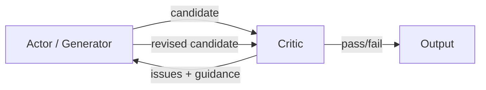

# Critic

> **Learning Path:** Agentic AI
> **Section:** 11.2.6 — Agent patterns

**Critic — Agent patterns**

### The problem

A single LLM pass is optimistic. It generates an answer, then stops. In production agents that answer is wrong, incomplete, non-compliant, or subtly unsafe, and you only find out after delivery.

The constraint is not intelligence, it's verification. You need quality, safety, and adherence to constraints without human-in-the-loop on every turn, but you can't trust the generator to self-evaluate honestly in one shot.

Without a check, you get hallucinated facts, missed requirements, bad tool use, and drift over multi-step plans.

### Mental model

Think editor, not second author.

The Actor generates a candidate output. The Critic reads the output + context + criteria and returns a structured critique: what is wrong, why it matters, how to fix it. The Actor then revises.

It is deliberate separation of concerns: generation vs evaluation. The same model can play both roles with different prompts, or you can use a smaller, cheaper, or rule-based critic.

### How it works

The core loop is Generate → Critique → Revise.

Essential mechanism:
1. **Criteria binding.** The critic is not generic "is this good?". It evaluates against explicit criteria: factuality, format, policy, tool-use correctness, business rules.
2. **Structured output.** Critique is returned as a machine-readable object: `issues[]`, `severity`, `suggested_fix`. This enables automated revision instead of free-text feedback.
3. **Bounded iteration.** A max loop count and an acceptance threshold stop the loop. Pass = meets criteria, Fail = escalate to human.

Implementation options:
* **Self-critic:** same model, system prompt switched to reviewer mode. Cheap, but prone to bias.
* **Separate critic model:** different model, often smaller and cheaper, or specialized for verification. Better independence.
* **Hybrid critic:** LLM critique + rule checks. Rules catch hard constraints fast; LLM catches semantic issues.

### Architectural reasoning

When it helps:
* Output quality is business critical and errors are costly: code, finance, legal, medical summaries.
* You have verifiable criteria that can be expressed as checks, not just taste.
* You need self-correction without a human reviewer on every request.

What it solves vs alternatives:
* **vs Guardrails only:** Guardrails block bad output. Critic improves good output. Use both: critic for quality, guardrail for safety.
* **vs More prompting:** "Be careful" does not create a feedback loop. Critic creates one.
* **vs Retrieval alone:** Retrieval reduces hallucination, critic reduces logic and compliance errors on top of retrieval.

Decision heuristic: Use a critic when the cost of a bad answer > cost of an extra LLM call + latency. Do not use it for low-stakes, high-throughput chat where latency matters more than perfection.

### Trade-offs and failure modes

* **Latency and cost.** Each iteration adds tokens and time. 1-3 rounds is typical; beyond that you pay diminishing returns.
* **Critic is also an LLM.** It can hallucinate issues, be overly harsh, or agree with the actor due to shared priors. Independence matters.
* **Over-correction and collapse.** The actor can chase the critic into safe but vacuous outputs.
* **Infinite loop.** Without a clear acceptance criteria and max iterations, the loop never converges.
* **Criteria drift.** If criteria are vague, the critic becomes a second generator with no ground truth.

Mitigations: make criteria explicit and testable, use structured critique schemas, cap iterations, log critic decisions for audit, and combine with deterministic checks.

### Example

Enterprise code generation agent.

Actor generates a pull request diff for a feature request. Critic evaluates against criteria:
* Does code compile and pass existing tests?
* Does it follow style guide and security policy?
* Are all acceptance criteria from the ticket addressed?

Critic returns: `issue: missing input validation, severity high, suggestion: add zod schema`. Actor revises. Second pass: critic runs static analysis tool output as part of its context and confirms pass.

This is cheaper and faster than human review for first pass, and creates an auditable trail of why changes were made.

### Reasoning challenge

You are designing a customer support agent that generates refund policy explanations. Latency SLO is <800ms p95. Error tolerance is low: a wrong policy statement triggers compliance risk.

Do you add a Critic loop, a hard-coded guardrail, or both? What criteria would you give the critic, and how would you bound the loop to meet latency?

### Key takeaway

* Critic exists to add a verifiable feedback loop to generation, not to make the model smarter.
* Separate generation from evaluation; bind evaluation to explicit, testable criteria.
* Use Critic when quality > latency and cost; bound iterations and combine with deterministic checks.
* A good critic is specific, structured, and independent. A bad critic is vague, chatty, and expensive.
