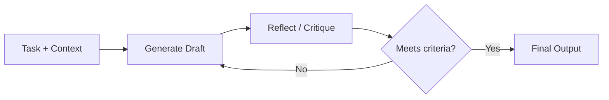

# Reflection

> **Learning Path:** Agentic AI
> **Section:** 11.2.7 — Agent patterns

**The problem**

A single-pass LLM is fast and cheap, but it has no built-in verification. It will confidently produce a plausible answer that is wrong, incomplete, or violates constraints. For agentic work where error cost is high — code generation, planning, financial summaries, compliance checks — you cannot ship the first draft.

You could scale the model, sample more, or add external validators. Those work, but they push verification outside the agent. Reflection brings a lightweight verification loop inside the agent.

**Mental model**

Reflection is drafting then editing your own work. The agent generates a candidate output, then switches to a critic role to evaluate it against criteria, and revises. The critic can be the same model with a different prompt, or a separate model.

It is not chain-of-thought. CoT is reasoning to produce an answer. Reflection is reasoning about the answer after it exists.

**How it works**

The core loop is generate → critique → revise, repeated for 1-3 iterations.

Critique is explicit and criteria-driven: factual consistency, completeness, format compliance, safety, adherence to user constraints. The revision prompt includes the draft plus the critique, often with instructions like "Fix the identified issues without changing intent."

In practice:
* **Self-reflection:** same model, system prompt changes role from writer to reviewer.
* **Separate critic:** stronger or different model for critique, reduces self-bias.
* **Reflection with tools:** critique can trigger tool calls for verification before revising.

**Architectural reasoning**

Use reflection when correctness matters more than raw latency and you cannot reliably validate externally.

It helps when:
* Output quality is non-uniform and errors are subtle — code, SQL, multi-step plans.
* You have clear evaluation criteria you can prompt for — style guide, schema, business rules.
* One high-quality answer is cheaper than many samples.

Alternatives:
* **ReAct / tool use:** delegate verification to tools. Better for ground truth, worse for subjective quality.
* **Self-consistency / best-of-N:** generate many candidates and pick. Good for reasoning tasks, costly.
* **Larger model:** improves first-pass quality but does not guarantee verification.

Choose reflection when you want iterative improvement with bounded compute, and the task is self-contained enough to critique without external data.

**Trade-offs and failure modes**

* **Latency and cost multiply.** Each iteration is a full forward pass. 2-3x tokens is typical. Diminishing returns after 2 iterations.
* **Echo chamber.** The same model tends to agree with itself. Critic is lenient, reinforcing initial errors. Mitigate with separate critic model or explicit checklists.
* **Over-refinement.** The agent changes correct content to fit perceived flaws, drifting from intent. Anchor revision to original task.
* **No ground truth.** Reflection improves coherence, not factual accuracy unless critique can access sources. Combine with retrieval or tool verification for factual tasks.
* **Termination.** Need a max iteration cap and acceptance criteria, otherwise loops.

**Example**

Enterprise contract summarizer.

Task: Summarize a 30-page MSA into a 10-bullet risk summary for legal review.

First pass often misses carve-outs, mixes obligations with rights, and hallucinates dates. 

Architecture: Generate draft summary → Reflect with checklist: coverage of payment, termination, liability cap, indemnity, data processing, missing sections? → Revise. Second reflection checks for hallucinations vs source text spans. Output is emitted with citations.

Reflection catches omissions a single pass misses, without requiring a human reviewer for every doc. Cost is ~2.5x tokens, acceptable given legal risk.

**Reasoning challenge**

You are building an agent that generates SQL from natural language for an internal analytics warehouse. Queries are business-critical, but latency SLA is <2s p95. Would you use reflection, best-of-N, or tool-based execution validation? What would you change if the SLA were <500ms?

**Key takeaway**

* Reflection exists to add a cheap internal verification loop when first-pass errors are expensive.
* It trades latency and cost for higher quality and self-consistency.
* It improves coherence and completeness, not ground truth; pair it with tools when facts matter.
* Design the critique explicitly with criteria, cap iterations, and watch for self-agreement bias.
