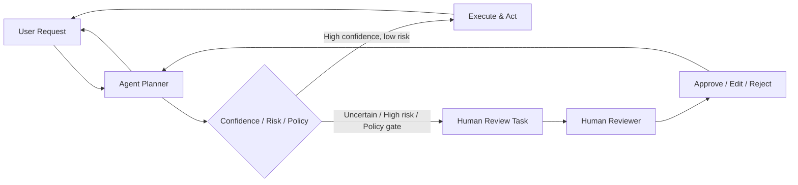

# Human-in-the-loop

> **Learning Path:** Agentic AI
> **Section:** 11.2.8 — Agent patterns

**Human-in-the-loop**

### 1. The problem

Agentic AI can act autonomously: plan, tool-use, and execute. That autonomy is the value. It is also the risk.

When an agent makes a decision with high cost of error, low confidence, or regulatory exposure, full autonomy fails. It hallucinates facts, misinterprets ambiguous input, violates policy, or takes irreversible actions like sending money, approving a loan, or modifying production code.

You cannot simply add more guardrails and hope. At some point the agent needs to *defer*.

The problem is therefore not accuracy, it is **risk-bound autonomy**: how do you keep the agent fast and useful while ensuring a human can intervene before damage is done.

### 2. Mental model

Human-in-the-loop is a control gate, not a babysitter.

The agent runs autonomously until it hits a decision boundary it cannot safely cross. At that boundary, execution pauses, context is packaged, and a human makes or approves the next step. The human is part of the control loop, not an afterthought.

Think of it as an escalation policy for uncertainty.

### 3. How it works

The core mechanism is a confidence and policy check inside the agent loop.

Typical signals that trigger handoff:
* **Confidence threshold**: model self-score < X on critical output
* **Risk class**: action is irreversible, financial, legal, safety-critical
* **Policy gate**: PII handling, external API call, production change
* **Novelty**: input is out of distribution vs training data
* **Conflict**: multiple tools disagree or tool output is malformed

The handoff must include the *why* the agent paused: summary, options considered, data used, and suggested action. Otherwise the human is debugging blind.

### 4. Architectural reasoning

Human-in-the-loop solves: *safe deployment of agents where error cost > latency cost*.

When it helps:
* High-stakes decisions: finance approvals, medical triage, compliance review
* Low data quality or ambiguity: customer emails with mixed intent
* Regulatory requirements: audit trail for who approved what
* First deployment of an agent in a new domain

Alternatives:
* **Human-on-the-loop**: agent runs autonomously, human can intervene at any time but does not pre-approve. Good for monitoring.
* **Human-in-command-loop**: human sets goals, agent executes. No per-step review.
* **Fully autonomous**: no human gate. Only viable when error cost is near zero.

Choose human-in-the-loop when you need *decision quality* over *throughput* and you can tolerate latency.

### 5. Trade-offs and failure modes

* **Latency vs Safety**: Every handoff adds minutes to hours. The system becomes as fast as your human reviewers.
* **Bottleneck and context loss**: Humans review a stream of tasks. If context is too thin, they rubber-stamp. If too thick, they are overwhelmed.
* **Automation bias**: Reviewers tend to trust agent suggestions. You need explicit "approve/reject/edit" friction, not just "looks good".
* **Cost**: Human review is expensive and non-linear. You need triage to route only the hard cases.
* **State management**: The agent must be able to pause, serialize its plan, and resume after human input without losing context.

Failure mode to watch: *handoff sprawl*. If thresholds are too low, 80% of work hits humans and you have built an expensive UI for an agent.

### 6. Example

Enterprise loan pre-qualification agent.

Agent ingests application, calls credit API, extracts income from documents, runs policy rules. For clean applications with score > 700 and complete docs, it auto-approves.

For score 620-700, missing docs, or policy edge case like self-employment income, the agent creates a review task:
* Summary: "Income extraction uncertain: $78k vs $92k from two docs"
* Options: Approve with condition, Request docs, Reject
* Evidence: doc snippets, API responses, policy citations

Loan officer reviews in queue, decides in ~2 minutes. Decision is logged for audit.

This keeps 70% of cases autonomous and protects the 30% that matter.

### 7. Reasoning challenge

You are building a customer support agent that can refund up to $500 autonomously. Refunds over $500 require approval. The agent currently escalates 40% of requests because it is uncertain about purchase date.

Do you lower the confidence threshold, expand the handoff to human-on-the-loop with sampling, or add a retrieval step to improve date extraction? What metric would you watch to know you chose correctly?

### 8. Key takeaway

* Human-in-the-loop is a risk control, not a fallback for bad models.
* Use it where error cost, uncertainty, or compliance require a human decision boundary.
* Design the handoff payload: context, options, and rationale, not raw logs.
* Optimize for *handoff rate*, not just accuracy. Too many handoffs kills value.
* Pair with telemetry: track why agents escalate, and close the loop by retraining on human decisions.
