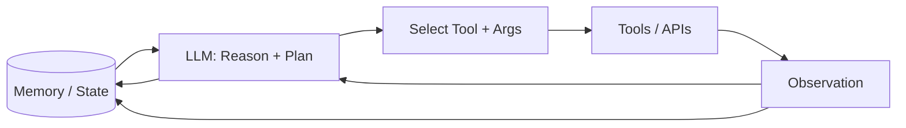

# Autonomous agent

> **Learning Path:** Agentic AI
> **Section:** 11.2.9 — Agent patterns

**Autonomous Agent — Agent Patterns**

### 1. The problem

A single LLM call is stateless and reactive. It can answer a question given context, but it cannot reliably pursue a multi-step goal that requires tool use, changing state, and error recovery.

What appears in production:
* Tasks need 3-10 steps: search, fetch, decide, call an API, verify.
* The world changes between steps. The agent must perceive new results.
* You need persistence across turns: memory of what was tried and what failed.
* Human in the loop for every step kills throughput and breaks the UX.

The constraint is not intelligence, it is control. You need a closed loop with an LLM as policy, not just a one-shot generator.

### 2. Mental model

An autonomous agent is a control loop, not a model.

Perceive → Reason → Act → Observe → Update memory → Repeat

The LLM is the decision maker. Tools are actuators. Memory is state. The loop gives it autonomy: the ability to set sub-goals, try, fail, reflect, and continue without prompting each step.

Analogy: a human operator with a terminal, a notebook, and a set of tools. The LLM is the operator.

### 3. How it works

Essential mechanism is a ReAct-style loop with guardrails.

Core components:
* **Planner / Policy:** LLM generates next action from goal + context + history. Patterns: ReAct for interleaved think-act, Plan-Then-Act for upfront planning, Reflect for self-critique.
* **Tools:** Functions, APIs, search, code execution. Tool descriptions are the agent's affordances.
* **Memory:** Short-term context window for the current episode, long-term store for facts, prior steps, and outcomes. Without memory the loop resets.
* **Termination:** Max iterations, goal check, or human stop. This prevents runaway loops.

Implementation is simple: a loop with a system prompt defining role, tools, and safety rules, a state object, and a parser for action→observation.

### 4. Architectural reasoning

When it helps:
* Long-horizon, tool-heavy workflows where the path is not known upfront: research synthesis, ticket triage and remediation, data reconciliation.
* Tasks with conditional branching and retries: if API fails, try alternative source.
* Need for observable autonomy: audit trail of reasoning + actions.

Alternatives:
* Prompt chaining / deterministic orchestration: cheaper and more predictable, but brittle when inputs vary.
* Human-in-the-loop for every decision: safe but slow and costly.
* Pure RAG: great for retrieval, not for multi-step planning with side effects.

Choose autonomous agent when the cost of human oversight exceeds the cost of tool misuse and you can bound risk with guardrails.

### 5. Trade-offs and failure modes

* **Autonomy vs control.** More autonomy = higher success on messy tasks, higher risk of unsafe tool use. Mitigate with allowlists, tool schemas, and validation layers.
* **Non-determinism.** Same goal can produce different plans. You need idempotency, retries, and deterministic checks after non-deterministic planning.
* **Context blow-up.** History grows fast. Summarization and selective memory retrieval are required, or the agent forgets earlier failures.
* **Hallucinated tools and args.** The LLM invents parameters. Strict schema validation and tool description quality are mandatory.
* **Infinite loops and drift.** Agent re-tries same failing step. Needs reflection step, max steps, and a goal progress check.
* **Cost and latency.** Each iteration is a LLM call + tool call. Budget per task and early exit conditions matter.

### 6. Example

Enterprise support triage agent.

Goal: resolve P1 incidents without human escalation.

Loop:
1. Perceive ticket + recent deploy logs + on-call runbook.
2. Reason: "Is this a known error? Which diagnostic tool fits?"
3. Act: call `search_incidents`, then `run_diagnostic`.
4. Observe result: CPU saturation on service X.
5. Memory updates with finding.
6. Reason: "Apply remediation per runbook." Act: call `scale_service` with approved params.

Guardrails: tool allowlist, no destructive actions without human approve, audit log of every step, max 5 iterations.

This is not a chatbot. It is a closed loop with verifiable effects.

### 7. Reasoning challenge

You need an agent to reconcile invoices against ERP data and create missing purchase orders.

Should the agent be allowed to autonomously create POs?

Decide based on risk, reversibility, and verification. What guardrails would you require before allowing write actions?

### 8. Key takeaway

* Autonomous agent = LLM as policy in a perceive-reason-act loop with memory and tools.
* It exists to pursue multi-step goals where the plan cannot be hard-coded.
* Choose it when task variability and tool use outweigh non-determinism risk.
* Control it with bounded iterations, tool allowlists, validation, and memory management.
* The architectural decision is not the model, it is how much autonomy you grant and how you contain failure.
