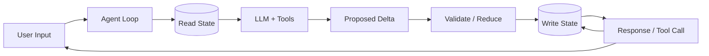

# State modeling

> **Learning Path:** Agentic AI
> **Section:** 11.3.1 — Agent state

**The problem**

LLMs are stateless. Every turn you pay the cost of re-injecting context and re-deriving what the agent already knew. In a multi-step agentic workflow that breaks down fast:

* The agent forgets decisions made 3 turns ago once the context window fills.
* Tool outputs, user preferences, and partial results are lost between invocations.
* You cannot reason about *what the agent believes* is true, only what was in the last prompt.

Without an explicit model of state, you get prompt bloat, non-deterministic repeats, and agents that re-ask the same question.

### Mental model

Agent state is the source of truth the agent loop maintains about the world, the task, and itself.

Think of it as the agent's working memory + long-term memory, made explicit and versioned.

`Perceive → Update State → Decide → Act → Update State`

State is not conversation history. History is raw events. State is derived, structured beliefs: current goal, slots filled, last tool result, user profile, guardrails, etc.

### How it works

A minimal state model has three parts:

1. **Schema.** What you track and its shape. e.g. `session_id, goal, intent, slots{email, date}, conversation_summary, tools_used, last_action, confidence`.
2. **Store.** Where state lives between turns. In-memory for speed, KV store / Postgres for durability, vector DB for retrieval. Access is via read/write primitives, not by stuffing everything into the prompt.
3. **Update contract.** How state changes are made. Deterministic reducers from observations and actions, not free-form LLM writes. The LLM proposes deltas; a validator applies them.



The loop is closed on state. The LLM never owns truth, it proposes changes to it.

### Architectural reasoning

When it helps:
* Multi-turn tasks with dependencies: booking, research, code generation with iterative tools.
* Personalization and compliance: you need auditable decisions, not just prompts.
* Orchestration: multiple agents/tools need a shared view of progress.

Alternatives:
* **In-context only.** Cheapest, works for < ~10 turns. Fails on cost, drift, and replay.
* **External state + selective context.** Keep full state durable, project a compact view into the prompt. Best trade-off for production agents.
* **Event sourcing.** Store immutable events, derive state. Good for audit and replay, costly to operate.

Choose explicit state when you need consistency, observability, and control over the agent's beliefs over time.

### Trade-offs and failure modes

* **Consistency vs latency.** Strong consistency makes updates safe but adds round trips. Eventual consistency is faster but risks stale decisions.
* **Schema rigidity vs flexibility.** Tight schema prevents drift but requires migration. Loose schema lets the LLM hallucinate fields.
* **State size vs context cost.** More state = better decisions, but larger prompt = higher cost and latency. You need summarization and projection.
* **Failure modes to design for:** state drift from unvalidated LLM writes, concurrent updates from parallel tools, stale reads leading to repeated actions, and orphaned state when sessions expire.

Operability matters: version your schema, log every state transition, and make state inspectable by humans.

### Example

Enterprise support agent.

State schema:
```
session_id, user_id, ticket_id, intent, slots{product, issue_type, order_id}, 
conversation_summary, last_tool{type, result, ts}, sentiment, escalation_flag
```

Flow: user says "my order is late". Agent reads state, sees `order_id` missing, calls lookup tool, writes `slots.order_id`. Next turn, agent reads state, sees order delayed, proposes refund. State is persisted to Postgres, summary projected into prompt, full history kept for audit.

Without state, the agent would re-ask for order ID every turn and lose escalation context.

### Reasoning challenge

You have a travel booking agent and a post-trip survey agent sharing the same user profile state. Both can update `user_preferences`. The booking agent runs synchronously, the survey agent runs async in a batch job. How do you prevent lost updates and stale reads without killing throughput?

Think about read-modify-write, versioning, and which updates need strong consistency.

### Key takeaway

* Agent state makes the agent's beliefs explicit, durable, and auditable; prompts are a view, not the source of truth.
* Model state as schema + store + update contract, not as raw chat history.
* Project a minimal, relevant slice of state into the LLM; keep the full model outside the context window.
* Design for drift, concurrency, and schema evolution from day one.
