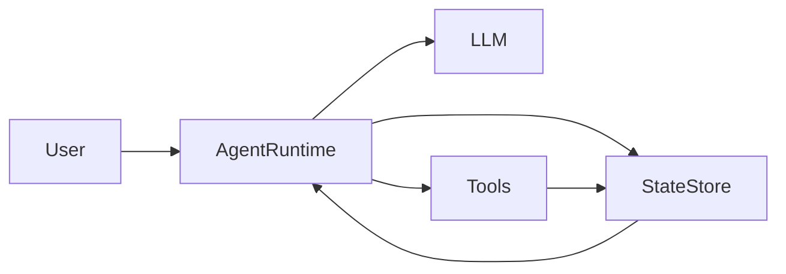

# Persistence

> **Learning Path:** Agentic AI
> **Section:** 11.3.2 — Agent state

**Persistence**

### 1. The problem

An LLM is stateless. An agent is not.

A single turn is easy: prompt in, response out. Real agentic work is multi-step, tool-using, long-running, and interrupted. The agent needs to remember:
* Where it is in a workflow
* What it has already tried and learned
* Partial results from tools
* User preferences and context across sessions

Without durable state, a crash, a pod restart, a context window reset, or a user returning tomorrow means the agent forgets everything. It restarts from scratch, repeats work, asks the same questions, and loses trust.

The problem is not memory in the LLM. It is durable, recoverable, and addressable state for the agent runtime.

### 2. Mental model

Think of agent state as a checkpointed execution log, not a chat history.

State = the minimal information needed to resume the agent's work correctly at any point:
* `session_id`, `user_id`, `task_id`
* Current step / workflow node
* Inputs and outputs of completed tool calls
* Intermediate artifacts, e.g., draft, summary, plan
* Metadata: timestamps, retry counts, error context

The agent runtime is ephemeral. The state store is durable.

On each step: read state, execute, write state. On restart: rehydrate state, continue.

### 3. How it works

Essentially checkpointing.

1. **Rehydrate:** On start, load last saved state for the session/task.
2. **Execute:** Run one step: reason, act, observe.
3. **Checkpoint:** Persist the updated state atomically before yielding.
4. **Resume:** On failure or new request, start from last checkpoint.

State shape is deliberate. Full conversation dump is wasteful and slow. Store a structured snapshot: `state_version`, `step`, `context`, `artifacts`, `history_ref`.

Persistence layer is typically:
* Fast KV store for active sessions, e.g., Redis
* Durable store for long-term history, e.g., Postgres, DynamoDB
* Object store for large artifacts, e.g., S3

The agent runtime never assumes in-memory state survives.

### 4. Architectural reasoning

Persistence enables the architectural decisions agents require.

* **Reliability:** Crash-safe workflows. A pod dies mid-tool-call, another instance resumes from last checkpoint.
* **Long-running tasks:** Multi-day research, approvals, batch jobs. State lets the agent pause and resume.
* **Scaling:** Stateless runtimes can be autoscaled behind a shared state store. No sticky sessions needed.
* **Multi-agent:** Handoffs and orchestration need a shared, durable record of who did what.
* **Audit and replay:** You can reconstruct why an agent decided something, and replay a task with a new model.

Alternatives:
* In-memory only: fast, simple, loses everything on restart.
* Full conversation replay: simple but expensive, hits token limits, non-deterministic.
* Event sourcing: full log of immutable events, max replayability, higher complexity.

Choose persistence when the cost of losing progress exceeds the cost of writing state.

### 5. Trade-offs and failure modes

* **Consistency vs latency.** Write-through on every step is durable but adds latency. Batch writes risk losing the last step on crash.
* **Granularity.** Coarse checkpoints reduce writes but increase rework. Fine checkpoints increase I/O and contention.
* **Schema evolution.** Agent logic changes; old state must still be readable. Version state and migrate on read.
* **Partial writes.** A tool succeeded but checkpoint failed → agent will retry and duplicate work. Make writes idempotent and use transactional outbox or write-ahead log.
* **State bloat.** Storing full tool outputs grows unbounded. Prune, summarize, or archive to cold storage.
* **Security.** State contains PII and tool results. Encrypt at rest, scope access by `user_id` and `session_id`, and set TTLs.

The most common failure: assuming the LLM's context window is state. It is not durable, not queryable, and not shareable across instances.

### 6. Example

Enterprise support agent handling a refund.

Step 1: verify identity → Step 2: fetch order → Step 3: check policy → Step 4: create refund ticket → Step 5: confirm.

User closes the app after step 3. Six hours later they return on mobile.

With persistence: runtime loads state, sees `step=3 complete, policy=eligible, order_id=...`, skips verification, continues at step 4. No repetition, no frustration.

Without persistence: agent asks for order again, re-verifies, user abandons.

State store also allows a human agent to take over mid-workflow with full context.

### 7. Reasoning challenge

You are designing a high-volume customer triage agent. 10k concurrent sessions, average 5 minutes, 95% finish in one session, 5% need to resume after hours. Writes cost latency, reads must be <20ms.

Do you checkpoint after every tool call, or only at workflow stage boundaries? What store do you pick for active vs long-term state, and what do you do about duplicate tool calls on resume?

### 8. Key takeaway

* Agent state is durable execution context, not just chat history.
* Persistence turns ephemeral LLM calls into recoverable, scalable workflows.
* Design state for resume, not replay: minimal, versioned, idempotent.
* Trade durability, latency, and complexity; pick checkpoint granularity deliberately.
* Without durable state, agents cannot be reliable, long-running, or horizontally scaled.
