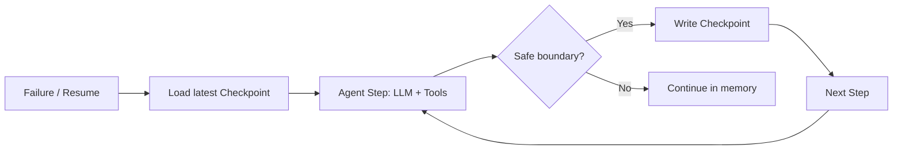

# Checkpoints

> **Learning Path:** Agentic AI
> **Section:** 11.3.3 — Agent state

### The problem

An agentic system is a long-running state machine. The LLM itself is stateless, but the agent accumulates state across steps: the conversation history, the current plan, tool outputs, memory writes, and pending sub-tasks.

What breaks without durable state:
* A pod crashes mid-workflow and the agent restarts with no memory of what it already did.
* You need to resume a task hours later, after a human approval, and the context window no longer fits.
* You want to audit, debug, or replay why an agent made a bad decision.
* You want to branch: try a different strategy from a known good point without re-running the whole chain.

State has to survive process restarts, scaling events, and long idle periods. It also has to be recoverable quickly.

### Mental model

A checkpoint is a durable, named snapshot of an agent's entire execution state at a safe point.

Think of it like a save point in a video game. The game state is complex and constantly changing. You don't save every frame, you save at meaningful boundaries where the game is consistent and you can resume from there.

For an agent, a checkpoint captures:
* The conversation / messages so far
* The current plan / next step
* Tool outputs and side-effects already committed
* Memory and context references
* Metadata: thread id, run id, step number, timestamps

You can restore from it and continue deterministically.

### How it works

The agent loop is intercepted at deterministic boundaries.

A safe boundary is typically after:
* A tool call completes successfully
* A human handoff is requested
* A sub-agent finishes
* A policy-defined interval is reached

Checkpointing is usually implemented as:
* **Snapshot**: Serialize the full agent state to durable storage. Fast to restore, expensive to write.
* **Incremental / Event log**: Append only the delta for this step. Cheaper writes, restore requires replay.

Most production systems do both: an event log as source of truth, with periodic snapshots to bound replay cost. The checkpoint id becomes the pointer to the last consistent snapshot + the events since.

### Architectural reasoning

When it helps:
* Long-running, multi-step workflows with tools and human-in-the-loop
* Agents that must survive crashes, deployments, and autoscaling
* Need for auditability, replay, and debugging
* Need for branching / A/B testing strategies from a known state

What it solves:
* Durability and resumability without re-executing the whole history
* Bounded context window: offload old messages to store, keep a pointer in checkpoint
* Consistent recovery: restore to last known good state, not mid-tool-call

Alternatives:
* **Pure in-memory state**: Fast, zero cost, lost on crash. Only viable for short, idempotent chats.
* **Full event sourcing only**: Perfect replay and audit, but restore cost grows linearly with steps. Needs snapshots anyway.
* **Re-derive state from logs**: Works if the workflow is purely deterministic and cheap to replay. Rare for LLM agents.

Choose checkpoints when recovery time and durability matter more than write overhead.

### Trade-offs and failure modes

* **Frequency vs cost**: More checkpoints = faster recovery, smaller replay, higher storage/write cost and write amplification. Too few = long replay, risk of losing work.
* **Granularity**: Checkpointing after every LLM call is safe but expensive. Checkpointing only at workflow completion risks losing hours of work.
* **Consistency**: A checkpoint must capture a consistent view. If you checkpoint after writing to memory but before persisting the tool output, restore will be inconsistent. Use atomic writes or write-ahead log.
* **State bloat**: Naively checkpointing the full context window grows quickly. Store references, not copies, and prune.
* **Partial failures**: A crash during checkpoint write can leave a corrupt snapshot. Version checkpoints and write to temp then atomic rename.
* **Non-determinism**: LLMs are non-deterministic. A checkpoint restores state but not the exact random seed. Replaying may diverge. Store the exact model inputs/outputs to make replay deterministic.

### Example

Customer support agent for a SaaS billing issue.

Steps: greet → fetch account via CRM → check open tickets → call pricing tool → draft resolution → wait for human approval → send email.

The agent checkpoints after each tool completes:
1. After CRM fetch
2. After ticket check
3. After pricing tool
4. After draft created

If the worker pod is killed after step 3, the new pod loads checkpoint 3, sees the draft is not yet created, and resumes. The user does not repeat steps 1-2. If the agent is later flagged for bad behavior, ops can load checkpoint 2 and replay with a different prompt to see where it diverged.

### Reasoning challenge

You are designing a financial reconciliation agent that runs for ~30 minutes per batch, makes ~200 tool calls to ledger APIs, and must be auditable for compliance.

Do you checkpoint after every tool call, every 10 calls, or only at the end of the batch? What do you store in the checkpoint vs in the event log? What happens if a checkpoint is restored but the external ledger has already been mutated by the previous run?

Think through recovery time, storage cost, and the risk of double-writing.

### Key takeaway

* Checkpoints exist to make non-deterministic, long-running agent state durable and resumable.
* They are architectural save points, not just persistence. Design them around safe boundaries where state is consistent.
* Combine event log for audit/replay with periodic snapshots for fast restore.
* The real trade-offs are write cost vs recovery time, consistency vs granularity, and storage size vs context window limits.
* A checkpoint is only as good as its restore semantics: know exactly what state is captured and what side-effects are already committed.
