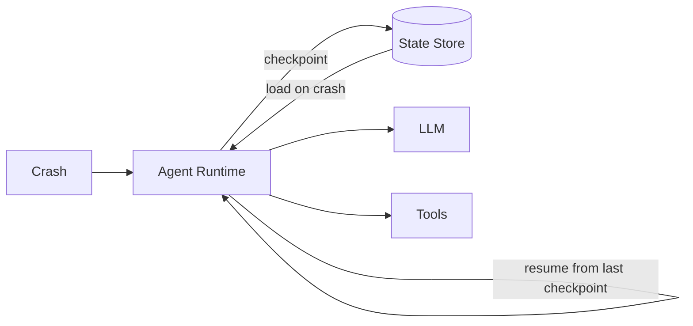

# Recovery

> **Learning Path:** Agentic AI
> **Section:** 11.3.4 — Agent state

**Recovery is not about restarting. It's about resuming without losing work.**

### 1. The problem

Agentic workflows are long, stateful, and fragile.

An agent does: LLM call -> tool call -> observe -> plan -> repeat. Each step depends on prior state: conversation history, tool outputs, intermediate artifacts, current plan, and side effects already performed.

The constraints are:
* **LLM is stateless.** The model has no memory between calls.
* **Failures are normal.** Timeouts, rate limits, node crashes, user disconnects, token limits, and non-deterministic tool results happen.
* **Work is expensive.** Re-running a 20-step research agent from step 1 wastes time, money, and API quota.
* **Side effects are irreversible.** Sending an email, creating a DB record, or charging a card cannot be safely replayed.

Without recovery, a failure at step 19 means you lose steps 1-18.

### 2. Mental model

Think of agent state as a durable ledger of decisions, not a runtime object.

The runtime is ephemeral. The ledger is persistent. Recovery = load last durable checkpoint + replay from there.

```
state = { conversation, plan, memory, artifacts, tool effects }
checkpoint = snapshot(state) + intent log
```

### 3. How it works

Minimal viable recovery has three pieces:

* **Explicit state boundary.** After each meaningful step, serialize agent state to a durable store: key-value, document DB, or object store.
* **Idempotent step log.** Store what was attempted, not just the result. `step_id, input_hash, tool_call, output_hash`.
* **Resume logic.** On start, load latest checkpoint. If the last step is incomplete or failed, re-execute from that point, not from scratch.

Mermaid:


For non-idempotent tools, you don't replay the tool call, you record the effect and skip it on resume.

### 4. Architectural reasoning

**When it helps:** long-running tasks >30s, multi-tool workflows, paid LLM usage, user-facing agents where interruption is expected.

**Alternatives:**
* **In-memory only.** Fast, cheap. Loses everything on crash. Acceptable for toy agents.
* **Coarse snapshot.** Save only at task completion. Simple, but loses a lot on failure.
* **Fine-grained event sourcing.** Append-only log of events. Max recoverability, higher complexity.

Decision driver: cost of recompute vs cost of storage + complexity. If a step costs $2 and takes 2 minutes, checkpoint it. If a step is cheap and pure, recompute is fine.

### 5. Trade-offs and failure modes

* **Consistency vs latency.** Checkpointing on every step is safe but adds write latency. Batch checkpointing is faster but risks losing more work.
* **Storage cost vs recompute.** Durable state grows fast with conversation history and artifacts. Prune or summarize.
* **Exactly-once vs at-least-once.** LLMs are non-deterministic, so replaying the same prompt can yield different output. You need to decide whether to accept divergence or pin outputs with step hashes.
* **Partial writes.** A crash mid-write corrupts state. Use write-ahead log or versioned checkpoints.
* **Non-idempotent side effects.** Replaying a tool call can duplicate actions. Record effects and make resume logic skip already-done actions.

### 6. Example

A report-building agent: search web → fetch PDFs → summarize → draft → user edit → finalize.

Step 5 takes 90 seconds and 4 LLM calls. Node crashes.

With recovery: load checkpoint after step 4, resume at step 5. No re-search, no re-fetch.

Without recovery: user waits again for 90 seconds and pays again.

State stored: `plan_json`, `conversation_history`, `artifacts/{pdf_hash}`, `tool_effects={sent_email:false}`. On resume, the agent knows what it already has.

### 7. Reasoning challenge

Your agent books travel. It calls `create_booking` which charges the card and is non-idempotent. A crash occurs right after the charge succeeds but before the checkpoint is written.

How do you design recovery so the agent does not double-charge on resume, and still knows the booking exists?

*Hint: separate effect recording from action execution.*

### 8. Key takeaway

* Recovery exists because agent runtime is ephemeral but agent work is expensive and has side effects.
* Durable state + checkpoint + resume logic turns crashes into pauses.
* Checkpoint granularity is an economic decision: cost of recompute vs cost of storage and complexity.
* Non-idempotent tools require effect tracking, not blind replay.
* Design for at-least-once execution and make your steps idempotent where possible.
