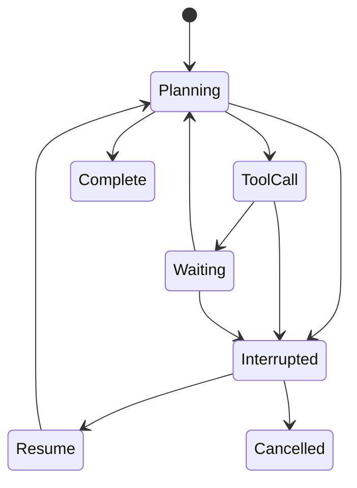

# Interruptions

> **Learning Path:** Agentic AI
> **Section:** 11.3.5 — Agent state

### 1. The problem

An agentic AI is not a single LLM call. It is a long-running process that plans, calls tools, waits for results, and updates its own memory over minutes or hours.

Without interruption handling the agent is blind to the world while it runs. The user sends a correction mid-flow and the agent keeps executing the old plan. A tool times out and the agent retries forever. A higher-priority request arrives and the agent cannot preempt.

LLMs are stateless. Tools are async. Context windows are finite. The problem is therefore: **how do you keep a coherent, resumable execution when the outside world can change at any time?**

That is agent state + interruptions.

### 2. Mental model

Think of an agent as a paused program with a call stack.

Agent state = everything needed to resume exactly where it left off: task graph, current step, conversation history, tool outputs, pending intents, user context, and the reasoning that led there.

An interruption is an external event that should be able to pause, inspect, and redirect that paused program without losing work.

The agent is never “running forever”. It runs in discrete steps, checkpoints state, and checks for interrupts between steps.

### 3. How it works

The essential mechanism is **checkpoint + event-driven re-entry**.

1. **Boundaries.** The agent only acts at well defined boundaries: after planning, before a tool call, after a tool result, on a timer. These are interruption points.
2. **Checkpoint.** At each boundary the agent serializes its state to durable storage: task plan, step pointer, context summary, conversation, tool outputs. This is the resume point.
3. **Event ingress.** Interrupts arrive via a queue: user message, system signal, tool callback, SLA timer, priority change.
4. **Rehydrate & route.** On wake, the agent loads the checkpoint, merges the new event into the current context, re-plans if needed, and continues or aborts.

State is not just chat history. It is an execution model: what was intended, what is in flight, what is complete, and what constraints are active.

### 4. Architectural reasoning

When it helps:
* Multi-step workflows with human-in-the-loop
* Long running tasks with external dependencies
* Systems where priority or context can change mid-task
* Cost-sensitive workloads where you want to pause instead of waste tokens

What it solves: wasted compute, stale outputs, inability to respond to the real world, and loss of trust.

Alternatives:
* **Stateless restart.** Discard work and start over from the last user message. Cheaper to build, but loses partial results and feels brittle.
* **Blocking execution.** Run to completion and ignore new input. Simple, but wrong for interactive agents.
* **Full streaming preemption.** Keep everything in memory and stream. Low latency, but fails on scale and crashes.

You choose interruption-aware state when continuity and control matter more than raw simplicity.

### 5. Trade-offs and failure modes

* **Checkpoint frequency vs latency & cost.** Checkpoint after every step = safe but expensive. Too infrequent = lost work on interrupt.
* **Consistency vs availability.** Strong consistency on resume prevents acting on stale data, but adds coordination latency. Eventual consistency allows faster resume but risks race conditions.
* **State size.** Unbounded history bloats checkpoints and context windows. You need summarization and pruning policies.
* **Failure modes to design for:**
  * Lost checkpoint → agent cannot resume, must recover from last durable event
  * Duplicate interrupt → idempotency needed on handlers
  * Re-entrancy race → two interrupts arrive while agent is rehydrating; need locking / versioning
  * Stale re-plan → agent resumes with old plan that no longer matches user intent

### 6. Example

Customer support agent processing a refund.

State: intent = refund, order_id, user verified, step = collect_reason, pending tool = payment_api.

User sends: “Never mind, just cancel the order instead.”

Without interruptions: agent collects reason, calls payment_api, then asks about cancellation. Waste + bad UX.

With interruptions: an interrupt arrives at the next boundary. The checkpoint is loaded, the new user message is merged, the planner re-evaluates. The task graph is updated to cancel instead of refund, prior work is pruned, and execution continues from the correct step.

### 7. Reasoning challenge

You have an agent that monitors a trading portfolio and rebalances nightly. Mid-rebalance, risk limits are lowered by compliance. Should the agent:
a) Finish the current rebalance then apply the new limit
b) Immediately pause, checkpoint, and re-plan with the new limit
c) Ignore the signal until the next run

What state do you need to capture to make that choice safely, and what failure do you risk if you choose wrong?

### 8. Key takeaway

* Interruptions exist because agents live in a changing world, not a closed prompt.
* Agent state must be explicit, serializable, and versioned to allow safe pause/resume.
* Design interruption points at natural boundaries, not in the middle of tool calls.
* The real cost is not the interrupt handler, it is maintaining coherent state across re-plans.
* Choose interruption awareness when continuity, cost control, and user trust outweigh implementation complexity.
