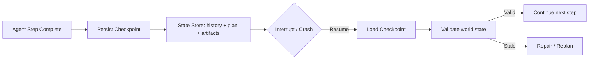

# Resumption

> **Learning Path:** Agentic AI
> **Section:** 11.3.6 — Agent state

**Resumption in Agent State**

### 1. The problem

An LLM is stateless. An agent is not.

A real agent runs a multi-step workflow: plan → call tools → interpret results → update plan → repeat. That work lives across many LLM calls, tool executions, and user interactions.

The problem appears when execution is interrupted:
* User closes the app and comes back hours later
* The worker crashes or is preempted
* Token limits or cost caps force a pause
* A human approves a step in the middle of the workflow

Without resumption you have two bad options: restart from scratch, losing all partial work and context, or keep the whole session alive forever, which is expensive and fragile.

Resumption is the ability to pause an agent at a well-defined point, persist its state, and later continue from exactly that point as if nothing happened.

### 2. Mental model

Think of it as a save game for an agent.

You don't save the whole RAM. You save a checkpoint: what the agent believed to be true, what it intended to do next, and the artifacts it already produced.

On resume you reload the checkpoint, re-hydrate the context window, and continue the next bounded step. The user and the world see continuity.

### 3. How it works

Resumption requires three things:

**Bounded steps.** The agent workflow is decomposed into deterministic steps with clear inputs and outputs. Each step is idempotent enough to be replayed safely.

**Durable state capture.** After a step completes you persist:
* Conversation history and system prompt
* Agent internal state: current goal, plan, pending tasks
* Tool outputs and side effects already committed
* Metadata: step id, version, timestamp, execution context

**Validation on restore.** On resume you load the checkpoint, validate that external world state still matches assumptions, and either continue or repair.

The LLM itself is re-primed from the persisted history, not from memory.

### 4. Architectural reasoning

Resumption helps when:
* Work is long-running or user-driven with unpredictable pauses
* Steps are expensive: API calls, human approvals, long-running tools
* You need reliability and horizontal scaling: workers can die and be replaced

Alternatives:
* **Stateless restart:** cheap, simple, but wastes work and breaks user trust.
* **Keep session hot:** no checkpointing, but you pay for idle resources and lose on failure.

Choose resumption when the cost of re-doing work or losing user context exceeds the cost of storing and validating state. It enables durable execution: you can scale workers, do rolling deploys, and survive failures without losing in-flight agents.

### 5. Trade-offs and failure modes

* **State size vs fidelity.** Full conversation + tool outputs grow fast. You must prune, summarize, or compress. Over-pruning loses reasoning ability; over-saving costs money and latency.
* **Consistency vs liveness.** The world changes while paused. A resume may find a resource deleted, price changed, or approval expired. You need a repair path, not just blind continuation.
* **Determinism.** Non-deterministic tools make replay unsafe. Record actual outputs, don't re-execute them on resume.
* **Security and privacy.** Persisted agent state is sensitive. It must be encrypted, access-controlled, and have a retention policy.
* **Version skew.** Agent code evolves. A checkpoint created by v1 may not load cleanly in v2. Version your state schema and provide migration.

### 6. Example

Customer support agent triages a refund request.

Step 1: collect order id and user identity.
Step 2: call billing tool, get transaction.
Step 3: present findings to user for confirmation.
User closes app.

With resumption: checkpoint after step 2 contains the verified transaction and pending confirmation. When user returns next day, the agent loads the checkpoint, shows a summary, and asks for confirmation. No re-identification, no re-querying billing.

Without it: the agent starts over, asks for order id again, user abandons.

### 7. Reasoning challenge

Your agent books travel: it has already selected flights and held a seat for 15 minutes via an external hold API. The user pauses for 30 minutes and resumes. The hold expired.

Do you: automatically continue with the now-invalid hold, silently re-hold, or surface the change and replan? What state do you need to persist to make that decision safely?

### 8. Key takeaway

* Resumption is about durable agent state, not just conversation history.
* Checkpoint after bounded, verifiable steps; validate world state on restore.
* It trades storage and complexity for reliability, cost savings, and user continuity.
* Design for repair: the world changes during pause, and resume must detect and handle drift.
