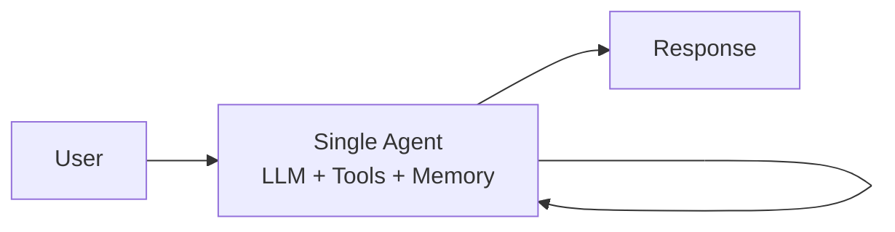
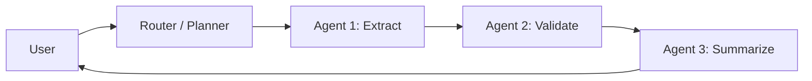

# Single agent vs workflow

> **Learning Path:** Multi-Agent Architecture
> **Section:** 12.1.1 — Learn

### 1. The problem

A single LLM can do surprisingly good end-to-end reasoning, but real work is not one prompt. It is: understand intent, retrieve data, apply policy, call tools, validate output, and produce a safe response.

When you push all of that into one agent you get:
* **Context bloat.** The model must hold task, data, tools, and history at once.
* **Unbounded non-determinism.** One bad tool call or hallucination cascades to the final answer.
* **Zero observability.** You know the input and output, not why it failed.
* **Cost and latency variance.** The agent may loop, retry, or overthink.

The problem is not capability, it is control.

### 2. Mental model

**Single agent** = one generalist brain with tools. It plans, executes, and revises internally in a loop.

**Workflow** = an assembly line of specialized agents with explicit contracts. Planning is externalized; each step has one job, one input schema, one output schema.

Single agent optimizes for flexibility. Workflow optimizes for reliability and operability.

### 3. How it works

Single agent: LLM + tool set + memory. The model decides what to do next each turn. Good when the task is open-ended and the steps are unknown until runtime.

Workflow: A deterministic orchestration layer defines the steps and handoffs. Each agent is narrowly scoped, e.g., "extract entities from invoice", "check policy compliance". The orchestrator routes, retries, and enforces schemas. Good when the steps are known and repeatable.

### 4. Architectural reasoning

Choose single agent when:
* Task is exploratory, low stakes, and step count is small
* You need maximum flexibility and minimal engineering overhead
* Latency matters more than auditability

Choose workflow when:
* The task is multi-step and well defined
* Different skills are needed: retrieval, classification, generation, validation
* You need observability, retries, and guardrails per step
* Compliance requires you to prove what was done and why

Alternatives are not binary. Most production systems start as single agent for speed, then decompose hot paths into workflow as failure modes appear.

### 5. Trade-offs and failure modes

**Single agent**
* Pros: Fast to build, adapts to novel inputs, fewer moving parts.
* Cons: Hard to debug, brittle under tool errors, expensive at scale, non-reproducible.
* Failure mode: Hallucination cascade. The model confabulates a tool result and builds the rest of the reasoning on it.

**Workflow**
* Pros: Predictable latency, per-step metrics, easy to test and version, can mix models by step.
* Cons: More operational complexity, rigid to changes, handoff errors between agents.
* Failure mode: Over-engineering. A workflow with 7 agents for a simple query adds latency and failure points with no benefit.

Key trade-off: **Flexibility vs control.** Single agent gives you adaptability at the cost of reliability. Workflow gives you reliability at the cost of rigidity.

### 6. Example

Enterprise support triage.

Single agent approach: One LLM receives ticket, searches KB, drafts reply. Works for simple tickets, fails when KB is noisy or policy constraints apply. You cannot tell if the failure was retrieval, reasoning, or policy.

Workflow approach:
1. Classifier Agent -> intent + priority
2. Retrieval Agent -> fetch KB + CRM data with structured query
3. Policy Agent -> checks for PII / refund rules
4. Draft Agent -> writes response
5. Validator Agent -> schema check + tone check

You can log, retry, and A/B test each step. Cost is higher, but you can explain a bad answer and fix it without retraining the whole system.

### 7. Reasoning challenge

You need to build an invoice processing pipeline: extract line items from PDF, validate against purchase order, check fraud signals, and create a payment record.

Do you start with a single agent with vision + tools, or a workflow of extract -> validate -> fraud -> post? What changes your decision if the invoice format is highly variable vs strictly standardized?

### 8. Key takeaway

* Single agent = one generalist with internal planning. Best for exploratory, low-stakes tasks.
* Workflow = explicit steps with specialized agents and contracts. Best for repeatable, high-stakes work.
* Decompose when you need observability, retries, policy enforcement, and independent scaling.
* The decision is driven by operational requirements, not model capability.

You should be able to reason: *Is the task shape known? Do I need to prove what happened?* If yes, workflow. If no, start single and decompose the failure points.
