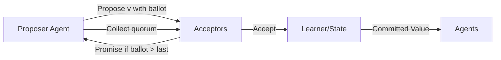

# Consensus

> **Learning Path:** Multi-Agent Architecture
> **Section:** 12.1.10 — Learn

**Consensus**

### The problem

Multiple autonomous agents share the same world: a warehouse floor, a database, a market, a planning graph. Each agent observes locally, decides locally, and acts concurrently.

Without agreement you get:
- Two agents reserve the same resource
- Two agents publish conflicting plans
- One agent acts on stale information while another has moved on

You need a single source of truth for decisions that must not diverge, even with network delays, crashes, and independent reasoning.

### Mental model

Consensus is not agreement by discussion. It is a commitment protocol: a set of nodes agree on one value and that value becomes immutable for all.

Think of it as a quorum-based vote with memory. An agent proposes a decision. A majority of peers promise not to accept an older conflicting proposal, then accept. Once a quorum accepts, the value is committed and learned by all.

The key invariant: **safety over speed**. Once committed, the value never changes.

### How it works

The essential mechanism is proposal + promise + accept, with quorum.

1. **Propose**: Leader or any agent proposes a value with a monotonically increasing ballot/term.
2. **Promise**: Acceptors compare ballot to last accepted. If ballot is higher, they promise not to accept older ballots and reply.
3. **Accept**: If proposer gets a quorum of promises, it sends accept. Acceptors record it.
4. **Commit**: Learners apply once quorum of accepts is reached.

This pattern appears in Raft/Paxos for logs, and in multi-agent coordination as negotiation with persistent promises. The state machine is deterministic; agents differ only in who proposes.

### Architectural reasoning

Use consensus when you need **safety for shared mutable state** across autonomous participants.

When it helps:
- Task allocation where double-assignment is costly: robots, workers, API slots
- Plan merging: agents build a joint plan and must commit to one version
- Configuration changes: leader election, membership, policy updates

Alternatives:
- **Central coordinator**: simple, single point of failure, bottleneck
- **Eventual consistency / CRDTs**: safe for commutative updates, unsafe for exclusive decisions
- **Leader-only**: fast but loses progress on leader failure

Choose consensus when the cost of a conflict > cost of coordination latency. If you can tolerate temporary divergence and resolve later, you don't need consensus.

### Trade-offs and failure modes

* **Latency vs safety**: Every commit needs a quorum round trip. You trade low latency for strong agreement.
* **Availability vs consistency**: With network partitions, a majority partition can still commit; minority must pause. CAP in practice.
* **Liveness**: Split votes cause retries. Without proper timeout jitter you get livelock.
* **Byzantine agents**: Classical consensus assumes crash faults. Malicious or buggy agents that lie require BFT variants and 2f+1 quorums.
* **Scope creep**: Using consensus for all state kills throughput. Use it only for the narrow decisions that require total order.

Failure modes architects see: split brain from misconfigured quorums, stale leaders committing old values, and unbounded log growth from repeated proposals.

### Example

Warehouse with 3 picking robots and a planning agent.

Each robot can pick one item per cycle. The planning agent proposes a batch assignment: Robot A -> item 12, Robot B -> item 7.

Robots act as acceptors. The proposal is sent with term 5. Two robots promise and accept. Assignment is committed to the shared task log. Even if Robot C is partitioned, it will learn the committed assignment when it reconnects and will not accept a conflicting proposal for item 12.

If the planning agent crashes, a new leader is elected via consensus on the next term. No item is assigned twice.

### Reasoning challenge

You are building a multi-agent research system. Three agents draft sections of a report and must agree on a single outline before writing. Network is unreliable, agents can crash but not lie.

Do you run strong consensus for every paragraph edit, or use a leader with CRDTs for edits and consensus only for outline commits? What breaks if you choose wrong?

### Key takeaway

* Consensus exists to prevent conflicting decisions in the presence of faults and concurrency.
* It guarantees safety via quorum promises; liveness is probabilistic and depends on timeouts.
* Use it narrowly for decisions that must be total-ordered and irreversible.
* Pay for it with latency, complexity, and reduced availability during partitions.
