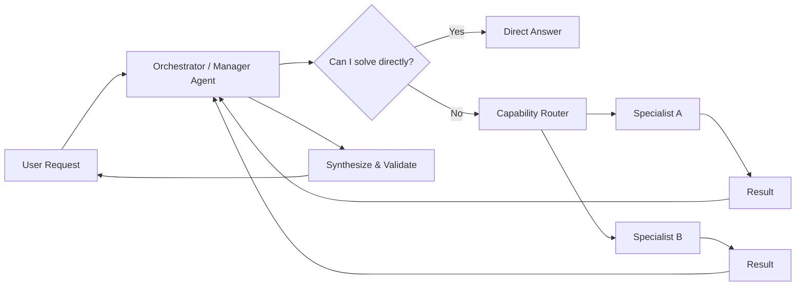

# Agent delegation

> **Learning Path:** Multi-Agent Architecture
> **Section:** 12.1.11 — Learn

**Agent delegation**

### The problem

A single agent can handle simple, well-scoped requests. It breaks down when requests are broad, multi-domain, or require different skills, tools, and data sources.

What appears:
* Context window bloat from mixing unrelated concerns
* Tool misuse because one general model tries to be expert in everything
* Latency grows linearly with work; no parallelism
* Cost and error rate rise as the agent hallucinates outside its competence
* One failure takes down the whole request

The constraint is not intelligence, it is scope and specialization under bounded resources.

### Mental model

Agent delegation is manager-worker separation for AI.

A manager agent owns the user goal, decomposes it, routes sub-tasks to specialist agents with bounded responsibilities, then synthesizes results.

Think of it as a capability router, not a bigger model. The system trades coordination overhead for specialization, parallelism, and isolation.

### How it works

Essential mechanism only:

* **Goal decomposition** - Manager extracts sub-goals with clear inputs/outputs. No vague handoffs.
* **Capability registry** - Each specialist advertises what it can do, tools it owns, latency/cost profile, and input schema.
* **Routing decision** - Router matches sub-goal to specialist by capability, not by keyword. Can be rule-based or a small classifier.
* **Contracted handoff** - Sub-task is sent with a contract: required inputs, output schema, success criteria, timeout.
* **Result aggregation** - Manager validates outputs, resolves conflicts, and decides if further delegation or retry is needed.

State is explicit. Either the manager holds the session state and passes relevant slices, or a shared context store is used. No implicit memory across agents.

### Architectural reasoning

When it helps:
* Tasks naturally decompose into independent domains: billing vs technical support vs compliance review
* Specialists need different tools, data access, or guardrails
* You want parallelism and independent scaling per skill
* You need failure isolation: a bad specialist should not corrupt the whole request

Alternatives:
* **Monolithic agent with tools** - Simpler, lower latency for small tasks. Fails on scope creep and tool confusion.
* **Collaborative multi-agent** - Agents negotiate peer-to-peer. More flexible but harder to reason about convergence and authority.
* **Human-in-the-loop** - Highest accuracy for edge cases, lowest autonomy.

Choose delegation when the cost of coordination is less than the cost of a generalist being wrong, slow, or expensive.

### Trade-offs and failure modes

* **Latency vs parallelism.** Delegation adds round trips and serialization. You win only if sub-tasks can run in parallel or are too heavy for a generalist.
* **Coordination overhead.** You now need routing logic, contracts, observability, and retry policies. Complexity moves from model to system.
* **Observability loss.** Tracing a user request across agents is harder. You need request IDs, spans, and per-agent telemetry.
* **State consistency.** Partial results can be stale or conflicting. Manager must define merge semantics.
* **Failure modes to watch:** delegation loops, ambiguous ownership, context loss at handoff, authority confusion where two agents try to act on same data, and cascading failures if router is a single point of failure.

### Example

Enterprise support triage.

User: "My invoice is wrong and my app keeps crashing on checkout."

Manager agent classifies intent into two independent sub-goals:
1. Verify billing discrepancy -> routes to Finance Specialist with read-only access to invoicing DB and refund tool
2. Diagnose checkout crash -> routes to Engineering Specialist with access to logs and reproduction sandbox

Both run in parallel with contracts: output must include evidence IDs and confidence. Manager synthesizes: "Invoice is correct per usage logs, here's breakdown. App crash is known bug X, workaround provided, ticket opened." No single agent touches both sensitive data domains.

### Reasoning challenge

You have a travel planning agent. Users ask for multi-city itineraries with visa checks, hotel booking, and price optimization. Latency SLA is 8 seconds.

Would you delegate visa checks, hotel search, and price optimization to specialists, or keep them in one agent with tools? What is the deciding constraint?

### Key takeaway

* Delegation exists to bound scope and specialize under resource constraints, not to make agents smarter.
* The architectural win is isolation, parallelism, and independent scaling of capabilities.
* Pay for it with coordination overhead, latency, and observability complexity.
* Design contracts and routing first; model choice second.
