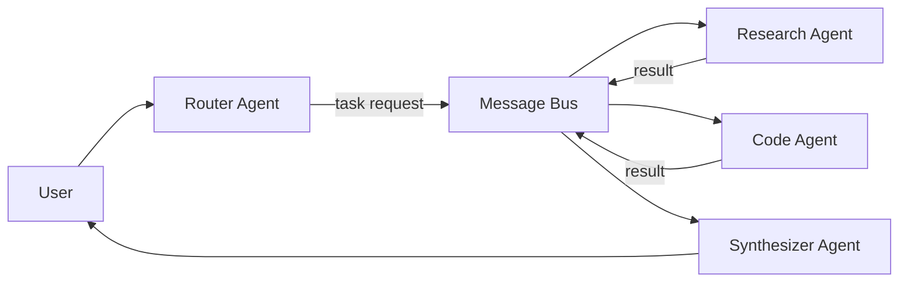

# Agent communication

> **Learning Path:** Multi-Agent Architecture
> **Section:** 12.1.12 — Learn

**Agent communication**

### 1. The problem

A single agent can reason and use tools, but real workloads need specialization. You get a Router, a Researcher, a Coder, a Reviewer. The problem isn't creating agents, it's making them cooperate without turning into a monolith.

Agents are autonomous, non-deterministic, and have different speeds and failure modes. If Agent A calls Agent B directly, you couple lifecycles, error handling, and schemas. If you just chain LLM prompts, you lose traceability and create brittle context passing.

You need a way for agents to exchange intent, not just data, while staying loosely coupled and observable.

### 2. Mental model

Think of agents as services with personalities. They communicate via messages with a contract: who sent it, what they want, what they assume, and what they will do next.

Communication is not RPC. It's more like a handoff of work with partial context. The message must be self-contained enough for a receiver to act without full system state.

### 3. How it works

Three primitives cover almost all multi-agent systems:

* **Request-response**: synchronous ask. Good for tight dependencies like Router → Specialist.
* **Publish-subscribe**: asynchronous events. Good for decoupled updates, e.g., `OrderCreated` -> Pricing, Inventory, Fraud agents.
* **Shared context store**: blackboard / memory. Agents read/write a shared artifact, e.g., a task ticket, and react to changes.

In practice you combine them. A message bus gives decoupling; a router gives orchestration.

Messages are structured, not free text. Minimum: `correlation_id, sender, receiver, intent, payload_schema, ttl, priority`. Natural language lives inside payload, but routing and observability rely on schema.

### 4. Architectural reasoning

When it helps: heterogeneous agents, long-running workflows, need for replay/audit, and teams that evolve independently.

Choose direct request-response when latency matters and the caller owns the outcome, e.g., Router needs a classification now.

Choose async bus when agents can work at different speeds and you want backpressure and retries. Events survive restarts.

Choose shared store when multiple agents need a consistent view of one artifact, e.g., a proposal document that Planner, Critic, and Legal agent all edit.

Alternatives: in-process function calls give speed but zero isolation. Central orchestrator gives control but becomes a bottleneck and single point of failure. Agent-to-agent LLM chat looks flexible but creates loops and non-determinism.

Decision rule: couple on intent, not implementation. Define a small, versioned message schema per domain and let agents subscribe to intents they can handle.

### 5. Trade-offs and failure modes

* **Coupling vs latency.** Direct calls are fast and simple. Bus adds latency and operational overhead but decouples deploy cycles.
* **Observability vs flexibility.** Structured messages are observable and testable. Free-form natural language messages are flexible but impossible to monitor.
* **Consistency vs autonomy.** Shared store gives a single source of truth but creates write contention. Message passing preserves autonomy but can diverge.
* **Cost.** Every agent hop is an LLM call. Unbounded fan-out explodes cost. You need dedupe, idempotency, and TTL.

Failure modes architects hit first:
* **Message loops**: A -> B -> A with no termination condition.
* **Context bloat**: forwarding entire conversation history instead of diffs.
* **Ambiguous intent**: receiver hallucinates what was asked.
* **Poison messages**: malformed payload crashes a downstream agent silently.

Mitigations: correlation IDs for tracing, schema validation at ingress, max hop count, explicit acknowledgements, and a dead-letter queue for unprocessable messages.

### 6. Example

Enterprise procurement triage.

Router receives a request: "Find a vendor for 500 laptops under $1200". It publishes `VendorSearchRequested` to bus with constraints.

Research Agent subscribes, queries catalog and web, writes results to shared `TaskTicket`. Pricing Agent subscribes to ticket updates, computes total cost of ownership. Compliance Agent checks policy. Synthesizer Agent waits for `all_required_results` event, then produces final recommendation.

If Pricing is slow, Router doesn't block. If Compliance fails, ticket is marked and Synthesizer can still produce partial output with caveats. Replay is possible from bus logs.

### 7. Reasoning challenge

You have a real-time customer support multi-agent system: Intent Classifier, Knowledge Retriever, and Safety Filter. Latency budget is 800ms p95. Retriever is often slow and occasionally times out.

Do you make Classifier call Retriever synchronously, move to async with a default answer, or put a cache in front? What happens to correctness and observability in each choice?

### 8. Key takeaway

* Agent communication is about intent handoff, not function calls. Design messages for autonomy and observability.
* Prefer loose coupling via a message bus + structured schemas over direct LLM-to-LLM chats.
* Choose sync for control, async for resilience. Never mix without explicit contracts.
* Guard against loops, context bloat, and ambiguous intent with correlation IDs, schemas, TTL, and max hops.
* The right pattern is the one that makes failure modes visible and cheap to fix.
