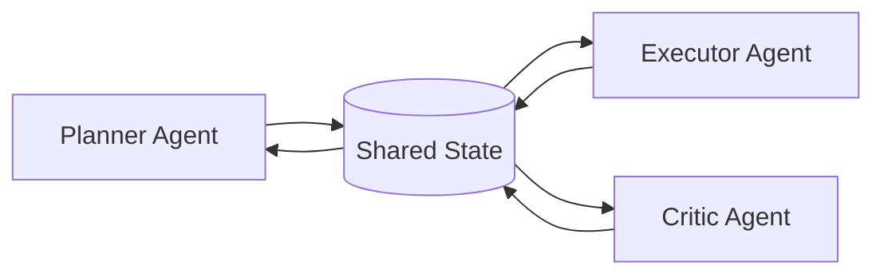

# Shared state

> **Learning Path:** Multi-Agent Architecture
> **Section:** 12.1.13 — Learn

**Shared state in multi-agent systems**

### The problem

When you move from a single agent to multiple autonomous agents, private state breaks down.

Each agent sees the world through its own memory. Agent A decides a task is done. Agent B still thinks it's pending. Agent C starts duplicate work because it never saw A's update. Without a common reference, you get inconsistency, wasted work, and agents that contradict each other.

The need is not just communication. Messages are point-to-point and ephemeral. Agents need a persistent, agreed-upon view of *what is true right now* about the world they are jointly acting on.

### Mental model

Think of a shared whiteboard in a war room, not a set of phone calls.

Agents read from and write to the same board. The board is the single source of truth for entities they co-own: tasks, facts, plans, customer context. Agents remain autonomous in *how* they act, but they converge on *what* they act on.

### How it works

A shared state layer sits behind the agents. It is not the agents' memory; it is the coordination surface.

Mechanically it is a store with read/write semantics plus conflict handling:

* **Write path:** Agent proposes an update with an entity id + version. Store applies if version matches, or rejects/merges.
* **Read path:** Agent queries a consistent snapshot of an entity or a subset of entities.
* **Coordination primitives:** versioning / ETags, optimistic concurrency, last-write-wins, CRDTs for commutative updates, or explicit locks for critical sections.

The store can be a relational DB, document store, key-value store, graph, or a purpose-built agent memory. The shape matters less than the contract: one truth, observable changes, and defined conflict resolution.

### Architectural reasoning

Shared state helps when agents must coordinate on the *same* mutable objects over time.

* **Common ground truth:** All agents need the same customer ticket, inventory item, or plan.
* **Reduced duplication:** A completion flag written once is seen by all.
* **Auditability:** State changes are a log you can replay and explain.

Alternatives exist:

* **Pure message passing / event bus:** Decouples agents, scales well, but reconstructing current state requires replay and inference. Good for fire-and-forget.
* **Central orchestrator:** A controller owns decisions, agents are workers. Simple, but creates a bottleneck and single point of failure.

Choose shared state when coordination latency matters more than write isolation, and when the cost of inconsistency is high. Choose message passing when agents are largely independent and eventual convergence is sufficient.

### Trade-offs and failure modes

* **Consistency vs availability.** Strong consistency prevents conflicting updates but creates contention and latency under load. Eventual consistency improves availability but agents may act on stale data.
* **Contention.** Hot entities become write bottlenecks. Optimistic concurrency causes retries; pessimistic locks cause blocking.
* **Stale reads.** Agents cache for speed, then act on old state. Version checks and short TTLs mitigate, but don't eliminate.
* **Poisoned state.** One buggy agent writes bad data that propagates to all. Need validation schemas, write permissions per agent role, and immutable event history for rollback.
* **Coupling.** Shared schema is a contract. Changing it is a coordinated migration across agents.

Failure mode to watch: thundering herd on a popular entity after a cache miss, and split-brain when agents read from partitioned replicas with divergent versions.

### Example

Enterprise support triage with three agents:

* Router agent classifies intent and assigns a priority.
* Sentiment agent updates escalation risk.
* Knowledge agent links relevant articles.

All three read/write `ticket_state` in a shared store:

`ticket_id -> {priority, sentiment_score, escalation_flag, plan_id, status, version}`

Router updates priority, increments version. Sentiment reads version, updates sentiment_score if version matches, otherwise retries. Executor agent watches `status` and only starts work when `status == 'ready'` and `version` is current. The store also emits change events so agents can react without polling.

Result: no duplicate escalation, plan updates are visible instantly, and an audit trail exists.

### Reasoning challenge

You have a real-time inventory agent and a forecasting agent sharing product stock levels. Inventory updates arrive at 1k writes/sec from POS terminals. Forecast agent writes daily predictions.

Do you use strong consistency for the stock entity, or allow eventual consistency with CRDTs? What breaks if you choose wrong?

Key takeaway

* Shared state exists to give autonomous agents a common, persistent view of jointly owned entities.
* It trades coupling and contention for coordination speed and reduced duplication.
* Design the conflict model first: versioning, merge semantics, and permissions before picking a store.
* Optimize for read patterns and hot entities; stale reads and write contention are the dominant failure modes.
