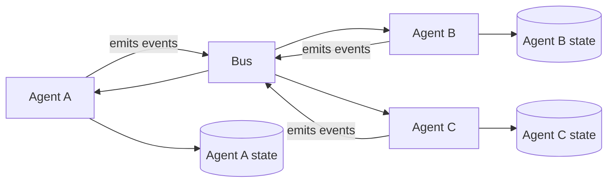

# Independent state

> **Learning Path:** Multi-Agent Architecture
> **Section:** 12.1.14 — Learn

**Independent state in multi-agent systems**

### The problem

What breaks when 5-10 autonomous agents need to work on the same workflow?

If they share a single mutable state — a central blackboard, a global store, an orchestrator-held context — you get coupling in 3 dimensions:
* **Contention:** agents read/write at different rates. The fastest agent stalls on locks, the slowest creates stale reads.
* **Blast radius:** one bad write corrupts the whole workflow. One agent crash can poison shared state.
* **Scaling & lifecycle:** agents scale independently, have different uptime, trust boundaries, and data retention needs. A shared state forces them to the lowest common denominator.

You end up with a distributed monolith disguised as agents.

### Mental model

Think of agents as independent services, not threads in the same process.

Each agent owns a private state boundary. It can be read and written by the agent alone. Other agents never touch it directly. Coordination happens via explicit contracts: messages, events, or read-only views.

Independent state = autonomy over data. Shared coordination over events.

No agent can reach into DB_B. The bus is for signals, not state sharing.

### How it works

* **State ownership:** each agent persists its own working memory, conversation history, tool outputs, and decisions. Persistence can be local DB, vector store, or file.
* **Communication via events:** when state changes matter to others, the agent emits a domain event: `InvoiceValidated`, `RiskScoreUpdated`. The event contains a minimal fact, not the whole state.
* **Read-only views:** if an agent needs context from another, it subscribes to events and builds a local projection, or calls a stable API. It never holds a live reference to the other's mutable state.
* **Idempotency and versioning:** messages carry agentId, runId, and sequence numbers so receivers can deduplicate and order independently.

This is message passing with state encapsulation, not shared memory.

### Architectural reasoning

When it helps:
* Agents have different scaling, SLAs, or failure domains. A triage agent can be stateless and autoscale; a billing agent must be durable and audited.
* Agents are owned by different teams or have different trust levels. Independent state enforces data boundaries.
* Workflows are long-running and non-linear. Agents come and go; state must survive agent restarts.

Alternatives:
* **Shared blackboard / central orchestrator state.** Simpler for small, tightly coupled workflows. Becomes a bottleneck and single point of failure at scale.
* **Full replication / CRDT.** Gives availability but adds complexity and eventual consistency headaches.

Decision rule: use independent state when autonomy, isolation, and independent evolution outweigh the cost of explicit coordination.

### Trade-offs and failure modes

* **Consistency vs autonomy.** Independent state trades strong consistency for availability and isolation. You must design for eventual consistency. An agent will act on slightly stale views of others.
* **Coordination overhead.** You pay for explicit contracts: schemas for events, versioned APIs, reconciliation logic. Shared state hides that cost until it explodes.
* **Duplicate data.** Projections are rebuilt locally, leading to storage cost and potential drift. You need compensating events and reconciliation jobs.
* **Failure modes to watch:** event loss → agents diverge; out-of-order delivery → bad decisions; missing backfills → new agents start with incomplete history.

Mitigations: at-least-once delivery, event logs with replay, explicit state snapshots, and clear ownership of “source of truth” per domain fact.

### Example

Enterprise support with three agents:

* **Triage Agent** owns intent classification and ticket routing state.
* **Billing Agent** owns customer plan, invoices, and payment state in PCI-compliant store.
* **Compliance Agent** owns audit log and policy checks.

They never share a DB. Triage emits `TicketCreated{customerId, issueType}`. Billing emits `PlanVerified{customerId, plan}`. Compliance subscribes to both and emits `RiskFlagRaised` if needed.

If Billing is down, Triage and Compliance continue. When Billing recovers, it replays missed events from the log and rebuilds its projection. No central state to corrupt.

### Reasoning challenge

You are designing a multi-agent loan approval flow. Credit Agent, Fraud Agent, and Pricing Agent all need the applicant profile.

Do you put the applicant profile in a shared document store that all agents read/write, or keep a canonical profile in one agent and let others work with events + read-only views?

What breaks first if the profile grows to 10MB per applicant and agents process 10k applications per hour?

### Key takeaway

* Independent state gives agents autonomy, isolation, and independent scaling at the cost of explicit coordination.
* Agents own their state; they communicate via events and stable contracts, not shared mutable objects.
* Choose it when agents have different lifecycles, trust boundaries, or failure domains.
* Design for eventual consistency, idempotent events, and replayable logs — not for a single source of truth for everything.
