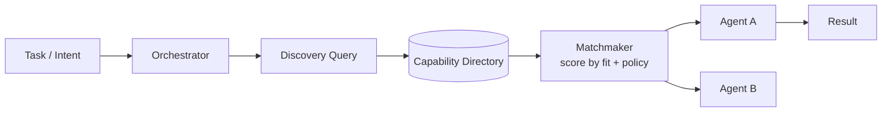

# Agent discovery

> **Learning Path:** Multi-Agent Architecture
> **Section:** 12.1.15 — Learn

### The problem

In a single-agent system you know who does what. In a multi-agent system you don't.

Agents are created, destroyed, scaled, and updated independently. An agent that handled PDF summarization yesterday may be retired today, while three new agents with overlapping but slightly different skills — e.g., `summarize-legal-pdf-v2`, `summarize-medical-pdf`, `summarize-with-citations` — come online.

Hardcoding agent addresses or capabilities in an orchestrator means constant redeploys, brittle routing, and lost autonomy. Static service discovery solves *where* a service is, not *which* agent is right for this intent, in this context, right now.

You need a way for an agent or orchestrator to find another agent by *capability, not name*, under churn.

### Mental model

Agent discovery is a matchmaking market, not a phone book.

A phone book gives you a name → address lookup. Agent discovery gives you an intent → best-fit agent lookup.

Agents publish a descriptor: what they can do, constraints, current load, version, and context requirements. A discoverer queries with a task and receives ranked candidates. The market can be centralized or decentralized.

### How it works

The essential mechanism is publish-describe-query-match.

1. **Advertise.** On start and on change, an agent publishes a capability descriptor to a directory. Descriptor is not just `service name`, it is semantic: inputs/outputs, tools, domain, cost/latency SLA, auth requirements, and freshness timestamp.
2. **Index.** A registry or distributed index stores descriptors. Some systems add a vector/semantic index for intent matching.
3. **Query.** An orchestrator or peer agent issues a discovery request: `need agent that can do X with data Y under constraints Z`.
4. **Match.** A matchmaker scores candidates by capability fit, context compatibility, load, and policy. It returns 1-N ranked agents, not a single hard route.

The directory can be a central registry, a gossip-based DHT, or a service mesh with sidecar metadata. The match step is what separates agent discovery from classic service discovery.

### Architectural reasoning

When it helps:
* Agents are dynamic and ephemeral. Auto-scaling, canary releases, and fault replacement create churn.
* Capabilities overlap and evolve. You want to route to the best agent, not a fixed one.
* You need loose coupling. Agents should be replaceable without changing callers.

Alternatives:
* **Static config / hardcoded routing.** Simple, fast, zero overhead. Fails at scale and churn.
* **Classic service discovery.** Kubernetes DNS, Consul, Eureka. Solves location, not semantic fit.
* **Direct peer gossip.** Agents ask neighbors. Fully decentralized, but discovery latency and completeness suffer.

You choose agent discovery when routing correctness and adaptability outweigh the cost of an index and matching logic.

### Trade-offs and failure modes

* **Freshness vs consistency.** Central registry gives strong consistency but is a hotspot and single point of failure. Decentralized gossip is resilient but descriptors go stale. You need TTLs, heartbeats, and versioned descriptors.
* **Precision vs latency.** Semantic matching with embeddings is more accurate but adds query latency and compute cost. Exact capability tags are fast but brittle.
* **Central control vs autonomy.** A central matchmaker simplifies policy enforcement and auditability. It also creates coupling and a bottleneck. Peer discovery preserves autonomy but makes global optimization hard.
* **Spoofing and trust.** Anyone can advertise a capability. Without attestation, signing, and policy checks, you can route to malicious or low-quality agents. Capability must be verifiable, not just claimed.

Common failures: stale entries routing to dead agents, thundering herd when a popular capability is advertised, and semantic drift where descriptors no longer match real behavior.

### Example

Enterprise support with a multi-agent mesh: Triage Agent, Billing Agent, Legal Review Agent, and region-specific Compliance Agents.

A customer request arrives: "Dispute charge on invoice #12345, EU customer, needs GDPR audit trail."

The orchestrator does not call `billing-agent-prod`. It queries discovery for `capability: dispute-billing`, `constraints: region=EU`, `requires: audit_trail=true`. The directory returns two candidates: Billing Agent EU with low load and Legal Review Agent with higher precision but higher cost. Matchmaker ranks by policy: route to Billing Agent EU, escalate to Legal if confidence < threshold.

When the EU agent is scaled down at night, discovery automatically returns the fallback US agent with a flag `audit_trail=false`, allowing the orchestrator to reject or reroute. No config change required.

### Reasoning challenge

You are designing a fraud detection mesh. Agents are short-lived, spawned per merchant, and advertise `detect-fraud` with different models and latency SLAs. A central registry gives 50ms query latency but becomes a bottleneck at 10k agents. A gossip mesh has no bottleneck but descriptors are up to 30s stale.

Which discovery pattern do you choose for real-time transaction scoring, and what guardrails do you add to make it safe? What do you sacrifice?

### Key takeaway

* Agent discovery solves *who is capable*, not just *where is it*. It enables dynamic routing in autonomous multi-agent systems.
* Publish capability descriptors, index them, and match by intent + constraints, not by name.
* Centralized gives freshness and control; decentralized gives resilience. Choose based on churn rate and policy needs.
* Always design for staleness, spoofing, and semantic drift. Discovery without verification and TTLs is a reliability hazard.
