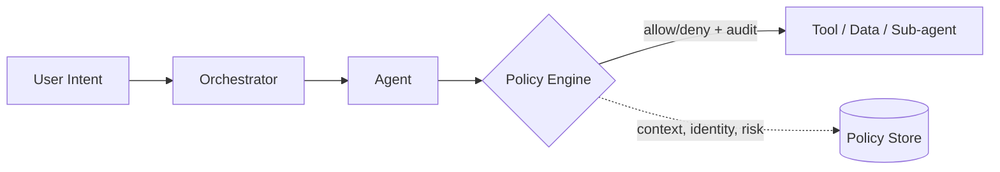

# Agent permissions

> **Learning Path:** Multi-Agent Architecture
> **Section:** 12.1.17 — Learn

**Agent permissions**

### The problem

Multi-agent systems give autonomy to the problem. An agent can read data, call tools, write to databases, and delegate to other agents. That power is useful, but it is also dangerous.

What problem appears when:
* A triage agent is compromised and starts calling billing APIs
* A research agent with read-only access to public data is asked to summarize a customer's PII
* An agent inherits the user's full identity and can act beyond the current intent

Without boundaries, one agent failure becomes a system-wide breach. You need a way to enforce *what an agent is allowed to do, on whose behalf, and under what conditions* — and you need to enforce it at runtime, not just at deployment.

### Mental model

Think of agent permissions as a capability guardrail, not an identity wall.

Identity answers *who* is calling. Permissions answer *what can be done with that identity, in this context, right now*.

The useful mental model is: **Agent = Identity + Policy + Context**.

Identity is who the agent is and what user it represents. Policy is the allowed actions and resources. Context is the current conversation, task, risk level, data classification. Permission is the intersection of the three.

### How it works

Permission is enforced at the action boundary, not inside the agent.

The essential mechanism:
1. **Scope the agent.** Each agent gets a capability set: allowed tools, data domains, actions. Not a user token, a derived capability token.
2. **Classify intent.** Before a tool call, extract what resource is targeted and what operation is requested.
3. **Evaluate policy.** Policy engine checks identity, capability, context, and data sensitivity. Policies are declarative and versioned.
4. **Enforce and audit.** Allowed actions proceed with a signed, short-lived grant. Denials are logged. All decisions are auditable.

This keeps agents dumb about policy and the policy system agnostic about agent logic.

### Architectural reasoning

When it helps:
* Multi-agent topologies where agents delegate to each other
* Agents that call external tools with side effects
* Systems with mixed trust levels: system agents vs user-delegated agents
* Regulated data where access must be justified per request

What it solves: privilege escalation, data exfiltration, unintended tool use, and loss of auditability.

Alternatives:
* **User impersonation.** Agent uses user's full token. Simple, but maximal blast radius.
* **Static role binding.** Agent has fixed role. Cheaper, but cannot adapt to context like data sensitivity.
* **No enforcement.** Rely on prompt instructions. Fails reliably.

Choose fine-grained, runtime permission when the cost of a bad action > cost of enforcement latency.

### Trade-offs and failure modes

* **Centralized vs distributed enforcement.** Central policy engine gives consistency and audit, adds latency and a single point of failure. Distributed checks are faster but risk drift.
* **Granularity vs operability.** Too fine-grained policies are correct but unmaintainable. Too coarse and you leak data.
* **Performance.** Policy evaluation on every tool call adds latency. Mitigate with short-lived cached grants and pre-flight checks.
* **Context misclassification.** If intent classification is wrong, policy will be wrong. This is a common failure mode.
* **Policy sprawl.** Permissions rot without ownership. Treat policies as code with tests and change review.

Failure mode to remember: a permission system that only checks *who* and *what*, but not *why now*, will allow a legitimate agent to perform a destructive action in the wrong conversation.

### Example

Enterprise support platform with three agents:
* Triage agent: can read ticket metadata, call search, delegate to specialists
* Billing agent: can read invoices, create refunds up to $500
* HR agent: can read employee records, but only for the employee's own data

All agents run under the same platform. Permissions are enforced by a policy engine that checks:
* Agent capability set
* User context: is the current user the employee in question?
* Risk context: refund amount, data classification

The triage agent receives a request "refund my invoice". It can read the ticket, but the refund tool call is routed through policy. Policy denies because triage lacks `billing.refund` capability. Orchestrator then delegates to billing agent with a scoped grant: `billing.refund` allowed for this ticket only, max $500, expires in 5 min.

No agent ever holds a full user token.

### Reasoning challenge

You are designing a research multi-agent system. Agent A summarizes public web data. Agent B accesses internal code repos. A user asks Agent A to "find similar code to this snippet" and Agent A wants to call Agent B.

Do you allow the delegation? What information do you need before deciding, and what permission model would you use?

### Key takeaway

* Agent permissions exist to contain blast radius when autonomous agents act.
* Enforce at the action boundary with identity + capability + context, not inside the agent.
* Prefer short-lived, scoped grants over long-lived impersonation.
* The hardest part is not the policy language, it is maintaining accurate context for decisions.
