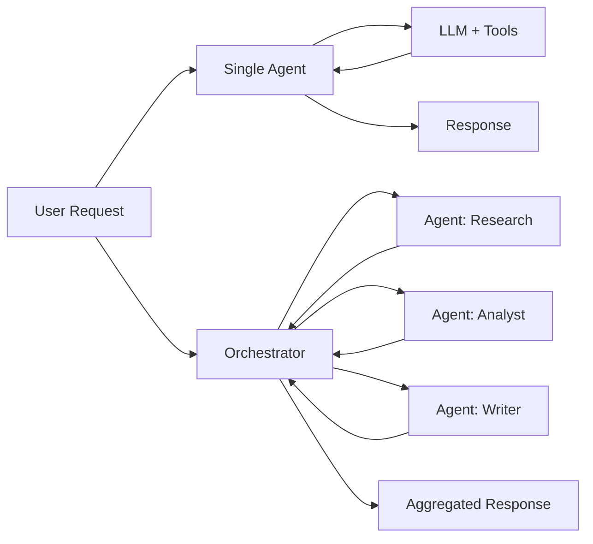

# Single agent vs multi-agent

> **Learning Path:** Multi-Agent Architecture
> **Section:** 12.1.2 — Learn

**Single agent vs multi-agent**

### 1. The problem

A single LLM agent is good at one thing: turn a prompt + context + tools into a coherent next step. It breaks down when the task is not one step.

You hit:
* **Capability breadth** - Needs deep finance *and* legal *and* code review in the same flow
* **Context overload** - Conversation history + documents + tool outputs exceed the window
* **Reasoning depth** - Multi-step planning with backtracking, verification, and conflict resolution
* **Operational constraints** - Different SLAs, data access policies, and failure domains for sub-tasks

The problem is not intelligence, it's *scope and control*.

### 2. Mental model

Single agent = one brain with tools.
Multi-agent = a team with roles, a coordinator, and handoffs.

Think of it as *centralized reasoning* vs *distributed specialization*.

### 3. How it works

**Single agent**
User request -> Agent loop: plan -> retrieve -> reason -> tool call -> repeat -> final answer.
All planning, tool selection, and memory lives in one model instance.

**Multi-agent**
Orchestrator receives request, decomposes it, routes to specialist agents, aggregates results.

Key mechanisms in multi-agent: decomposition, role definition, message passing, and a coordination protocol - shared blackboard, centralized orchestrator, or peer-to-peer negotiation.

### 4. Architectural reasoning

Choose single agent when:
* Task is well scoped, single domain, < ~10 steps
* Latency and cost matter more than perfect accuracy
* You need simple operability and observability

Choose multi-agent when:
* Task naturally decomposes into independent subproblems with different expertise
* You need verifiable separation of concerns, e.g., research vs judgment vs compliance
* You want to isolate failure, scale specialists independently, and enforce data boundaries
* You need auditability - who decided what, and why

Alternatives: ReAct loop with better prompting, tool routing, or retrieval augmentation. Multi-agent is not always better, it's more expensive coordination for problems that benefit from decomposition.

### 5. Trade-offs and failure modes

* **Coordination overhead vs reasoning capacity.** Multi-agent adds latency, message passing cost, and failure points. You trade a single model's confusion for inter-agent inconsistency.
* **Consistency and hallucination propagation.** Agents can reinforce each other's errors. Need validation gates, contracts on outputs, and a final critic.
* **Observability complexity.** Debugging requires tracing across agents, not just one prompt chain. Logging, state, and replay become critical.
* **Cost.** N agents = N LLM calls + orchestration. Budget and rate limits multiply.

Common failures: infinite loops between agents, ambiguous handoffs, role drift, and the orchestrator becoming a bottleneck single point of failure.

### 6. Example

Enterprise procurement approval.

Single agent can draft a request for quote and summarize a vendor response. It will struggle with: check budget policy, verify supplier compliance, negotiate terms, and produce a legally reviewed contract, all with different data sources and approval SLAs.

Multi-agent design:
* **Policy Agent** - reads internal controls, outputs allowed budget range
* **Vendor Agent** - retrieves supplier data, checks risk score
* **Negotiation Agent** - generates counter-offer within constraints
* **Compliance Agent** - validates contract clauses
* **Orchestrator** - enforces workflow order, merges outputs, escalates conflicts

Each agent has a narrow context, tools, and success criteria. Failure is contained.

### 7. Reasoning challenge

You need an AI assistant to onboard enterprise customers: verify identity documents, run KYC checks, create billing profile, and send welcome email.

Do you build one powerful single agent with all tools, or a multi-agent pipeline with verification, finance, and communications specialists?

What constraints would push you one way or the other?

### 8. Key takeaway

* Single agent optimizes for simplicity and latency on bounded tasks. Multi-agent optimizes for decomposition, specialization, and control on complex workflows.
* The decision is architectural, not model capability: can you decompose cleanly with verifiable contracts?
* Multi-agent buys you modularity and safety at the cost of coordination overhead, consistency risk, and operational complexity.
* Start single. Split when you can name distinct roles with different data, tools, and SLAs.
