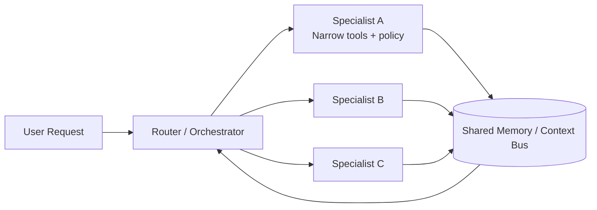

# Agent specialization

> **Learning Path:** Multi-Agent Architecture
> **Section:** 12.1.3 — Learn

**Agent specialization**

### 1. The problem

What problem appears when you try to make one agent do everything?

A generalist agent needs to hold domain knowledge, tools, policies, and reasoning strategies for all tasks. As scope grows:
* Context window saturates. The agent sees less of what matters.
* Tool selection error rate rises. More tools = more chance to call the wrong one.
* Latency and cost grow linearly with task breadth. Every request pays for unused capabilities.
* Safety and quality degrade. One policy mistake affects all workflows.
* Change becomes risky. Updating billing logic can break support triage.

The constraint is not intelligence, it is *bounded attention and bounded reliability* under real-world constraints.

### 2. Mental model

Agent specialization is division of labor.

Instead of one generalist, you have a narrow expert per problem class with a bounded skill set, tools, and success criteria. A router decides who should work, and a coordination layer manages handoffs.

Think of a hospital, not a solo doctor. Triage -> specialist -> surgery -> recovery. Each role has a tight scope and clear handoff contract.

### 3. How it works

The essential mechanism is **decompose, route, execute, hand off**.

* Router classifies intent and constraints, often with a lightweight model or rules.
* Each specialist owns: a prompt/system policy, a limited tool set, a validation step, and an output schema.
* Shared memory provides continuity without polluting each specialist's context. Handoffs are explicit, not implicit.

Specialization can be by domain, modality, tool, or quality bar.

### 4. Architectural reasoning

When it helps:
* Tasks cluster into distinct domains with different tools and policies. e.g., billing vs technical support.
* Latency SLO differs per task. Fast triage vs deep research.
* Safety requirements differ. Access to PII vs public web search.
* You need independent scaling and rollout. Update one specialist without redeploying all.

Alternatives:
* **Monolithic generalist.** Simpler ops, worse at scale. Good for prototypes and low volume.
* **Fine-tuned models per domain.** Strong performance, high training and maintenance cost. Specialization via agents is cheaper to iterate.
* **Human-in-the-loop for all.** Reliable but not scalable.

Choose specialization when coordination cost < cost of generalist errors + wasted compute.

### 5. Trade-offs and failure modes

* **Coordination overhead.** Router misclassification creates cascading errors. You need observability on routing accuracy.
* **Context fragmentation.** Specialists lose cross-domain signals. Mitigate with a shared context bus and explicit handoff contracts.
* **Handoff latency.** Each hop adds round trips. Keep handoffs rare and batched.
* **Operational complexity.** More agents = more prompts to maintain, more failure surfaces. Standardize interfaces, schemas, and testing.
* **Incentive misalignment.** Specialist optimizes locally, degrades global outcome. Define end-to-end success metrics, not just per-agent accuracy.

Failure mode to watch: *over-specialization*. Too many tiny agents create a brittle routing graph that is harder to reason about than the monolith it replaced.

### 6. Example

Enterprise customer support.

* **Triage Agent:** classifies intent, extracts account, checks SLA. Tools: search tickets, read profile. No refunds.
* **Billing Specialist:** owns payment tools, refund policy, audit log. Validates identity strictly.
* **Technical Specialist:** owns logs, runbooks, can invoke remediation tools. No billing access.
* **Escalation Agent:** synthesizes summary from specialists, decides human handoff.

Router routes on intent + risk. Shared memory holds ticket state. Each specialist runs smaller, faster, cheaper, and can be A/B tested independently. A billing policy change does not risk technical advice quality.

### 7. Reasoning challenge

You are designing an AI agent for loan applications.

Options:
A. One agent with credit check, document extraction, compliance review, and approval.
B. Four specialists: Intake, Document Verification, Credit Risk, Compliance, with a router.

Application volume is 10k/day, compliance audit is strict, credit model updates monthly.

Which do you choose and what is the first thing you instrument to prove it works?

### 8. Key takeaway

* Specialization trades coordination complexity for bounded context, lower error rate, and independent evolution.
* Design agents around *scope, tools, and safety bar*, not personality.
* Router accuracy is the system bottleneck. Measure it first.
* Keep handoffs explicit with schemas and shared memory, not free-form chat.
* Start with 2-3 specialists where cost/quality pain is highest, not full decomposition upfront.
