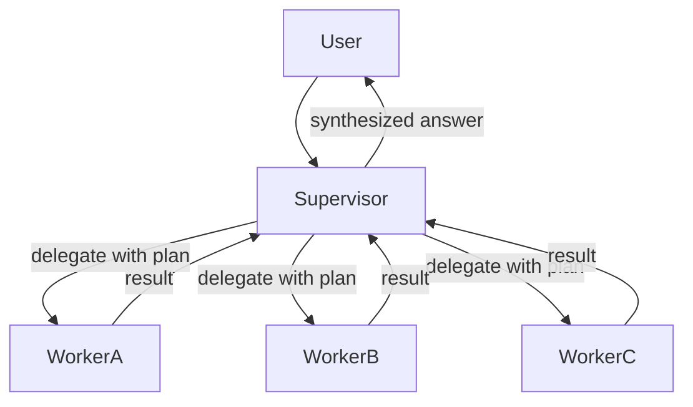

# Supervisor architecture

> **Learning Path:** Multi-Agent Architecture
> **Section:** 12.1.4 — Learn

### The problem

A single agent can handle a simple, well-scoped request. It breaks down when the request is multi-step, requires different tools and expertise, and needs a coherent final answer.

You get:
* Context overload. The agent must hold the whole task, intermediate results, and tool outputs in one window.
* Tool conflict. One agent with access to billing, code search, and customer DB will hallucinate which tool to use when.
* No accountability. When the answer is wrong, you can't tell if the failure was planning, execution, or synthesis.

The need is not more power in one agent. It's decomposition with coordination.

### Mental model

Supervisor architecture = air traffic controller for agents.

The supervisor does not do the work. It plans, routes, monitors, and synthesizes. Workers are specialist agents with narrow roles and tools. The supervisor maintains the global context and decides who does what next.

### How it works

1. **Receive and plan.** Supervisor ingests the user request and produces a decomposition plan: subtasks, required worker roles, dependencies.
2. **Delegate.** Each subtask is handed to one worker with a focused prompt and only the context it needs. Handoffs are explicit.
3. **Monitor.** Supervisor tracks completion, timeouts, and errors. It can re-assign or re-prompt.
4. **Synthesize.** Workers return structured results. Supervisor merges them into a final coherent response, resolves conflicts, and ensures policy compliance.

State is held by the supervisor, not duplicated in workers. Workers are stateless specialists.

### Architectural reasoning

**When it helps**
* Tasks are decomposable into independent or loosely coupled subtasks with different skills.
* Workers need different tools, guardrails, or data access.
* You need a single accountable output and consistent tone/policy.

**Alternatives**
* **Single agent with tools.** Cheaper, lower latency. Fails when tasks grow complex or tools interfere.
* **Router / flat collaboration.** Agents pick each other. Better for peer-to-peer, worse for global coherence and ordering.
* **Hierarchical supervisors.** Supervisors of supervisors for large systems. Adds latency for marginal control gain.

Choose supervisor when coordination cost < specialization gain.

### Trade-offs and failure modes

* **Supervisor is a bottleneck and single point of failure.** All planning and synthesis goes through it. If it drifts, the whole answer drifts.
* **Latency adds up.** Sequential delegation is slower than one shot. Parallel delegation helps but needs dependency modeling.
* **Context loss at boundaries.** Workers see only a slice. The supervisor must summarize correctly or workers repeat work.
* **Over-delegation.** Supervisor can create too many tiny tasks, increasing token cost and error surface.
* **Prompt brittleness.** Supervisor prompt defines routing quality. Small changes change who gets what.

Failure mode to watch: supervisor hallucinates a subtask completion and synthesizes from missing data. Mitigate with structured outputs, required fields, and explicit "no result" handling.

### Example

Enterprise support triage.

User: "My invoice is wrong and the app keeps crashing on checkout."

Supervisor plan:
* Worker Billing: fetch invoices, check discrepancies, propose correction.
* Worker Tech: reproduce crash, check logs, suggest fix.
* Worker Policy: ensure refund wording complies with retention policy.

Supervisor receives three structured results, checks for conflict, and produces one response: apology, billing correction timeline, immediate workaround, and escalation path. Workers never see each other's internal tools.

Without supervisor, one agent would mix billing DB queries with log analysis and likely hallucinate.

### Reasoning challenge

You are building a real-time fraud detection agent that must score a transaction in <500ms using rules, graph lookup, and LLM reasoning.

Would you use a supervisor with specialist workers? Why or why not?

### Key takeaway

* Supervisor exists to trade coordination overhead for specialization, context isolation, and accountable synthesis.
* Use it when tasks decompose cleanly and consistency matters more than raw latency.
* The supervisor's quality is the system's quality; workers only execute.
* Watch for bottleneck, latency, and context loss at delegation boundaries.
