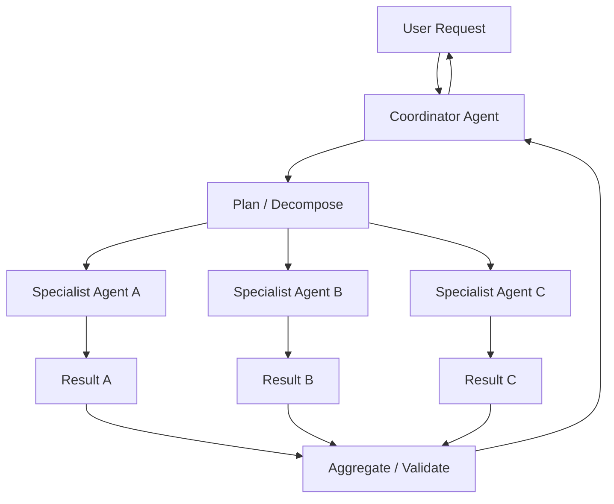

# Hierarchical agents

> **Learning Path:** Multi-Agent Architecture
> **Section:** 12.1.5 — Learn

### 1. The problem

A flat multi-agent system works for 2-3 agents with a clear, bounded task. It breaks when the task space grows.

You get:
* **Prompt explosion.** Every agent needs the full context to coordinate, hitting token limits and cost.
* **No specialization.** Agents are generalists, so reasoning quality drops on domain-specific subtasks.
* **Coordination chaos.** N agents negotiating with each other creates O(N²) message traffic and non-determinism.
* **No governance.** No single place to enforce policy, safety, or quality gates.

The constraint is cognitive and operational: you need decomposition without losing coherence.

### 2. Mental model

Hierarchical agents are an org chart, not a committee.

A coordinator owns the goal, decomposes it, delegates to specialists, and aggregates results. Specialists can themselves be coordinators for their own sub-team.

The hierarchy creates bounded context: each layer sees only what it needs, and responsibilities are explicit.

### 3. How it works

The essential mechanism is **decompose → delegate → aggregate**.

Coordinator decides *what* needs doing and *who* should do it. Specialists decide *how* to do it. Aggregator resolves conflicts, fills gaps, and enforces output contracts.

The contract between layers is key: input schema, output schema, success criteria, and a timeout/cost budget.

### 4. Architectural reasoning

**When it helps**
* Complex, multi-step goals that naturally decompose: research → synthesize → draft.
* Need for domain specialization: legal, finance, support tiers.
* Governance and auditability requirements: one place to log decisions and enforce policy.

**What it solves**
* Keeps context bounded per agent, reducing token use and latency per step.
* Enables parallel work without cross-talk.
* Makes failure localizable: a bad specialist can be retried or swapped without restarting the whole job.

**Alternatives**
* **Monolithic agent:** Simpler, lower latency for small tasks, but degrades quickly with complexity and cost.
* **Flat multi-agent with consensus:** More democratic, good for collaborative creativity, but expensive and brittle at scale.
* **Hierarchical:** Trade coordination overhead for structure and specialization.

Choose hierarchy when the task graph is deep and the cost of a wrong decomposition is higher than the cost of coordination.

### 5. Trade-offs and failure modes

* **Latency stacks.** Each layer adds a round trip. Deep trees can become slower than a single pass.
* **Error propagation.** A bad plan from the coordinator poisons all children. Garbage in, garbage out at scale.
* **Single point of failure / bottleneck.** Coordinator becomes critical path. If it hallucinates routing, specialists waste work.
* **Context loss.** Aggregation must summarize, so nuance can be lost. You need explicit contracts, not free-form summaries.
* **Cost and observability.** You pay for multiple model calls and need tracing across the tree to debug.

Most architects underestimate planning quality. The hierarchy is only as good as the decomposition logic.

### 6. Example

Enterprise support triage.

User request: "My invoice is wrong and my API is down."

Coordinator classifies intent → two sub-problems: billing discrepancy and technical outage.

It delegates to Billing Specialist Agent with context: customer ID, last 3 invoices, SLA. Delegates to Tech Specialist Agent with context: API logs, recent deploys.

Each specialist works in a bounded context, returns structured findings: `issue_confirmed`, `root_cause`, `recommended_action`.

Aggregator checks for conflicts — e.g., outage caused failed payment retries — and produces a single response with two action tracks and an escalation path.

No agent ever sees the full support history, just its slice.

### 7. Reasoning challenge

You are building a procurement assistant for a large retailer. It must: find suppliers, check compliance, negotiate price, and generate a PO.

Would you use a flat team of 4 specialists or a 2-level hierarchy with a Coordinator + 4 specialists? What changes if the supplier pool is 10,000 vs 10? What metric would you watch to know the hierarchy is hurting you?

### 8. Key takeaway

* Hierarchical agents exist to contain complexity via decomposition and specialization, not to make agents smarter.
* The coordinator's job is planning and routing, not doing. Specialists' job is execution within a bounded context.
* The real cost is latency and planning errors; the real benefit is operability, governance, and scalability.
* Design the contracts between layers first — input/output schemas and success criteria — then the agents.
