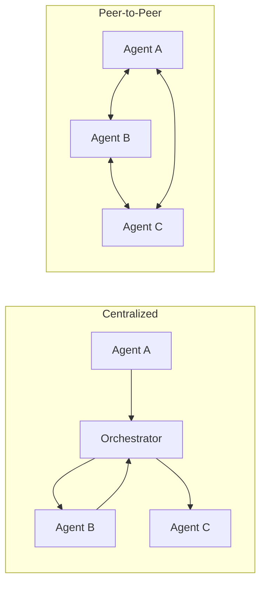

# Peer-to-peer agents

> **Learning Path:** Multi-Agent Architecture
> **Section:** 12.1.6 — Learn

**Peer-to-peer agents**

### 1. The problem

Central orchestration works until it doesn't. With a hub-and-spoke multi-agent system, every request, handoff, and decision flows through an orchestrator or central bus.

That creates three architectural pressures:
* **Chokepoint and latency.** All inter-agent traffic is serialized through one controller. As agent count and message rate grow, the orchestrator becomes the bottleneck.
* **Single point of failure and coupling.** If the orchestrator fails, coordination stops. Agents become dumb workers that can't reason about each other.
* **Loss of autonomy.** The orchestrator must know the whole workflow, capabilities, and state. Agents can't dynamically form new collaborations without a code change in the center.

The problem appears when agents are numerous, specialized, long-lived, and need to collaborate in ad-hoc ways. You want decentralization without anarchy.

### 2. Mental model

Peer-to-peer agents is a mesh, not a star.

In a star, agents are nodes and the orchestrator is the hub. In a mesh, agents are both nodes and routers. Each agent advertises its capabilities, discovers peers, and communicates directly with those peers to negotiate work.

Think of it like a market of specialists rather than a call center with a supervisor. Agents publish what they can do, others query and contract directly.

### 3. How it works

The essential mechanism is decentralized coordination primitives, not magic messaging.

* **Capability advertisement.** Agents publish an agent card / capability description: inputs, outputs, SLAs, cost, trust level. This is discoverable via a service registry or gossip.
* **Direct addressing and routing.** Agents maintain a partial view of the network and can route messages peer-to-peer. The transport can still be a message bus, but the *control plane* is distributed.
* **Negotiation protocol.** Two agents exchange intent, constraints, and a contract before work begins. This is local reasoning, not orchestrator scripting.
* **Shared context, not shared brain.** Agents share ephemeral context for a task via direct links, then drop it. No central state must be kept consistent for all time.

Implementation is minimal: discovery + a message envelope with sender/receiver/contract + local policy for acceptance/rejection.

### 4. Architectural reasoning

Peer-to-peer helps when:
* **Scale and churn matter.** Agents join and leave continuously. You can't update a central routing table each time.
* **Latency is critical.** Direct handoff avoids round-trips through the orchestrator.
* **Agents need autonomy.** Each agent can decide whom to trust, when to refuse, and how to compose sub-tasks.

Alternatives:
* **Central orchestrator.** Good for deterministic workflows, strong auditability, and when you need global optimization. Bad for scale and dynamism.
* **Shared blackboard / event bus.** Good for loose coupling and broadcast. Bad for targeted negotiation and private contracts.

Choose peer-to-peer when the system value comes from *emergent collaboration* rather than *pre-defined processes*.

### 5. Trade-offs and failure modes

* **Observability loss.** No single log of who talked to whom. You need distributed tracing, correlation IDs, and agent-level telemetry, otherwise debugging is impossible.
* **Consistency and conflict.** Two agents can accept overlapping work or make contradictory commitments. You need local conflict resolution, idempotency, and eventually consistent state.
* **Security surface.** Every agent is an entry point. You need mutual authentication, capability-based authorization, and message validation at each peer, not just at the hub.
* **Operational complexity.** Failure modes like network partitions, stale routing tables, and Byzantine agents appear. You trade central complexity for distributed coordination complexity.

### 6. Example

Supply chain reconciliation. Procurement agent, inventory agent, compliance agent, and logistics agent all run independently.

In a centralized design, the orchestrator routes: "Order placed → check inventory → check compliance → book logistics". If logistics is slow, the orchestrator backs up.

In peer-to-peer, the procurement agent broadcasts intent. Inventory agent replies directly with availability and ETA. Compliance agent negotiates directly with procurement on required docs. Logistics agent negotiates directly with inventory on pickup window. The orchestrator is only used for audit, not for real-time coordination.

Latency drops, the system survives if one agent is down, and new regional agents can join without redeploying the center.

### 7. Reasoning challenge

You are designing a customer support system with 200 specialized agents: triage, refund, fraud check, billing, product expert.

Peak load requires <500ms handoffs. Agents are added weekly by different teams. Compliance requires a full audit trail of who handled what.

Do you go peer-to-peer, centralized, or hybrid? What do you keep centralized and what do you push to peers?

### 8. Key takeaway

* Peer-to-peer agents exist to remove the coordination chokepoint and let agents negotiate directly.
* It trades global control and easy observability for scalability, autonomy, and resilience.
* Use it when agents are dynamic, specialized, and need low-latency ad-hoc collaboration.
* Keep a thin central layer for discovery, security, and audit, but move workflow control to the edges.
