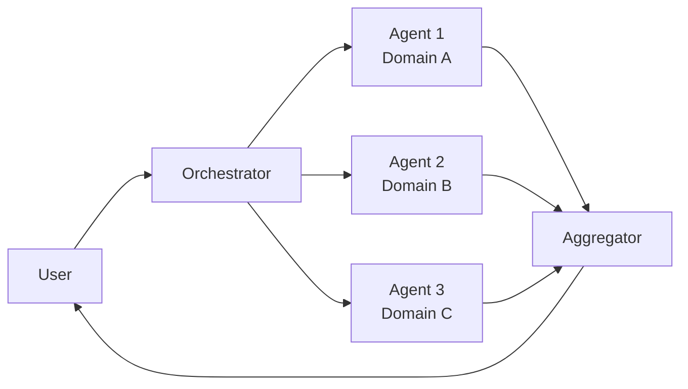

# Parallel agents

> **Learning Path:** Multi-Agent Architecture
> **Section:** 12.1.8 — Learn

**Parallel agents**

### 1. The problem

A single agent can handle a complex task, but it pays for it in latency, context bloat and error propagation.

When a request requires multiple independent skills — research, code review, summarization, policy check — a sequential chain means each step waits for the previous one. The agent's context window accumulates all intermediate outputs, diluting focus and increasing hallucination risk. One slow or wrong step stalls the whole job.

You hit a wall when:
* Sub-tasks are independent but must complete before synthesis
* SLO demands throughput, not just correctness
* Different domains need different tools, prompts, or safety guardrails

Sequential is simpler. Parallel is necessary when the cost of waiting exceeds the cost of coordination.

### 2. Mental model

Think map-reduce, not assembly line.

A coordinator decomposes a problem into independent sub-problems, fans out to specialized workers, then reduces the results into a coherent answer.

Agents are workers. The coordinator is the contract: what to ask, what context to share, and how to merge.

### 3. How it works

Essential mechanism, not features:

1. **Decompose**: Coordinator extracts parallelizable sub-tasks with explicit inputs and success criteria.
2. **Fan-out**: Sub-tasks are dispatched concurrently to agents with bounded context. No inter-agent chatter.
3. **Fan-in**: Results return to an aggregator that resolves conflicts, fills gaps, and produces the final artifact.

Shared state is minimal and read-only: original request, constraints, and a schema for outputs. No shared mutable memory during execution.

### 4. Architectural reasoning

When it helps:
* Embarrassingly parallel work: market data + competitor analysis + regulatory check for a report
* Strict latency SLO where wall-clock time matters more than total compute
* Isolation of risk: a failing or hallucinated sub-agent does not poison others

Alternatives:
* **Sequential chain**: cheaper to operate, easier to reason about, preserves causal flow. Best when steps depend on each other.
* **Single broad agent**: lowest coordination cost, but context saturation and skill averaging.

Choose parallel when sub-problems are independent and the merge cost is predictable. Choose sequential when the output of step N is a required input for step N+1.

### 5. Trade-offs and failure modes

* **Cost vs latency**: You pay N times for LLM calls. Wall-clock time drops, total token cost rises. Budget this explicitly.
* **Consistency**: Independent agents can contradict each other. Aggregation needs conflict resolution rules, not naive concatenation.
* **Coordination overhead**: Decompose too finely and orchestration dominates. Too coarse and you lose parallelism.
* **Failure amplification**: Non-determinism multiplies. One agent hallucinates, aggregator must detect and dampen it.
* **Observability**: Tracing across agents is harder. You need correlation IDs, per-agent metrics, and per-sub-task success criteria.

Common failure: fan-out without a contract. Agents return free-form text, aggregator cannot merge. Define output schemas.

### 6. Example

Enterprise due-diligence brief.

Request: "Assess acquisition target Acme Corp."

Coordinator decomposes:
* Agent A: financials — revenue trend, burn, cash runway
* Agent B: market — TAM, competitors, positioning
* Agent C: risk — litigation, compliance, key personnel

All three run in parallel with read-only data access and a JSON schema for output. Aggregator checks for contradictions, weights by confidence, and produces a 1-page brief with citations.

Latency goes from ~90s sequential to ~35s parallel. Cost triples. Acceptable because the brief is time-critical and the sub-domains are independent.

### 7. Reasoning challenge

You need a loan approval decision in <2s. The policy requires: credit score check, fraud signal check, and affordability calculation from bank statements.

Credit and fraud are independent API calls. Affordability needs the raw statements, which the other two do not.

Would you run three parallel agents, two parallel + one sequential, or a single agent with tools? What changes if fraud check must veto approval before affordability runs?

### 8. Key takeaway

* Parallel agents exist to buy wall-clock time by trading coordination cost and compute cost.
* Use them when sub-tasks are independent, mergeable, and latency-sensitive.
* Design the contract first: decomposition, output schema, conflict resolution.
* The hardest part is not fan-out, it is safe fan-in.
