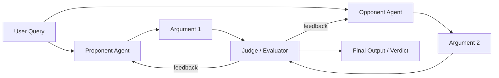

# Debate

> **Learning Path:** Multi-Agent Architecture
> **Section:** 12.1.9 — Learn

**Debate** in multi-agent architecture is not discussion for its own sake. It is an adversarial reasoning pattern to force a single-agent failure mode into the open.

### 1. The problem

A single LLM agent is optimistically consistent. It generates a coherent answer, fills gaps with plausible text, and rarely signals uncertainty. That creates three architectural problems:

* **Hallucination and overconfidence.** No internal check exists to challenge a bad premise.
* **Bias lock-in.** The model commits to the first reasoning path and defends it.
* **Poor calibration.** You cannot distinguish a solid conclusion from a well-written bad one without external scrutiny.

Chain-of-thought helps the agent think, but it does not make it think critically.

### 2. Mental model

Think courtroom, not committee.

Two or more agents take opposing positions on the same prompt and argue for them. A judge agent then evaluates the arguments, not just the conclusions, and selects or synthesizes the stronger position.

The value is adversarial pressure. A claim must survive an explicit counter-argument.

### 3. How it works

The essential mechanism is role separation + forced disagreement + evaluation.

Typical flow:
1. **Positioning.** Agents are given a stance or forced to argue both sides.
2. **Rounds.** Each agent produces reasoning and evidence for its position, then critiques the other.
3. **Judging.** A separate judge agent scores on criteria: logical validity, factual support, coherence, risk. The judge can pick a winner or request another round.
4. **Synthesis.** Final answer is the winning argument or a merged position with caveats.

No agent is allowed to simply agree. The system is designed to surface contradictions.

### 4. Architectural reasoning

When it helps:
* High-stakes decisions where error cost > latency cost: finance, legal review, medical triage, safety-critical planning.
* Problems with ambiguous evidence where multiple plausible interpretations exist.
* You need an auditable reasoning trace, not just an answer.

What it solves:
* Increases error detection via explicit counter-arguments.
* Reduces hallucination by requiring citation and justification under attack.
* Produces confidence signals from the judge's scoring.

Alternatives:
* **Self-critique / Reflexion.** Cheaper and faster, but the same model critiques itself. Limited independence.
* **Ensemble voting.** Reduces variance but does not explain *why* an answer is wrong.
* **Tool use + RAG.** Improves factual grounding but does not improve logical robustness.

Choose Debate when you need adversarial robustness, not just more compute.

### 5. Trade-offs and failure modes

* **Cost and latency.** 2-3 agents + judge + multiple rounds = 3-5x tokens and latency. This is an architectural cost decision.
* **Judge bias.** The judge is itself an LLM. It can prefer more verbose or confident-sounding arguments. You need explicit scoring rubrics, not free-form verdicts.
* **Collusion / echo chamber.** If agents share weights, system prompt, or context, they converge quickly. Architectural isolation matters: different prompts, different tools, sometimes different models.
* **Infinite debate.** Without a stopping rule, agents can cycle. Use max rounds, score delta threshold, or a judge with final authority.
* **Adversarial gaming.** Agents can learn to "win debates" by rhetorical tricks rather than truth. Mitigate with grounded evidence requirements and external tool checks.

### 6. Example

Enterprise credit risk review.

User query: Should we approve a $2M line of increase for client X?

Proponent agent is given role: risk analyst advocating approval. Opponent agent: compliance analyst advocating denial. Both access the same RAG corpus: payment history, industry news, covenant data.

Round 1: Proponent cites 18-month on-time payments. Opponent cites recent sector downturn and a missed covenant in Q2.
Judge scores on factual support and risk quantification. Requests clarification on sector exposure.

Round 2: Proponent provides updated industry forecast tool output. Opponent flags the forecast source as low reliability.

Final verdict: Conditional approval with covenant tightening, with explicit reasoning trace for audit.

You get a decision *and* a documented dispute.

### 7. Reasoning challenge

You are designing a multi-agent system for real-time customer support triage. Average response SLA is 800ms. Debate improves answer quality but adds ~2s latency.

Do you use debate here? If yes, how would you architect it to meet SLA? If no, what pattern would you use instead and what quality are you accepting?

### 8. Key takeaway

* Debate exists to surface errors a single agent will hide, by forcing explicit opposition.
* It trades latency and cost for robustness and auditability.
* Architectural success depends on role separation, independent evidence access, and a judge with explicit criteria, not just another LLM.
* Use it where decision risk justifies adversarial compute, not as a default improvement.
