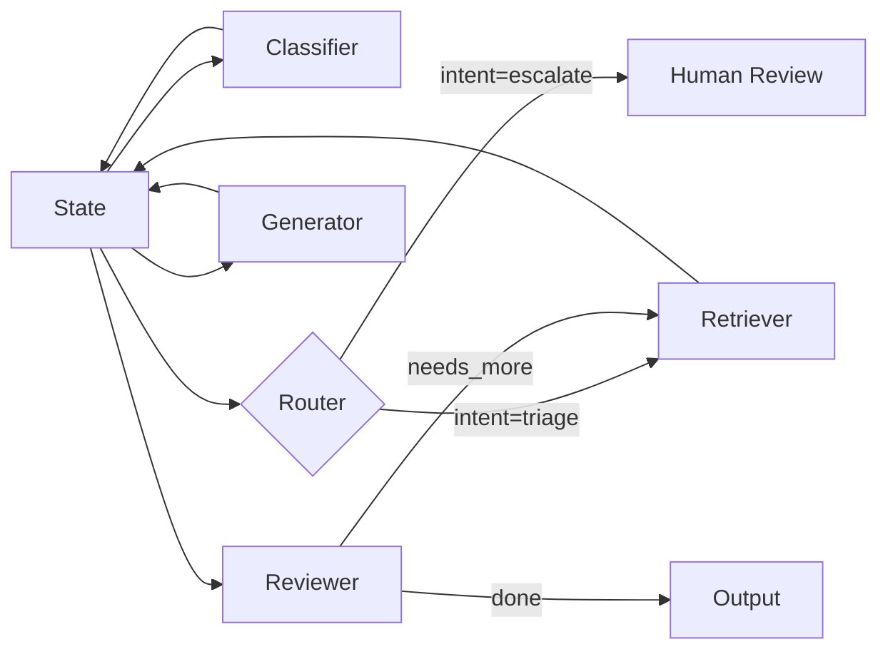

# State

> **Learning Path:** AI Orchestration
> **Section:** 13.1.1 — LangGraph concepts

### The problem

Building an agent with multiple LLM steps breaks if each step is stateless.

You need a classifier, then retrieval, then a generator, then a reviewer, with loops back for clarification. Each step needs the conversation history, the previous tool outputs, the decision made by the router, and any partial result from earlier passes.

Passing everything manually through function arguments explodes. You end up re-serializing the whole context on every call, losing the ability to resume after a failure, and you cannot cleanly branch: the "escalate" branch needs a different subset of data than the "resolve" branch.

The constraint is: **coordinated, long-running, conditional workflows where state must survive across nodes, time, and retries.**

### Mental model

Think of State as the single source of truth that travels with the execution.

Nodes are pure functions: `state in -> state out`. The graph is the control flow, State is the data flow.

It is not a global variable. It is an explicit, typed record that is versioned on every transition and can be checkpointed. The graph owns the control, the State owns the memory.

### How it works

You define a schema for the state. In LangGraph that is typically a TypedDict or a custom class with reducers.

```python
class AgentState(TypedDict):
    messages: Annotated[list[Message], add_messages]
    intent: str
    documents: list[Document]
    draft: str | None
```

Nodes read what they need and write back partial updates. LangGraph merges updates via reducers, so two nodes can write `messages` without clobbering each other.

Control flow reads the state to decide next. A router node inspects `intent` and returns `escalate` or `resolve`. The graph then routes.



Checkpointing persists the state between steps. That is what enables interruption, human-in-the-loop, and resume after crash.

### Architectural reasoning

When it helps:
* Multi-step agents with conditional branching and loops
* Workflows that must be observable and resumable
* Need for audit trail of what data was present at each decision

What it solves vs alternatives:
* **Manual dict passing** works for 2-3 steps, fails at branching and recovery
* **External store per node** decouples but adds latency and consistency problems
* **State graph** gives a single contract for data, explicit evolution, and built-in persistence

You choose State when the workflow is more than a linear chain and you need deterministic replay.

### Trade-offs and failure modes

* **State bloat.** LLM messages grow unbounded. You pay serialization cost on every step and checkpoint size explodes. Architect for pruning, summarization, and bounded fields.
* **Implicit coupling.** All nodes share the same namespace. A node writing a field it should not touch can corrupt downstream logic. Keep schema narrow and typed.
* **Reducer complexity.** Merging lists like messages is easy, merging conflicting scalar fields is not. Define reducers explicitly.
* **Checkpoint durability.** State is only as reliable as its store. If checkpointing fails mid-transition you can lose the ability to resume. Treat checkpoint store as critical infrastructure with retention and cost controls.
* **Concurrency.** Same graph instance with different threads must not share mutable state. State is per execution, not global.

### Example

Enterprise support triage agent.

`messages` -> `Classifier` sets `intent`. `Router` branches on intent. `Retriever` writes `documents`. `Generator` writes `draft`. `Reviewer` checks confidence; if low, it adds a clarification question to `messages` and loops back to the user node. All steps read from and write to the same `AgentState`. An operator can pause at Human Review, the state is checkpointed, and resumed later with the exact context intact.

### Reasoning challenge

You have an agent that processes a 50-page document. Each step adds summaries and annotations. The state grows to 10 MB after 5 iterations.

Do you keep everything in LangGraph State, move large blobs to object storage and keep only references in State, or summarize aggressively? What do you optimize for: latency, cost, and debuggability?

### Key takeaway

* State is the memory contract for a LangGraph workflow, not a convenience.
* Nodes are stateless transformers; State is the explicit, versioned context that enables control flow, branching, and recovery.
* Design the schema first: decide what must persist, what can be derived, and how it merges.
* Watch size, serialization cost, and checkpoint durability; they dominate operability at scale.
