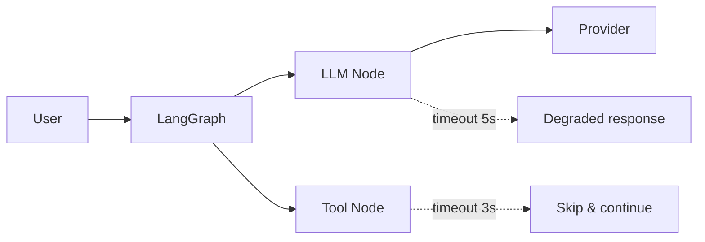

# Timeouts

> **Learning Path:** AI Orchestration
> **Section:** 13.1.10 — LangGraph concepts

### The problem

An AI orchestrated workflow is a chain of fallible, variable-latency steps: LLM calls, retrievers, tools, code execution, human-in-the-loop. Any one step can stall.

Without a boundary, a slow LLM provider or a hung tool call blocks the entire graph, holds the event loop, burns cost, and violates the user-facing SLA. In LangGraph that means a node never yields, the graph never advances, and downstream state is never committed.

Timeouts exist to convert an unbounded wait into a bounded failure you can handle.

### Mental model

A timeout is a budget guard, not a quality judgment.

Think of it as a fuse for a node. You allocate each node a latency budget derived from the overall SLA. If the node exceeds its budget, you trip the fuse and decide: retry, degrade, skip, or abort.

In orchestration the timeout belongs at the orchestration layer, not inside the node logic. The graph decides how long to wait for a capability, the node decides what to do with the result.

### How it works in LangGraph

LangGraph does not enforce node timeouts automatically. You enforce them around node execution.

Graph level: wrap the whole run
```python
await asyncio.wait_for(graph.ainvoke(state, config), timeout=GRAPH_TIMEOUT)
```

Node level: guard each async node
```python
async def safe_llm_node(state):
    try:
        return await asyncio.wait_for(llm_call(state), timeout=5.0)
    except asyncio.TimeoutError:
        return {"status": "degraded", "output": fallback(state)}
```

In practice you combine timeouts with LangGraph primitives:
* `max_iterations` prevents infinite loops
* `interrupt_after` / `interrupt_before` gives a safe pause point to check budgets
* `RunnableConfig` carries timeout budgets through the graph



### Architectural reasoning

When it helps:
* User-facing requests with hard latency SLOs
* Nodes that call external systems with variable tail latency
* Loops where an agent can retry indefinitely

What it solves:
* Prevents one slow dependency from cascading to resource exhaustion
* Makes latency predictable for the orchestrator
* Enables graceful degradation instead of silent hangs

Alternatives:
* No timeout → maximum correctness, zero availability guarantees
* Client-side timeout only → graph still holds resources internally
* Retry with backoff → improves success but increases worst-case latency
* Circuit breaker → stops calling a known unhealthy dependency

Choose per-node timeouts when different steps have different cost and criticality. Choose graph-level timeout when the end-to-end SLA is the only thing that matters.

### Trade-offs and failure modes

* Too short → false positives, flaky agents, unnecessary fallbacks
* Too long → defeats the purpose, holds connections and tokens
* Timeout without handling → you lose partial work and state. Always define a fallback path in the graph
* Retries + timeouts → can create thundering herd. Budget retries separately
* Async cancellation → ensure nodes clean up external calls on cancellation, otherwise you pay for work you discard

Timeouts also interact with streaming. A timeout on `invoke` is different from a timeout on first token. For LLMs you often want a timeout on first token and a separate max duration.

### Example

Enterprise support agent: `classify → retrieve → summarize → respond`

SLA: 4s p95.

Budgets: classify 0.5s, retrieve 1.5s, summarize 1.5s, graph total 4s.

The retriever calls a vector DB that occasionally stalls. With a 1.5s timeout on the retriever node, a stall triggers a fallback to a smaller index. The graph continues to summarize with partial context and returns a degraded but timely answer instead of timing out the whole request.

Without the timeout, one slow DB call would breach SLA for every user.

### Reasoning challenge

You have a research agent that can call a code execution tool. Some analyses finish in 2s, some take 30s. The user-facing SLA is 8s.

Do you set a 8s timeout on the whole graph, a 5s timeout on the code node, or no timeout and let it run? What does your fallback look like and what state do you need to preserve for a resume?

### Key takeaway

* Timeouts convert unbounded latency into a decision point you control
* Set budgets per node from the end-to-end SLA, not from average latency
* Always pair a timeout with an explicit graph path: retry, degrade, skip, or abort
* In LangGraph, timeouts are orchestration concerns implemented with `asyncio.wait_for` and safe interrupt points, not node internals
