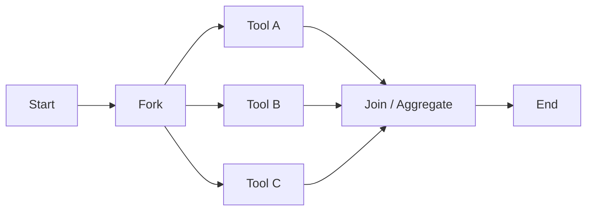

# Parallel execution

> **Learning Path:** AI Orchestration
> **Section:** 13.1.11 — LangGraph concepts

**Parallel execution in LangGraph**

### 1. The problem

An AI agent workflow is a chain of LLM calls, tool calls, retrievals and transforms. Each step is I/O bound and takes hundreds of milliseconds to seconds.

If those steps are sequential, latency adds up linearly:
`T_total = T1 + T2 + T3 + ...`

For an orchestrated agent that needs to call 3 tools, summarize, and validate, a user can wait 5-8 seconds for work that could have been done in parallel. You also pay for wall-clock time, not just compute.

The problem gets worse with fan-out: you want diverse perspectives, multiple retrievers, or an ensemble of models. Doing them one by one is slow and hides independent work.

The constraint is not CPU, it's latency and independence. Many branches of the graph do not depend on each other, only on the same incoming state.

### 2. Mental model

Think of an assembly line vs a kitchen brigade.

Sequential is an assembly line: one station finishes, passes to the next. Parallel is a brigade: the chef fires three independent dishes at once, then combines them for plating.

Parallel execution in LangGraph is fan-out / fan-in. A fork node produces a set of ready-to-run nodes. The scheduler runs all ready nodes concurrently, then a join node merges results back into shared state.

### 3. How it works

LangGraph is an async DAG. Nodes are async callables. The runtime tracks which nodes are *ready*: all incoming edges have fired and their dependencies are satisfied.

A fork creates multiple ready nodes at once:

State is the single source of truth. Parallel branches read from the same snapshot of state at fork time and write back via partial updates. The join node defines the merge policy: last-write-wins, union, or explicit reducer.

In practice you get this with:
* Static fan-out: multiple outgoing edges from one node, no dependency between them
* Dynamic fan-out: `Send` API to spawn N parallel sub-graphs
* `RunnableParallel` for pure data parallelism outside a graph

The runtime uses asyncio, so real parallelism is limited to I/O concurrency, which is exactly what LLM/tool calls are.

### 4. Architectural reasoning

Parallel helps when:
* Branches are independent given the same input state
* Latency dominates over compute
* You need redundancy / ensemble, e.g., multiple retrievers, multiple validators

Do not parallelize when:
* Branch B needs the output of Branch A
* You have tight rate limits or cost caps and want to serialize
* Ordering matters for correctness, e.g., incremental refinement

The decision is architectural: you are trading latency for coordination complexity. You accept the need for a deterministic merge strategy in exchange for reduced wall-clock time.

Alternatives are sequential chaining, which is simpler and easier to debug, or manual batching outside the graph, which loses stateful orchestration.

### 5. Trade-offs and failure modes

* **State merging conflicts.** Parallel writers can clobber each other. You need explicit keys or a reducer. If two tools update `summary`, who wins?
* **Partial failure.** One branch fails, others succeed. You need a policy: fail-fast, best-effort, or retry only the failed branch.
* **Non-determinism.** Execution order of parallel nodes is not guaranteed. Do not rely on side effects ordering.
* **Resource contention.** Parallel LLM calls hit rate limits, cost, and token budgets faster. Throughput goes up, but so does peak load.
* **Observability.** Tracing a fan-out with 3-5 branches is harder than a linear chain. You need correlated run IDs and per-branch metrics.

### 6. Example

Document triage agent.

Input: support ticket.

Fork to three independent extractions:
A: extract entities via NER tool
B: classify sentiment via LLM
C: retrieve relevant KB chunks via vector search

All three read the same ticket text from state. They run concurrently. Join aggregates:
`state = {entities: ..., sentiment: ..., context: ...}`

Then a final node generates a response using all three.

Sequential time ~ 2s + 1.5s + 1.8s = 5.3s. Parallel time ~ max(2,1.5,1.8) + overhead ≈ 2.2s.

If sentiment extraction fails, you can still produce a response with entities + context, or fail the whole run depending on policy.

### 7. Reasoning challenge

You need to build a compliance checker that:
1. Looks up policy from a DB
2. Calls a live risk API
3. Generates a justification with an LLM

The risk API requires the policy ID returned from step 1. The justification needs both policy and risk result.

Can you parallelize any of this? What do you fork, what must stay sequential, and where do you merge state?

### 8. Key takeaway

* Parallel execution exists to reduce wall-clock latency by exploiting independence, not to use more CPU.
* Fan-out / fan-in with a deterministic join is the core pattern; state merging is the hard part.
* Use it for independent retrievals, tools, and ensemble evaluations. Do not use it where data dependencies exist.
* Design for partial failure and rate limits first, speed second.
