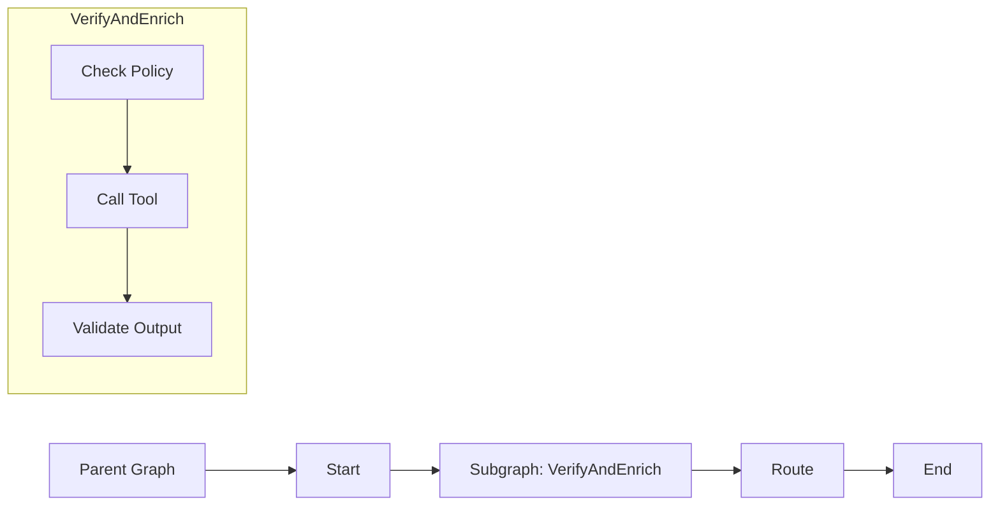

# Subgraphs

> **Learning Path:** AI Orchestration
> **Section:** 13.1.12 — LangGraph concepts

**Subgraphs in LangGraph**

### 1. The problem

A LangGraph agent is a directed graph of nodes. At first a graph is simple: retrieve → decide → act. In production you get loops, tool calls, retries, human-in-the-loop, validation, and the same pattern repeats across workflows.

Without composition the graph becomes a flat tangle:
* duplicated logic for common concerns like auth, retries, or formatting
* impossible to test a piece in isolation
* changes ripple across the whole graph
* reviewers can't reason about the workflow at the right level of abstraction

You need the same thing you need in software engineering: functions. Encapsulate a subgraph of nodes, treat it as one node, reuse it.

### 2. Mental model

A subgraph is a mini-graph with its own entry and exit. To the parent it looks like a single node with an input schema and an output schema.

Think of it as a compiled function. Inside you can have loops, branching, tools. Outside you only see `input → subgraph → output`.

### 3. How it works

You build a `StateGraph`, compile it, and then pass it as a node to a parent graph.

Key mechanics:
* **Boundary schema.** The subgraph declares which fields of the shared `State` it reads/writes. Mapping is explicit, not implicit.
* **Isolation.** Internal nodes and edges are hidden from the parent. Only the public input/output is visible.
* **Reusability.** The same compiled subgraph can be mounted in multiple parent graphs, or nested multiple levels deep.
* **State flow.** By default the subgraph participates in the parent state. You can also use a separate state class and map fields in/out.

### 4. Architectural reasoning

Use a subgraph when you have a coherent capability that appears in multiple places or is too complex to inline.

When it helps:
* **Reuse.** `ClassifyIntent`, `GuardrailCheck`, `ToolRetryLoop` used by several agents.
* **Encapsulation.** Hide low-level retry/parse/format logic behind a stable interface.
* **Team boundaries.** One team owns the subgraph, others consume it as a black box.
* **Testing.** You can unit test the subgraph with a fixed input/output state.

Alternatives:
* Flat graph with duplicated nodes. Cheaper initially, unmaintainable later.
* Custom Python node that runs imperative code. Loses LangGraph observability, tracing, and interrupt points.

Choose subgraph when the cost of abstraction is paid back by reuse and clarity.

### 5. Trade-offs and failure modes

* **Abstraction cost.** Indirection makes debugging harder. Errors surface inside the subgraph; you need good tracing to see why.
* **State coupling.** The parent and subgraph must agree on state shape. Changing a field inside the subgraph can break multiple parents. Version the schema.
* **Hidden cycles.** A subgraph can contain loops. Composed with a parent loop you can create unintentional infinite paths. Define clear entry/exit contracts.
* **Observability.** Metrics and costs get aggregated at the subgraph boundary. If you need per-node latency inside, keep the subgraph small enough to inspect.
* **Over-modularization.** Extracting too early creates a graph of tiny subgraphs with more mapping overhead than value.

### 6. Example

Enterprise support triage.

Parent graph: `Triage → Resolve → Close`

`Triage` is a subgraph:
1. `Extract entities` from user message
2. `Policy guardrail` check → if violation, route to human
3. `Intent classifier` → returns `billing`, `technical`, `account`
4. `Enrich` with CRM lookup

The parent only knows: input `message`, output `intent`, `risk_flag`, `customer_id`. The internal retries, tool calls, and validation are hidden. Same `Policy guardrail` subgraph is reused in `Resolve`.

### 7. Reasoning challenge

You have a customer onboarding workflow with 3 steps: KYC check, credit check, welcome email. KYC check itself needs: document parse → OCR → validation → manual review loop.

Do you model manual review loop as a subgraph inside KYC, or keep the whole KYC flat in the parent graph? What breaks if you later need the same manual review loop for a loan application workflow?

### 8. Key takeaway

* Subgraphs exist to compose agents hierarchically, not to add features.
* Use them for reuse, encapsulation, and testability of coherent capabilities.
* The contract is the state schema at the boundary; keep it stable and explicit.
* Prefer few, well-defined subgraphs over many tiny ones; watch state coupling and observability cost.
